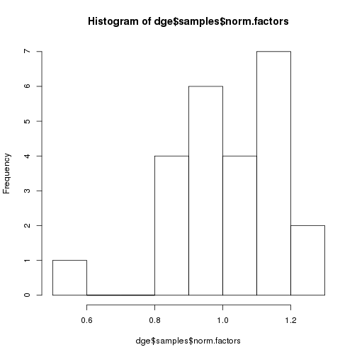

**Script:** `2_24bioosci_create_dge_normalize_mirna_exp.R`

**Directory of Code:**  `/mnt/research/pigeqtl/analyses/microRNA/3_pcr_duplication_analysis/3_24bioosci_mirna_expression_characterization/scripts`

**Date:**  8/17/16

**Input File Directory:**  `/mnt/research/pigeqtl/analyses/microRNA/3_pcr_duplication_analysis/3_24bioosci_mirna_expression_characterization/`

**Input File(s):** `1_24bioosci_mirna_expression.Rdata`

**Output File Directory:** `/mnt/research/pigeqtl/analyses/microRNA/3_pcr_duplication_analysis/3_24bioosci_mirna_expression_characterization/`

**Output File(s):** `2_24bioosci_dge_normalized_mirna_expression.Rdata`

**Table of contents:**

1. [Objectives](#objectives)
2. [Install libraries](#install-libraries)
3. [Load data](#load-data)
4. [Analysis](#analysis)
5. [Save data](#save-data)

## Objectives

The objective of this script is to create a dge object of the subset of Bioo Scientific libraries matching the Illumina-prepped libraries. 
Additionally, the read counts of the miRNAs will be normalized using the cpm function of edgeR, filtered for expression (rough filter: < 1cpm in > 6 libraries removed) 
and the calcNormFactors and estimateCommonDisp functions of edgeR will be applied to the non-cpm read counts prior to the final cpm normalization of the read counts. 

THIS ANALYSIS COMPLETED USING R/3.2.0
## Install libraries


```r
library(limma)
```

```
## Loading required package: methods
```

```r
library(edgeR)

rm(list=ls())

setwd("/mnt/research/pigeqtl/analyses/microRNA/3_pcr_duplication_analysis/3_24bioosci_mirna_expression_characterization/scripts/")
```

## Load data
Load the subset of 24 libraries from the Bioo Scientific prepped libraries


```r
load("../1_24bioosci_mirna_expression.Rdata")
```

Load the annotation file from the mature miRNAs


```r
load("../../../2_mirna_characterization_expression/3_build_dge_object_for_eqtl/2_mature_mirna_annotation.Rdata")
```


## Analysis

### Create the dge object and transform the read counts: log-cpm, then filter genes by expression (1 cpm in 6 or more samples retained):

Create the dge object:


```r
dge<-DGEList(counts=bioosci24libmirnaexp,genes=total.mature.annot2)
dim(dge)
```

```
## [1] 335  24
```

```r
dge[1:5,1:5]
```

```
## An object of class "DGEList"
## $counts
##                1034  1058  1080  1096  1116
## ssc-let-7a    48132 40758 38799 35977 36678
## ssc-let-7c    32745 34313 28022 20772 29022
## ssc-let-7d-3p   381   778   774   440   710
## ssc-let-7d-5p  4925  3472  3705  3259  3083
## ssc-let-7e     2811  2512  2229  1898  2069
## 
## $samples
##      group lib.size norm.factors
## 1034     1  1462358            1
## 1058     1  1257197            1
## 1080     1  1109738            1
## 1096     1  1182030            1
## 1116     1  1057987            1
## 
## $genes
##                        Name  chr0     start       end width strand  type
## ssc-let-7a       ssc-let-7a  chr3  44864443  44864464    22      + miRNA
## ssc-let-7c       ssc-let-7c chr13 191559351 191559372    22      + miRNA
## ssc-let-7d-3p ssc-let-7d-3p  chr3  44867331  44867352    22      + miRNA
## ssc-let-7d-5p ssc-let-7d-5p  chr3  44867277  44867298    22      + miRNA
## ssc-let-7e       ssc-let-7e  chr6  51858385  51858406    22      + miRNA
##                      Alias          Precursors
## ssc-let-7a    MIMAT0013865 MI0017984,MI0013085
## ssc-let-7c    MIMAT0002151           MI0002445
## ssc-let-7d-3p MIMAT0025357           MI0022120
## ssc-let-7d-5p MIMAT0025356           MI0022120
## ssc-let-7e    MIMAT0013866           MI0013086
```

Calculate the read counts per million in order to filter miRNAs by normalized expression:


```r
cpm.dge<-cpm(dge)
dim(cpm.dge)
```

```
## [1] 335  24
```

```r
cpm.dge[1:5,1:5]
```

```
##                     1034      1058       1080      1096       1116
## ssc-let-7a    32913.9650 32419.740 34962.3064 30436.622 34667.7228
## ssc-let-7c    22391.9177 27293.256 25251.0052 17573.158 27431.3389
## ssc-let-7d-3p   260.5381   618.837   697.4619   372.241   671.0858
## ssc-let-7d-5p  3367.8484  2761.699  3338.6259  2757.121  2914.0245
## ssc-let-7e     1922.2379  1998.096  2008.5822  1605.712  1955.6006
```

```r
if (sum(rownames(bioosci24libmirnaexp)!=rownames(cpm.dge))!=0) stop ("miRNAs not the same between read counts and cpm")
if (sum(colnames(bioosci24libmirnaexp)!=colnames(cpm.dge))!=0) stop ("animal ids not the same between read counts and cpm")
if (sum(rownames(bioosci24libmirnaexp)!=rownames(total.mature.annot2))!=0) stop ("miRNAs not the same between read counts and annotation")
```

Filter miRNAs with at least 1 cpm in at least 1/4 of the samples (24/4=6)


```r
filtercpm<-rowSums(cpm.dge>=1)>=6
sum(filtercpm)
```

```
## [1] 297
```

```r
nrow(cpm.dge) - sum(filtercpm)
```

```
## [1] 38
```

We are removing 38 miRNA profiles from the analysis

So, keep the miRNA profiles in dge based on those retained in the cpm-filtering step:

This retains the rounded, filtered mean read counts, not the cpm (this will be done later):


```r
dge<-dge[filtercpm,]
names(dge)
```

```
## [1] "counts"  "samples" "genes"
```

```r
dge[1:5,1:5]
```

```
## An object of class "DGEList"
## $counts
##                1034  1058  1080  1096  1116
## ssc-let-7a    48132 40758 38799 35977 36678
## ssc-let-7c    32745 34313 28022 20772 29022
## ssc-let-7d-3p   381   778   774   440   710
## ssc-let-7d-5p  4925  3472  3705  3259  3083
## ssc-let-7e     2811  2512  2229  1898  2069
## 
## $samples
##      group lib.size norm.factors
## 1034     1  1462358            1
## 1058     1  1257197            1
## 1080     1  1109738            1
## 1096     1  1182030            1
## 1116     1  1057987            1
## 
## $genes
##                        Name  chr0     start       end width strand  type
## ssc-let-7a       ssc-let-7a  chr3  44864443  44864464    22      + miRNA
## ssc-let-7c       ssc-let-7c chr13 191559351 191559372    22      + miRNA
## ssc-let-7d-3p ssc-let-7d-3p  chr3  44867331  44867352    22      + miRNA
## ssc-let-7d-5p ssc-let-7d-5p  chr3  44867277  44867298    22      + miRNA
## ssc-let-7e       ssc-let-7e  chr6  51858385  51858406    22      + miRNA
##                      Alias          Precursors
## ssc-let-7a    MIMAT0013865 MI0017984,MI0013085
## ssc-let-7c    MIMAT0002151           MI0002445
## ssc-let-7d-3p MIMAT0025357           MI0022120
## ssc-let-7d-5p MIMAT0025356           MI0022120
## ssc-let-7e    MIMAT0013866           MI0013086
```

```r
dim(dge$counts)
```

```
## [1] 297  24
```

```r
if (sum(colnames(dge)!=colnames(cpm.dge))!=0) stop ("colnames not the same between dge and cpm.dge")
```

Apply the TMM normalization:


```r
dge<-calcNormFactors(dge)
head(dge$samples)
```

```
##      group lib.size norm.factors
## 1034     1  1462358     1.140703
## 1058     1  1257197     1.122473
## 1080     1  1109738     1.150074
## 1096     1  1182030     1.134933
## 1116     1  1057987     1.128097
## 1134     1  1582559     1.205250
```

```r
hist(dge$samples$norm.factors)
```

 

This function (estimateCommonDisp) applies normalization factors, caluclates normalized expression based on robust count of normalized reads.


```r
dge<-estimateCommonDisp(dge,verbose=TRUE)
```

```
## Disp = 0.20819 , BCV = 0.4563
```

```r
dge$common.dispersion
```

```
## [1] 0.2081853
```

The cpm conversion is used to normalize the read counts between libraries (accounts for differences in sequencing depth)


```r
dge.filter.cpm<-cpm(dge)
head(dge.filter.cpm)
```

```
##                     1034       1058       1080       1096       1116
## ssc-let-7a    28854.1067 28882.4268 30400.0403 26817.9823 30731.1488
## ssc-let-7c    19629.9286 24315.2930 21955.9764 15483.8682 24316.4677
## ssc-let-7d-3p   228.4014   551.3158   606.4494   327.9849   594.8829
## ssc-let-7d-5p  2952.4324  2460.3706  2902.9653  2429.3244  2583.1324
## ssc-let-7e     1685.1345  1780.0838  1746.4803  1414.8075  1733.5391
## ssc-let-7f    21240.7277 11700.9331 15024.1185 21673.8375 11265.9095
##                     1134       1154       1170       1194       1240
## ssc-let-7a    31455.2140 28419.6760 20098.2015 34560.0994 30915.7938
## ssc-let-7c    23714.2230 21506.6589 26137.8555 20113.0283 20673.9471
## ssc-let-7d-3p   561.5036   426.4487  4459.6601   286.6571   231.5758
## ssc-let-7d-5p  3492.2276  2970.9257  1486.5534  2897.9244  2614.4817
## ssc-let-7e     2066.7109  1410.6922   637.0943  1921.4985  1508.2555
## ssc-let-7f    18036.2730 16723.0421  4892.8842 23290.8912 23413.2558
##                     1278      1300       1426       1434       1458
## ssc-let-7a    21191.5957 30428.522 34060.7743 34385.9057 31351.3372
## ssc-let-7c    18929.0765 22959.923 20805.3331 22113.5811 19458.8443
## ssc-let-7d-3p  1378.8686   688.175   174.5758   258.3391   161.5708
## ssc-let-7d-5p  1810.0154  2686.204  3118.7461  2507.8388  2767.5875
## ssc-let-7e      743.4945  1459.733  2020.9721  1721.8543  1346.4236
## ssc-let-7f    13433.6243 19602.432 25350.4666 24478.8459 22573.7542
##                     1484       1502      1512       1534       1580
## ssc-let-7a    25071.0622 50473.5147 34836.875 48211.2218 37706.0593
## ssc-let-7c    19007.4104 30601.4668 29955.275 28683.8971 27307.0602
## ssc-let-7d-3p   439.2713   406.7875  1683.963   317.2023   522.3387
## ssc-let-7d-5p  2172.2976  5049.2633  3149.475  4079.5737  3507.7379
## ssc-let-7e     1386.1106  3236.2442  1713.204  2699.7438  1995.9284
## ssc-let-7f     9755.5489 37551.9041 17245.569 36189.2555 20416.8608
##                     1594      1640       1644       1662
## ssc-let-7a    30411.7185 44970.535 56761.2883 29574.4660
## ssc-let-7c    18775.9449 23793.415 35744.1602 19495.3399
## ssc-let-7d-3p   275.5103   327.793   446.8933   313.7735
## ssc-let-7d-5p  2982.7703  4613.293  5332.0502  2874.3756
## ssc-let-7e     1728.9509  2439.699  3959.2408  1702.0518
## ssc-let-7f    23081.8245 36752.729 40714.0224 22485.5935
```

```r
dim(dge.filter.cpm)
```

```
## [1] 297  24
```

## Save data


```r
save(dge.filter.cpm, file="../2_24bioosci_dge_normalized_mirna_expression.Rdata")
```

