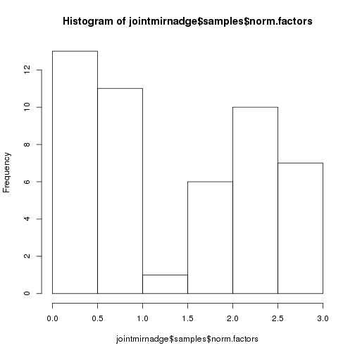

**Script:** `1_join_mirna_expression_datasets_create_dge.R`

**Directory of Code:**  `/mnt/research/pigeqtl/analyses/microRNA/3_pcr_duplication_analysis/4_join_datasets_dge_object/scripts`

**Date:**  8/29/16

**Input File Directory:**  

1. `/mnt/research/pigeqtl/analyses/microRNA/3_pcr_duplication_analysis/2_24illumina_mirna_expression_characterization`
2. `/mnt/research/pigeqtl/analyses/microRNA/3_pcr_duplication_analysis/4_join_datasets_dge_object`

**Input File(s):**

1. `1_24illumina_rounded_mean_mature_mirna_exp.Rdata`
2. `1_24bioosci_rounded_mean_mature_mirna_expression.Rdata`
3. `1_mature_mirna_annotation.Rdata`

**Output File Directory:** ``

**Output File(s):** 
1. `3_joint_mirna_expression_df.Rdata`
2. `4_joint_mirna_dge_object.Rdata`
3. `5_joint_mirna_deanalysis_results.Rdata`

**Table of contents:**

1. [Objectives](#objectives)
2. [Install libraries](#install-libraries)
3. [Load data](#load-data)
4. [Analysis](#analysis)
5. [Save data](#save-data)

## Objectives
The objective of this script is to (1) join the two miRNA expression datasets into one and (2) make them into a dge object. 
This dge object will then (3) be filtered for miRNA expression: first, the read counts of the miRNAs will be normalized using the cpm function of edgeR, then filtered for expression (rough filter: < 1cpm in > 6 libraries removed) 
and the calcNormFactors and estimateCommonDisp functions of edgeR will be applied to the non-cpm read counts prior to the differential expression analysis of the read counts. 

THIS ANALYSIS COMPLETED WITH R/3.2.0
## Install libraries


```r
library(methods)
library(limma)
library(edgeR)
library(statmod)

rm(list=ls())

setwd("/mnt/research/pigeqtl/analyses/microRNA/3_pcr_duplication_analysis/4_join_datasets_dge_object/scripts")
```

## Load data
Load the miRDeep2 read count data for the 24 Illumina libraries


```r
load("../../2_24illumina_mirna_expression_characterization/1_24illumina_rounded_mean_mature_mirna_exp.Rdata")
```

Load the miRDeep2 read count data for the 24 Bioo Scientific libraries


```r
load("../../3_24bioosci_mirna_expression_characterization/1_24bioosci_rounded_mean_mature_mirna_expression.Rdata")
```

Load the annotation file for the 24 libraries 


```r
load("../1_mature_mirna_annotation.Rdata")
ls()
```

```
## [1] "bioosci24libmirnaexp"           "illumina24.dfmeanrcround"      
## [3] "illumina24.total.mature.annot2"
```

## Analysis

### 1. Join the two expression datasets (rounded, mean mature miRNA expression)

Make a matrix of miRNA read counts from the Illumina prepped libraries


```r
illumina24.dfmeanrcround<-as.matrix(illumina24.dfmeanrcround)
dim(illumina24.dfmeanrcround)
```

```
## [1] 411  24
```

Make the sample IDs more descriptive (ITS = Illumina TruSeq)


```r
colnames(illumina24.dfmeanrcround)<-paste(colnames(illumina24.dfmeanrcround), ".ITS", sep = "")
illumina24.dfmeanrcround[1:5,1:5]
```

```
##               1034.ITS 1058.ITS 1080.ITS 1096.ITS 1116.ITS
## ssc-let-7a       24174    53646     6014    57852    56632
## ssc-let-7c        3001     5920     1765     8426     7084
## ssc-let-7d-3p      211      232     2040      643      661
## ssc-let-7d-5p     1246     3067      364     3617     3382
## ssc-let-7e        1026     2068      270     2582     2601
```

Define which miRNAs have zero expression in the Bioo prepped libraries:


```r
illumina24zeromir<-rownames(illumina24.dfmeanrcround[rowSums(illumina24.dfmeanrcround)==0,])
length(illumina24zeromir)
```

```
## [1] 86
```

```r
illumina24zeromir
```

```
##  [1] "ssc-miR-1224"    "ssc-miR-124a"    "ssc-miR-1296-3p"
##  [4] "ssc-miR-146a-3p" "ssc-miR-194b-3p" "ssc-miR-218-3p" 
##  [7] "ssc-miR-219b-3p" "ssc-miR-371-5p"  "ssc-miR-376b"   
## [10] "ssc-miR-4334-5p" "ssc-miR-4335"    "ssc-miR-4338"   
## [13] "ssc-miR-4339"    "ssc-miR-484"     "ssc-miR-494"    
## [16] "ssc-miR-7136-3p" "ssc-miR-7141-3p" "ssc-miR-7144-3p"
## [19] "ssc-miR-92b-5p"  "ssc-miR-9784-5p" "ssc-miR-9786-3p"
## [22] "ssc-miR-9787-3p" "ssc-miR-9789-3p" "ssc-miR-9790-3p"
## [25] "ssc-miR-9791-3p" "ssc-miR-9792-5p" "ssc-miR-9793-5p"
## [28] "ssc-miR-9794-3p" "ssc-miR-9795-3p" "ssc-miR-9796-3p"
## [31] "ssc-miR-9797-3p" "ssc-miR-9798-3p" "ssc-miR-9799-3p"
## [34] "ssc-miR-9800-3p" "ssc-miR-9801-5p" "ssc-miR-9802-3p"
## [37] "ssc-miR-9803-5p" "ssc-miR-9804-5p" "ssc-miR-9805-3p"
## [40] "ssc-miR-9806-5p" "ssc-miR-9808-3p" "ssc-miR-9809-3p"
## [43] "ssc-miR-9811-5p" "ssc-miR-9812-3p" "ssc-miR-9813-5p"
## [46] "ssc-miR-9814-3p" "ssc-miR-9815-3p" "ssc-miR-9816-3p"
## [49] "ssc-miR-9817-5p" "ssc-miR-9818-3p" "ssc-miR-9819-5p"
## [52] "ssc-miR-9821-5p" "ssc-miR-9823-5p" "ssc-miR-9824-5p"
## [55] "ssc-miR-9825-5p" "ssc-miR-9826-5p" "ssc-miR-9827-5p"
## [58] "ssc-miR-9828-3p" "ssc-miR-9829-5p" "ssc-miR-9830-5p"
## [61] "ssc-miR-9831-3p" "ssc-miR-9832-3p" "ssc-miR-9833-5p"
## [64] "ssc-miR-9834-5p" "ssc-miR-9836-3p" "ssc-miR-9837-5p"
## [67] "ssc-miR-9838-5p" "ssc-miR-9839-5p" "ssc-miR-9840-3p"
## [70] "ssc-miR-9842-5p" "ssc-miR-9844-3p" "ssc-miR-9845-5p"
## [73] "ssc-miR-9846-3p" "ssc-miR-9847-3p" "ssc-miR-9848-3p"
## [76] "ssc-miR-9849-5p" "ssc-miR-9850-5p" "ssc-miR-9852-3p"
## [79] "ssc-miR-9853-5p" "ssc-miR-9854-5p" "ssc-miR-9855-5p"
## [82] "ssc-miR-9856-3p" "ssc-miR-9857-5p" "ssc-miR-9859-3p"
## [85] "ssc-miR-9861-5p" "ssc-miR-9862-3p"
```

Make a matrix of miRNA read counts from the Bioo prepped libraries


```r
bioosci24libmirnaexp<-as.matrix(bioosci24libmirnaexp)
dim(bioosci24libmirnaexp)
```

```
## [1] 411  24
```

Make the sample IDs more descriptive (BNF = Bioo Scientific Next Flex)


```r
colnames(bioosci24libmirnaexp)<-paste(colnames(bioosci24libmirnaexp), ".BNF", sep = "")
bioosci24libmirnaexp[1:5,1:5]
```

```
##               1034.BNF 1058.BNF 1080.BNF 1096.BNF 1116.BNF
## ssc-let-7a       48132    40758    38799    35977    36678
## ssc-let-7c       32745    34313    28022    20772    29022
## ssc-let-7d-3p      381      778      774      440      710
## ssc-let-7d-5p     4925     3472     3705     3259     3083
## ssc-let-7e        2811     2512     2229     1898     2069
```

Define which miRNAs have zero expression in the Bioo prepped libraries:


```r
bioozeromir<-rownames(bioosci24libmirnaexp[rowSums(bioosci24libmirnaexp)==0,])
length(bioozeromir)
```

```
## [1] 85
```

```r
bioozeromir
```

```
##  [1] "ssc-miR-1296-3p" "ssc-miR-146a-3p" "ssc-miR-155-3p" 
##  [4] "ssc-miR-1839-3p" "ssc-miR-194b-3p" "ssc-miR-218-3p" 
##  [7] "ssc-miR-371-5p"  "ssc-miR-376b"    "ssc-miR-4334-5p"
## [10] "ssc-miR-4335"    "ssc-miR-4338"    "ssc-miR-4339"   
## [13] "ssc-miR-484"     "ssc-miR-494"     "ssc-miR-7141-3p"
## [16] "ssc-miR-7141-5p" "ssc-miR-7143-5p" "ssc-miR-9786-3p"
## [19] "ssc-miR-9787-3p" "ssc-miR-9789-3p" "ssc-miR-9790-3p"
## [22] "ssc-miR-9791-3p" "ssc-miR-9792-5p" "ssc-miR-9793-5p"
## [25] "ssc-miR-9794-3p" "ssc-miR-9795-3p" "ssc-miR-9796-3p"
## [28] "ssc-miR-9797-3p" "ssc-miR-9798-3p" "ssc-miR-9799-3p"
## [31] "ssc-miR-9800-3p" "ssc-miR-9801-5p" "ssc-miR-9802-3p"
## [34] "ssc-miR-9803-5p" "ssc-miR-9804-5p" "ssc-miR-9805-3p"
## [37] "ssc-miR-9806-5p" "ssc-miR-9807-5p" "ssc-miR-9808-3p"
## [40] "ssc-miR-9809-3p" "ssc-miR-9812-3p" "ssc-miR-9813-5p"
## [43] "ssc-miR-9814-3p" "ssc-miR-9815-3p" "ssc-miR-9816-3p"
## [46] "ssc-miR-9817-5p" "ssc-miR-9818-3p" "ssc-miR-9819-5p"
## [49] "ssc-miR-9821-5p" "ssc-miR-9822-3p" "ssc-miR-9823-5p"
## [52] "ssc-miR-9824-5p" "ssc-miR-9825-5p" "ssc-miR-9826-5p"
## [55] "ssc-miR-9827-5p" "ssc-miR-9828-3p" "ssc-miR-9829-5p"
## [58] "ssc-miR-9830-5p" "ssc-miR-9831-3p" "ssc-miR-9832-3p"
## [61] "ssc-miR-9833-5p" "ssc-miR-9834-5p" "ssc-miR-9835-3p"
## [64] "ssc-miR-9836-3p" "ssc-miR-9837-5p" "ssc-miR-9838-5p"
## [67] "ssc-miR-9839-5p" "ssc-miR-9840-3p" "ssc-miR-9842-5p"
## [70] "ssc-miR-9844-3p" "ssc-miR-9845-5p" "ssc-miR-9846-3p"
## [73] "ssc-miR-9847-3p" "ssc-miR-9848-3p" "ssc-miR-9849-5p"
## [76] "ssc-miR-9850-5p" "ssc-miR-9852-3p" "ssc-miR-9853-5p"
## [79] "ssc-miR-9854-5p" "ssc-miR-9855-5p" "ssc-miR-9856-3p"
## [82] "ssc-miR-9857-5p" "ssc-miR-9859-3p" "ssc-miR-9861-5p"
## [85] "ssc-miR-9862-3p"
```

In total, 78 miRNAs are not expressed in either dataset:


```r
sum(illumina24zeromir %in% bioozeromir)
```

```
## [1] 78
```

miRNAs not expressed in either dataset:


```r
illumina24zeromir[illumina24zeromir %in% bioozeromir]
```

```
##  [1] "ssc-miR-1296-3p" "ssc-miR-146a-3p" "ssc-miR-194b-3p"
##  [4] "ssc-miR-218-3p"  "ssc-miR-371-5p"  "ssc-miR-376b"   
##  [7] "ssc-miR-4334-5p" "ssc-miR-4335"    "ssc-miR-4338"   
## [10] "ssc-miR-4339"    "ssc-miR-484"     "ssc-miR-494"    
## [13] "ssc-miR-7141-3p" "ssc-miR-9786-3p" "ssc-miR-9787-3p"
## [16] "ssc-miR-9789-3p" "ssc-miR-9790-3p" "ssc-miR-9791-3p"
## [19] "ssc-miR-9792-5p" "ssc-miR-9793-5p" "ssc-miR-9794-3p"
## [22] "ssc-miR-9795-3p" "ssc-miR-9796-3p" "ssc-miR-9797-3p"
## [25] "ssc-miR-9798-3p" "ssc-miR-9799-3p" "ssc-miR-9800-3p"
## [28] "ssc-miR-9801-5p" "ssc-miR-9802-3p" "ssc-miR-9803-5p"
## [31] "ssc-miR-9804-5p" "ssc-miR-9805-3p" "ssc-miR-9806-5p"
## [34] "ssc-miR-9808-3p" "ssc-miR-9809-3p" "ssc-miR-9812-3p"
## [37] "ssc-miR-9813-5p" "ssc-miR-9814-3p" "ssc-miR-9815-3p"
## [40] "ssc-miR-9816-3p" "ssc-miR-9817-5p" "ssc-miR-9818-3p"
## [43] "ssc-miR-9819-5p" "ssc-miR-9821-5p" "ssc-miR-9823-5p"
## [46] "ssc-miR-9824-5p" "ssc-miR-9825-5p" "ssc-miR-9826-5p"
## [49] "ssc-miR-9827-5p" "ssc-miR-9828-3p" "ssc-miR-9829-5p"
## [52] "ssc-miR-9830-5p" "ssc-miR-9831-3p" "ssc-miR-9832-3p"
## [55] "ssc-miR-9833-5p" "ssc-miR-9834-5p" "ssc-miR-9836-3p"
## [58] "ssc-miR-9837-5p" "ssc-miR-9838-5p" "ssc-miR-9839-5p"
## [61] "ssc-miR-9840-3p" "ssc-miR-9842-5p" "ssc-miR-9844-3p"
## [64] "ssc-miR-9845-5p" "ssc-miR-9846-3p" "ssc-miR-9847-3p"
## [67] "ssc-miR-9848-3p" "ssc-miR-9849-5p" "ssc-miR-9850-5p"
## [70] "ssc-miR-9852-3p" "ssc-miR-9853-5p" "ssc-miR-9854-5p"
## [73] "ssc-miR-9855-5p" "ssc-miR-9856-3p" "ssc-miR-9857-5p"
## [76] "ssc-miR-9859-3p" "ssc-miR-9861-5p" "ssc-miR-9862-3p"
```

(8) miRNAs not expressed only in the illumina24 dataset:


```r
illumina24zeromir[!illumina24zeromir %in% bioozeromir]
```

```
## [1] "ssc-miR-1224"    "ssc-miR-124a"    "ssc-miR-219b-3p" "ssc-miR-7136-3p"
## [5] "ssc-miR-7144-3p" "ssc-miR-92b-5p"  "ssc-miR-9784-5p" "ssc-miR-9811-5p"
```

(7) miRNAs not expressed only in the bioo dataset:


```r
bioozeromir[!bioozeromir %in% illumina24zeromir]
```

```
## [1] "ssc-miR-155-3p"  "ssc-miR-1839-3p" "ssc-miR-7141-5p" "ssc-miR-7143-5p"
## [5] "ssc-miR-9807-5p" "ssc-miR-9822-3p" "ssc-miR-9835-3p"
```

Check that the rownames are equal between the datasets


```r
if (sum(rownames(bioosci24libmirnaexp) != rownames(illumina24.dfmeanrcround)) != 0) stop ("rownames not equal between datasets")
```

Join the two datasets using cbind


```r
jointmirnaexp<-cbind(illumina24.dfmeanrcround,bioosci24libmirnaexp)
jointmirnaexp[1:10,1:30]
```

```
##               1034.ITS 1058.ITS 1080.ITS 1096.ITS 1116.ITS 1134.ITS
## ssc-let-7a       24174    53646     6014    57852    56632    61338
## ssc-let-7c        3001     5920     1765     8426     7084     6985
## ssc-let-7d-3p      211      232     2040      643      661      493
## ssc-let-7d-5p     1246     3067      364     3617     3382     3228
## ssc-let-7e        1026     2068      270     2582     2601     2377
## ssc-let-7f       13892    37998     2129    19620    25098    47539
## ssc-let-7g        5005    12008      945     9915    14049    12378
## ssc-let-7i        4073     9769      567     7695     6382     9685
## ssc-miR-1         2372    10823      821     2637     3576     8515
## ssc-miR-100      21034    35674     3049    38984    50318    38032
##               1154.ITS 1170.ITS 1194.ITS 1240.ITS 1278.ITS 1300.ITS
## ssc-let-7a       59234    57940    35574    35545    39448    36966
## ssc-let-7c        8230     6396     3996     6624     6101     4591
## ssc-let-7d-3p      702      338      220     1540      518      407
## ssc-let-7d-5p     3280     3155     1868     2272     2115     2202
## ssc-let-7e        2446     2395     1102     1404     1569     1309
## ssc-let-7f       18634    41082    27064    25634    26353    20856
## ssc-let-7g       10013    14907     7862     8610     7290     8306
## ssc-let-7i        6804     8039     5283     6200     5791     5233
## ssc-miR-1         2385     7491     8255    11787     5484     3256
## ssc-miR-100      31860    42734    11779     9324    10703     9756
##               1426.ITS 1434.ITS 1458.ITS 1484.ITS 1502.ITS 1512.ITS
## ssc-let-7a       76446   219999    96168   106308    19862    14706
## ssc-let-7c        8332    29347    10912    13799     1940     2532
## ssc-let-7d-3p      337     1643      405     1110       95      580
## ssc-let-7d-5p     4586    11705     5192     5524     1245     1030
## ssc-let-7e        3011     8544     3578     4294      783      702
## ssc-let-7f       58404   203564    67330    37886    13534     7414
## ssc-let-7g       18454    59183    22547    18443     4954     4024
## ssc-let-7i       12545    59193    13765    13265     2895     1460
## ssc-miR-1        16871    62677    22416     3422     2824     2970
## ssc-miR-100       7882    48273    46953    27257     3580     2294
##               1534.ITS 1580.ITS 1594.ITS 1640.ITS 1644.ITS 1662.ITS
## ssc-let-7a       34628    78745   124874    42307    29834    47926
## ssc-let-7c        3603     9650    13632     3856     3160     5098
## ssc-let-7d-3p      156      524      624      213      170      245
## ssc-let-7d-5p     2010     5003     7418     2827     1795     2578
## ssc-let-7e        1382     3137     5032     1682     1503     1731
## ssc-let-7f       26159    38624   103978    35902    20510    36414
## ssc-let-7g        9258    15106    35493    16101     9251    12034
## ssc-let-7i        4369    11173    16054     5323     3447     6876
## ssc-miR-1         6708     6318    24153     8237     3628     7483
## ssc-miR-100       3518     8140    24204     8534     6178     9680
##               1034.BNF 1058.BNF 1080.BNF 1096.BNF 1116.BNF 1134.BNF
## ssc-let-7a       48132    40758    38799    35977    36678    59997
## ssc-let-7c       32745    34313    28022    20772    29022    45232
## ssc-let-7d-3p      381      778      774      440      710     1071
## ssc-let-7d-5p     4925     3472     3705     3259     3083     6661
## ssc-let-7e        2811     2512     2229     1898     2069     3942
## ssc-let-7f       35432    16512    19175    29076    13446    34402
## ssc-let-7g       16700    11420    12589    13903     8935    19988
## ssc-let-7i       10966     6161     5958     6678     4530     9968
## ssc-miR-1       307458   109839   117277   299430    87831   201671
## ssc-miR-100       9539    17474    12515     4132    10920    12615
```

```r
dim(jointmirnaexp)
```

```
## [1] 411  48
```

```r
str(jointmirnaexp)
```

```
##  num [1:411, 1:48] 24174 3001 211 1246 1026 ...
##  - attr(*, "dimnames")=List of 2
##   ..$ : chr [1:411] "ssc-let-7a" "ssc-let-7c" "ssc-let-7d-3p" "ssc-let-7d-5p" ...
##   ..$ : chr [1:48] "1034.ITS" "1058.ITS" "1080.ITS" "1096.ITS" ...
```

Check that the data remained the same between the datasets (no shuffling took place):


```r
for (i in colnames(illumina24.dfmeanrcround)){
        print(sum(illumina24.dfmeanrcround[,i] != jointmirnaexp[,i]))
}
```

```
## [1] 0
## [1] 0
## [1] 0
## [1] 0
## [1] 0
## [1] 0
## [1] 0
## [1] 0
## [1] 0
## [1] 0
## [1] 0
## [1] 0
## [1] 0
## [1] 0
## [1] 0
## [1] 0
## [1] 0
## [1] 0
## [1] 0
## [1] 0
## [1] 0
## [1] 0
## [1] 0
## [1] 0
```

```r
for (i in colnames(bioosci24libmirnaexp)){
        print(sum(bioosci24libmirnaexp[,i] != jointmirnaexp[,i]))
}
```

```
## [1] 0
## [1] 0
## [1] 0
## [1] 0
## [1] 0
## [1] 0
## [1] 0
## [1] 0
## [1] 0
## [1] 0
## [1] 0
## [1] 0
## [1] 0
## [1] 0
## [1] 0
## [1] 0
## [1] 0
## [1] 0
## [1] 0
## [1] 0
## [1] 0
## [1] 0
## [1] 0
## [1] 0
```

```r
if (sum(rownames(illumina24.dfmeanrcround) != rownames(jointmirnaexp)) != 0) stop ("rownames not equal between datasets")
if (sum(rownames(bioosci24libmirnaexp) != rownames(jointmirnaexp)) != 0) stop ("rownames not equal between datasets")
```

### 2. Create dge object for the joint miRNA expression dataset, including a group option with the library preparation kit determining the groups.


```r
jointmirnadge<-DGEList(counts=jointmirnaexp, genes=illumina24.total.mature.annot2)
names(jointmirnadge)
```

```
## [1] "counts"  "samples" "genes"
```

```r
dim(jointmirnadge$counts)
```

```
## [1] 411  48
```

```r
head(jointmirnadge$counts)
```

```
##               1034.ITS 1058.ITS 1080.ITS 1096.ITS 1116.ITS 1134.ITS
## ssc-let-7a       24174    53646     6014    57852    56632    61338
## ssc-let-7c        3001     5920     1765     8426     7084     6985
## ssc-let-7d-3p      211      232     2040      643      661      493
## ssc-let-7d-5p     1246     3067      364     3617     3382     3228
## ssc-let-7e        1026     2068      270     2582     2601     2377
## ssc-let-7f       13892    37998     2129    19620    25098    47539
##               1154.ITS 1170.ITS 1194.ITS 1240.ITS 1278.ITS 1300.ITS
## ssc-let-7a       59234    57940    35574    35545    39448    36966
## ssc-let-7c        8230     6396     3996     6624     6101     4591
## ssc-let-7d-3p      702      338      220     1540      518      407
## ssc-let-7d-5p     3280     3155     1868     2272     2115     2202
## ssc-let-7e        2446     2395     1102     1404     1569     1309
## ssc-let-7f       18634    41082    27064    25634    26353    20856
##               1426.ITS 1434.ITS 1458.ITS 1484.ITS 1502.ITS 1512.ITS
## ssc-let-7a       76446   219999    96168   106308    19862    14706
## ssc-let-7c        8332    29347    10912    13799     1940     2532
## ssc-let-7d-3p      337     1643      405     1110       95      580
## ssc-let-7d-5p     4586    11705     5192     5524     1245     1030
## ssc-let-7e        3011     8544     3578     4294      783      702
## ssc-let-7f       58404   203564    67330    37886    13534     7414
##               1534.ITS 1580.ITS 1594.ITS 1640.ITS 1644.ITS 1662.ITS
## ssc-let-7a       34628    78745   124874    42307    29834    47926
## ssc-let-7c        3603     9650    13632     3856     3160     5098
## ssc-let-7d-3p      156      524      624      213      170      245
## ssc-let-7d-5p     2010     5003     7418     2827     1795     2578
## ssc-let-7e        1382     3137     5032     1682     1503     1731
## ssc-let-7f       26159    38624   103978    35902    20510    36414
##               1034.BNF 1058.BNF 1080.BNF 1096.BNF 1116.BNF 1134.BNF
## ssc-let-7a       48132    40758    38799    35977    36678    59997
## ssc-let-7c       32745    34313    28022    20772    29022    45232
## ssc-let-7d-3p      381      778      774      440      710     1071
## ssc-let-7d-5p     4925     3472     3705     3259     3083     6661
## ssc-let-7e        2811     2512     2229     1898     2069     3942
## ssc-let-7f       35432    16512    19175    29076    13446    34402
##               1154.BNF 1170.BNF 1194.BNF 1240.BNF 1278.BNF 1300.BNF
## ssc-let-7a       49982     2366    30864    35912    15876    28829
## ssc-let-7c       37824     3077    17962    24015    14181    21753
## ssc-let-7d-3p      750      525      256      269     1033      652
## ssc-let-7d-5p     5225      175     2588     3037     1356     2545
## ssc-let-7e        2481       75     1716     1752      557     1383
## ssc-let-7f       29411      576    20800    27197    10064    18572
##               1426.BNF 1434.BNF 1458.BNF 1484.BNF 1502.BNF 1512.BNF
## ssc-let-7a       33168    28218    28524    32304    47522    20253
## ssc-let-7c       20260    18147    17704    24491    28812    17415
## ssc-let-7d-3p      170      212      147      566      383      979
## ssc-let-7d-5p     3037     2058     2518     2799     4754     1831
## ssc-let-7e        1968     1413     1225     1786     3047      996
## ssc-let-7f       24686    20088    20538    12570    35356    10026
##               1534.BNF 1580.BNF 1594.BNF 1640.BNF 1644.BNF 1662.BNF
## ssc-let-7a       27358    35516    36868    37179    38866    39304
## ssc-let-7c       16277    25721    22762    19671    24475    25909
## ssc-let-7d-3p      180      492      334      271      306      417
## ssc-let-7d-5p     2315     3304     3616     3814     3651     3820
## ssc-let-7e        1532     1880     2096     2017     2711     2262
## ssc-let-7f       20536    19231    27982    30385    27878    29883
```

```r
jointmirnadge$samples
```

```
##          group lib.size norm.factors
## 1034.ITS     1  1837116            1
## 1058.ITS     1  3712023            1
## 1080.ITS     1  1838011            1
## 1096.ITS     1  3533423            1
## 1116.ITS     1  3390992            1
## 1134.ITS     1  4031993            1
## 1154.ITS     1  3468560            1
## 1170.ITS     1  3452760            1
## 1194.ITS     1  3047581            1
## 1240.ITS     1  3941710            1
## 1278.ITS     1  2993782            1
## 1300.ITS     1  2477073            1
## 1426.ITS     1  4632932            1
## 1434.ITS     1 12115255            1
## 1458.ITS     1  7166260            1
## 1484.ITS     1  6026289            1
## 1502.ITS     1  1121402            1
## 1512.ITS     1  1255147            1
## 1534.ITS     1  2143878            1
## 1580.ITS     1  4633132            1
## 1594.ITS     1  8660105            1
## 1640.ITS     1  2775204            1
## 1644.ITS     1  2135040            1
## 1662.ITS     1  3449438            1
## 1034.BNF     1  1462358            1
## 1058.BNF     1  1257197            1
## 1080.BNF     1  1109738            1
## 1096.BNF     1  1182030            1
## 1116.BNF     1  1057987            1
## 1134.BNF     1  1582559            1
## 1154.BNF     1  1476707            1
## 1170.BNF     1   223934            1
## 1194.BNF     1   917965            1
## 1240.BNF     1  1133876            1
## 1278.BNF     1   765335            1
## 1300.BNF     1   958081            1
## 1426.BNF     1   961236            1
## 1434.BNF     1   823729            1
## 1458.BNF     1   910724            1
## 1484.BNF     1  1069564            1
## 1502.BNF     1  1088339            1
## 1512.BNF     1   650729            1
## 1534.BNF     1   700713            1
## 1580.BNF     1   939869            1
## 1594.BNF     1  1154715            1
## 1640.BNF     1   887635            1
## 1644.BNF     1   787899            1
## 1662.BNF     1  1181022            1
```

Check that the data remained the same between the datasets (no shuffling took place):


```r
if (sum(rownames(illumina24.dfmeanrcround) != rownames(jointmirnadge)) != 0) stop ("rownames not equal between datasets")
if (sum(rownames(bioosci24libmirnaexp) != rownames(jointmirnadge)) != 0) stop ("rownames not equal between datasets")

for (i in colnames(illumina24.dfmeanrcround)){
        print(sum(illumina24.dfmeanrcround[,i] != jointmirnadge$counts[,i]))
}
```

```
## [1] 0
## [1] 0
## [1] 0
## [1] 0
## [1] 0
## [1] 0
## [1] 0
## [1] 0
## [1] 0
## [1] 0
## [1] 0
## [1] 0
## [1] 0
## [1] 0
## [1] 0
## [1] 0
## [1] 0
## [1] 0
## [1] 0
## [1] 0
## [1] 0
## [1] 0
## [1] 0
## [1] 0
```

```r
for (i in colnames(bioosci24libmirnaexp)){
        print(sum(bioosci24libmirnaexp[,i] != jointmirnadge$counts[,i]))
}
```

```
## [1] 0
## [1] 0
## [1] 0
## [1] 0
## [1] 0
## [1] 0
## [1] 0
## [1] 0
## [1] 0
## [1] 0
## [1] 0
## [1] 0
## [1] 0
## [1] 0
## [1] 0
## [1] 0
## [1] 0
## [1] 0
## [1] 0
## [1] 0
## [1] 0
## [1] 0
## [1] 0
## [1] 0
```

### 3. Filter the joint expression dataset (dge object)
First, eliminate miRNAs whose total expression is 0 among the datasets


```r
sum(rowSums(jointmirnadge$counts) == 0)
```

```
## [1] 78
```

So, 78 miRNAs have 0 expression among the datasets


```r
jointmirnadge<-jointmirnadge[rowSums(jointmirnadge$counts)>0,]
dim(jointmirnadge)
```

```
## [1] 333  48
```

Calculate the read counts per million in order to filter miRNAs by normalized expression:


```r
cpm.jointmirnadge<-cpm(jointmirnadge)
dim(cpm.jointmirnadge)
```

```
## [1] 333  48
```

```r
cpm.jointmirnadge[1:5,1:5]
```

```
##                 1034.ITS    1058.ITS  1080.ITS   1096.ITS   1116.ITS
## ssc-let-7a    13158.6683 14451.95787 3272.0152 16372.7920 16700.7177
## ssc-let-7c     1633.5387  1594.81770  960.2772  2384.6565  2089.0642
## ssc-let-7d-3p   114.8539    62.49961 1109.8954   181.9765   194.9282
## ssc-let-7d-5p   678.2370   826.23410  198.0402  1023.6533   997.3483
## ssc-let-7e      558.4841   557.10862  146.8979   730.7362   767.0322
```

```r
if (sum(colnames(illumina24.dfmeanrcround)!=colnames(cpm.jointmirnadge[1:24]))!=0) stop ("animal ids not the same between read counts and cpm")
if (sum(rownames(illumina24.dfmeanrcround)!=rownames(illumina24.total.mature.annot2))!=0) stop ("miRNAs not the same between read counts and annotation")

if (sum(colnames(bioosci24libmirnaexp)!=colnames(cpm.jointmirnadge[25:ncol(cpm.jointmirnadge)]))!=0) stop ("animal ids not the same between read counts and cpm")
if (sum(rownames(bioosci24libmirnaexp)!=rownames(illumina24.total.mature.annot2))!=0) stop ("miRNAs not the same between read counts and annotation")
```

Filter miRNAs with at least 1 cpm in at least 1/4 of the samples (24/4=6)


```r
filtercpm<-rowSums(cpm.jointmirnadge>=1)>=6
sum(filtercpm)
```

```
## [1] 299
```

```r
nrow(cpm.jointmirnadge) - sum(filtercpm)
```

```
## [1] 34
```

We are removing 34 miRNA profiles from the analysis

So, keep the miRNA profiles in dge based on those retained in the cpm-filtering step:

This retains the rounded, mean read counts, not the cpm (this will be done later):


```r
jointmirnadge<-jointmirnadge[filtercpm,]
names(jointmirnadge)
```

```
## [1] "counts"  "samples" "genes"
```

```r
jointmirnadge[1:5,1:5]
```

```
## An object of class "DGEList"
## $counts
##               1034.ITS 1058.ITS 1080.ITS 1096.ITS 1116.ITS
## ssc-let-7a       24174    53646     6014    57852    56632
## ssc-let-7c        3001     5920     1765     8426     7084
## ssc-let-7d-3p      211      232     2040      643      661
## ssc-let-7d-5p     1246     3067      364     3617     3382
## ssc-let-7e        1026     2068      270     2582     2601
## 
## $samples
##          group lib.size norm.factors
## 1034.ITS     1  1837116            1
## 1058.ITS     1  3712023            1
## 1080.ITS     1  1838011            1
## 1096.ITS     1  3533423            1
## 1116.ITS     1  3390992            1
## 
## $genes
##                        Name  chr0     start       end width strand  type
## ssc-let-7a       ssc-let-7a  chr3  44864443  44864464    22      + miRNA
## ssc-let-7c       ssc-let-7c chr13 191559351 191559372    22      + miRNA
## ssc-let-7d-3p ssc-let-7d-3p  chr3  44867331  44867352    22      + miRNA
## ssc-let-7d-5p ssc-let-7d-5p  chr3  44867277  44867298    22      + miRNA
## ssc-let-7e       ssc-let-7e  chr6  51858385  51858406    22      + miRNA
##                      Alias          Precursors
## ssc-let-7a    MIMAT0013865 MI0017984,MI0013085
## ssc-let-7c    MIMAT0002151           MI0002445
## ssc-let-7d-3p MIMAT0025357           MI0022120
## ssc-let-7d-5p MIMAT0025356           MI0022120
## ssc-let-7e    MIMAT0013866           MI0013086
```

```r
dim(jointmirnadge$counts)
```

```
## [1] 299  48
```

```r
if (sum(colnames(jointmirnadge)!=colnames(cpm.jointmirnadge))!=0) stop ("colnames not the same between dge and cpm.jointmirnadge")
```

Apply the TMM normalization (normalizes for RNA composition by finding a set of scaling factors for the library sizes that minimize the log-fold changes between the samples for the most genes):

The result is the effective library size, which is equal to the product of the original library size and the scaling factor. Effective library size is what is used in downstream analyses.


```r
jointmirnadge<-calcNormFactors(jointmirnadge)
jointmirnadge$samples
```

```
##          group lib.size norm.factors
## 1034.ITS     1  1837116    0.5858137
## 1058.ITS     1  3712023    0.4434860
## 1080.ITS     1  1838011    0.3657435
## 1096.ITS     1  3533423    0.5956029
## 1116.ITS     1  3390992    0.5951298
## 1134.ITS     1  4031993    0.4106749
## 1154.ITS     1  3468560    0.5835953
## 1170.ITS     1  3452760    0.5261668
## 1194.ITS     1  3047581    0.3469001
## 1240.ITS     1  3941710    0.6271393
## 1278.ITS     1  2993782    0.5798180
## 1300.ITS     1  2477073    0.5274844
## 1426.ITS     1  4632932    0.4446734
## 1434.ITS     1 12115255    0.6349976
## 1458.ITS     1  7166260    0.3679400
## 1484.ITS     1  6026289    0.5022787
## 1502.ITS     1  1121402    0.4536061
## 1512.ITS     1  1255147    0.5876734
## 1534.ITS     1  2143878    0.3535257
## 1580.ITS     1  4633132    0.4313204
## 1594.ITS     1  8660105    0.3655995
## 1640.ITS     1  2775204    0.3551187
## 1644.ITS     1  2135040    0.3096507
## 1662.ITS     1  3449438    0.3557918
## 1034.BNF     1  1462358    2.5755196
## 1058.BNF     1  1257197    2.7635060
## 1080.BNF     1  1109738    2.7181325
## 1096.BNF     1  1182030    2.1530688
## 1116.BNF     1  1057987    2.6468326
## 1134.BNF     1  1582559    2.7060602
## 1154.BNF     1  1476707    2.9002032
## 1170.BNF     1   223934    1.1036254
## 1194.BNF     1   917965    2.1222083
## 1240.BNF     1  1133876    1.9743159
## 1278.BNF     1   765335    1.8946419
## 1300.BNF     1   958081    2.2021523
## 1426.BNF     1   961236    2.0393939
## 1434.BNF     1   823729    2.1485872
## 1458.BNF     1   910724    2.1852161
## 1484.BNF     1  1069564    2.8491267
## 1502.BNF     1  1088339    1.9256647
## 1512.BNF     1   650729    1.8755739
## 1534.BNF     1   700713    1.6815548
## 1580.BNF     1   939869    2.3927425
## 1594.BNF     1  1154715    2.1591441
## 1640.BNF     1   887635    2.0219513
## 1644.BNF     1   787899    1.9084893
## 1662.BNF     1  1181022    2.1150624
```

```r
hist(jointmirnadge$samples$norm.factors)
```



```r
jointmirnadge$samples$norm.factors
```

```
##  [1] 0.5858137 0.4434860 0.3657435 0.5956029 0.5951298 0.4106749 0.5835953
##  [8] 0.5261668 0.3469001 0.6271393 0.5798180 0.5274844 0.4446734 0.6349976
## [15] 0.3679400 0.5022787 0.4536061 0.5876734 0.3535257 0.4313204 0.3655995
## [22] 0.3551187 0.3096507 0.3557918 2.5755196 2.7635060 2.7181325 2.1530688
## [29] 2.6468326 2.7060602 2.9002032 1.1036254 2.1222083 1.9743159 1.8946419
## [36] 2.2021523 2.0393939 2.1485872 2.1852161 2.8491267 1.9256647 1.8755739
## [43] 1.6815548 2.3927425 2.1591441 2.0219513 1.9084893 2.1150624
```

This function (estimateCommonDisp) applies normalization factors, caluclates normalized expression based on robust count of normalized reads.

estimateCommonDisp estimates the quantile-adjusted conditional maximum likelihood (qCML) common dispersion.

This creates a matrix of pseudo-counts, used internally to speed up computation of conditional likelihood used for dispersion estimation & exact tests in the limma pipeline.
Pseudo-counts represent the equivalent counts that would have been observed had the library sizes all been equal, assuming the fitted model.
DO NOT INTERPRET PSEUDO-COUNTS AS GENERAL-PURPOSE NORMALIZED COUNTS.


```r
jointmirnadge<-estimateCommonDisp(jointmirnadge,verbose=TRUE)
```

```
## Disp = 0.58339 , BCV = 0.7638
```

```r
jointmirnadge$common.dispersion
```

```
## [1] 0.5833887
```

### 4. Perform the DE analysis (following the case study in edgeR User Guide: "edgeR: differential expression analysis of digital gene expression data")

Examine the samples for outliers and for other relationships by using the function plotMDS():

This function draws a multi-dimensional scaling plot of the RNA samples in which distances correspond to leading log-fold-changes between each pair of RNA samples.
The leading log-fold-change is the average (root-mean-square) of the largest absolute log-fold-changes between each pair of samples. Can be viewed as unsupervised clustering.


```r
plotMDS(jointmirnadge)
```


What this shows is that dimension 1 separates the ITS from the BNF samples, while dimension 2 roughly corresponds to sample number. 
This shows the paired nature of the samples.

Now to create the design matrix for the proposed hypothesis:
Testing for "differential expression" between 1. (PCR-duplciate-removed) BNF and 2. ITS kits, adjusting for differences between individuals.

Statistically, this is an additive linear model with individual as a blocking factor

First, create factors of individual and kit to create the design matrix:


```r
indiv<-factor(substr(colnames(jointmirnadge$counts), 1, 4))
head(indiv)
```

```
## [1] 1034 1058 1080 1096 1116 1134
## 24 Levels: 1034 1058 1080 1096 1116 1134 1154 1170 1194 1240 1278 ... 1662
```

```r
str(indiv)
```

```
##  Factor w/ 24 levels "1034","1058",..: 1 2 3 4 5 6 7 8 9 10 ...
```

```r
kit<-factor(rep(c("ITS", "BNF"), c(24,24)))
kit
```

```
##  [1] ITS ITS ITS ITS ITS ITS ITS ITS ITS ITS ITS ITS ITS ITS ITS ITS ITS
## [18] ITS ITS ITS ITS ITS ITS ITS BNF BNF BNF BNF BNF BNF BNF BNF BNF BNF
## [35] BNF BNF BNF BNF BNF BNF BNF BNF BNF BNF BNF BNF BNF BNF
## Levels: BNF ITS
```

```r
str(kit)
```

```
##  Factor w/ 2 levels "BNF","ITS": 2 2 2 2 2 2 2 2 2 2 ...
```

View this as a data.frame to check for correctness:


```r
data.frame(Sample=colnames(jointmirnadge$counts), indiv, kit)
```

```
##      Sample indiv kit
## 1  1034.ITS  1034 ITS
## 2  1058.ITS  1058 ITS
## 3  1080.ITS  1080 ITS
## 4  1096.ITS  1096 ITS
## 5  1116.ITS  1116 ITS
## 6  1134.ITS  1134 ITS
## 7  1154.ITS  1154 ITS
## 8  1170.ITS  1170 ITS
## 9  1194.ITS  1194 ITS
## 10 1240.ITS  1240 ITS
## 11 1278.ITS  1278 ITS
## 12 1300.ITS  1300 ITS
## 13 1426.ITS  1426 ITS
## 14 1434.ITS  1434 ITS
## 15 1458.ITS  1458 ITS
## 16 1484.ITS  1484 ITS
## 17 1502.ITS  1502 ITS
## 18 1512.ITS  1512 ITS
## 19 1534.ITS  1534 ITS
## 20 1580.ITS  1580 ITS
## 21 1594.ITS  1594 ITS
## 22 1640.ITS  1640 ITS
## 23 1644.ITS  1644 ITS
## 24 1662.ITS  1662 ITS
## 25 1034.BNF  1034 BNF
## 26 1058.BNF  1058 BNF
## 27 1080.BNF  1080 BNF
## 28 1096.BNF  1096 BNF
## 29 1116.BNF  1116 BNF
## 30 1134.BNF  1134 BNF
## 31 1154.BNF  1154 BNF
## 32 1170.BNF  1170 BNF
## 33 1194.BNF  1194 BNF
## 34 1240.BNF  1240 BNF
## 35 1278.BNF  1278 BNF
## 36 1300.BNF  1300 BNF
## 37 1426.BNF  1426 BNF
## 38 1434.BNF  1434 BNF
## 39 1458.BNF  1458 BNF
## 40 1484.BNF  1484 BNF
## 41 1502.BNF  1502 BNF
## 42 1512.BNF  1512 BNF
## 43 1534.BNF  1534 BNF
## 44 1580.BNF  1580 BNF
## 45 1594.BNF  1594 BNF
## 46 1640.BNF  1640 BNF
## 47 1644.BNF  1644 BNF
## 48 1662.BNF  1662 BNF
```

Use the model.matrix() command to create the design matrix for this analysis:


```r
design <- model.matrix(~indiv+kit)
rownames(design)<-colnames(jointmirnadge$counts)
design
```

```
##          (Intercept) indiv1058 indiv1080 indiv1096 indiv1116 indiv1134
## 1034.ITS           1         0         0         0         0         0
## 1058.ITS           1         1         0         0         0         0
## 1080.ITS           1         0         1         0         0         0
## 1096.ITS           1         0         0         1         0         0
## 1116.ITS           1         0         0         0         1         0
## 1134.ITS           1         0         0         0         0         1
## 1154.ITS           1         0         0         0         0         0
## 1170.ITS           1         0         0         0         0         0
## 1194.ITS           1         0         0         0         0         0
## 1240.ITS           1         0         0         0         0         0
## 1278.ITS           1         0         0         0         0         0
## 1300.ITS           1         0         0         0         0         0
## 1426.ITS           1         0         0         0         0         0
## 1434.ITS           1         0         0         0         0         0
## 1458.ITS           1         0         0         0         0         0
## 1484.ITS           1         0         0         0         0         0
## 1502.ITS           1         0         0         0         0         0
## 1512.ITS           1         0         0         0         0         0
## 1534.ITS           1         0         0         0         0         0
## 1580.ITS           1         0         0         0         0         0
## 1594.ITS           1         0         0         0         0         0
## 1640.ITS           1         0         0         0         0         0
## 1644.ITS           1         0         0         0         0         0
## 1662.ITS           1         0         0         0         0         0
## 1034.BNF           1         0         0         0         0         0
## 1058.BNF           1         1         0         0         0         0
## 1080.BNF           1         0         1         0         0         0
## 1096.BNF           1         0         0         1         0         0
## 1116.BNF           1         0         0         0         1         0
## 1134.BNF           1         0         0         0         0         1
## 1154.BNF           1         0         0         0         0         0
## 1170.BNF           1         0         0         0         0         0
## 1194.BNF           1         0         0         0         0         0
## 1240.BNF           1         0         0         0         0         0
## 1278.BNF           1         0         0         0         0         0
## 1300.BNF           1         0         0         0         0         0
## 1426.BNF           1         0         0         0         0         0
## 1434.BNF           1         0         0         0         0         0
## 1458.BNF           1         0         0         0         0         0
## 1484.BNF           1         0         0         0         0         0
## 1502.BNF           1         0         0         0         0         0
## 1512.BNF           1         0         0         0         0         0
## 1534.BNF           1         0         0         0         0         0
## 1580.BNF           1         0         0         0         0         0
## 1594.BNF           1         0         0         0         0         0
## 1640.BNF           1         0         0         0         0         0
## 1644.BNF           1         0         0         0         0         0
## 1662.BNF           1         0         0         0         0         0
##          indiv1154 indiv1170 indiv1194 indiv1240 indiv1278 indiv1300
## 1034.ITS         0         0         0         0         0         0
## 1058.ITS         0         0         0         0         0         0
## 1080.ITS         0         0         0         0         0         0
## 1096.ITS         0         0         0         0         0         0
## 1116.ITS         0         0         0         0         0         0
## 1134.ITS         0         0         0         0         0         0
## 1154.ITS         1         0         0         0         0         0
## 1170.ITS         0         1         0         0         0         0
## 1194.ITS         0         0         1         0         0         0
## 1240.ITS         0         0         0         1         0         0
## 1278.ITS         0         0         0         0         1         0
## 1300.ITS         0         0         0         0         0         1
## 1426.ITS         0         0         0         0         0         0
## 1434.ITS         0         0         0         0         0         0
## 1458.ITS         0         0         0         0         0         0
## 1484.ITS         0         0         0         0         0         0
## 1502.ITS         0         0         0         0         0         0
## 1512.ITS         0         0         0         0         0         0
## 1534.ITS         0         0         0         0         0         0
## 1580.ITS         0         0         0         0         0         0
## 1594.ITS         0         0         0         0         0         0
## 1640.ITS         0         0         0         0         0         0
## 1644.ITS         0         0         0         0         0         0
## 1662.ITS         0         0         0         0         0         0
## 1034.BNF         0         0         0         0         0         0
## 1058.BNF         0         0         0         0         0         0
## 1080.BNF         0         0         0         0         0         0
## 1096.BNF         0         0         0         0         0         0
## 1116.BNF         0         0         0         0         0         0
## 1134.BNF         0         0         0         0         0         0
## 1154.BNF         1         0         0         0         0         0
## 1170.BNF         0         1         0         0         0         0
## 1194.BNF         0         0         1         0         0         0
## 1240.BNF         0         0         0         1         0         0
## 1278.BNF         0         0         0         0         1         0
## 1300.BNF         0         0         0         0         0         1
## 1426.BNF         0         0         0         0         0         0
## 1434.BNF         0         0         0         0         0         0
## 1458.BNF         0         0         0         0         0         0
## 1484.BNF         0         0         0         0         0         0
## 1502.BNF         0         0         0         0         0         0
## 1512.BNF         0         0         0         0         0         0
## 1534.BNF         0         0         0         0         0         0
## 1580.BNF         0         0         0         0         0         0
## 1594.BNF         0         0         0         0         0         0
## 1640.BNF         0         0         0         0         0         0
## 1644.BNF         0         0         0         0         0         0
## 1662.BNF         0         0         0         0         0         0
##          indiv1426 indiv1434 indiv1458 indiv1484 indiv1502 indiv1512
## 1034.ITS         0         0         0         0         0         0
## 1058.ITS         0         0         0         0         0         0
## 1080.ITS         0         0         0         0         0         0
## 1096.ITS         0         0         0         0         0         0
## 1116.ITS         0         0         0         0         0         0
## 1134.ITS         0         0         0         0         0         0
## 1154.ITS         0         0         0         0         0         0
## 1170.ITS         0         0         0         0         0         0
## 1194.ITS         0         0         0         0         0         0
## 1240.ITS         0         0         0         0         0         0
## 1278.ITS         0         0         0         0         0         0
## 1300.ITS         0         0         0         0         0         0
## 1426.ITS         1         0         0         0         0         0
## 1434.ITS         0         1         0         0         0         0
## 1458.ITS         0         0         1         0         0         0
## 1484.ITS         0         0         0         1         0         0
## 1502.ITS         0         0         0         0         1         0
## 1512.ITS         0         0         0         0         0         1
## 1534.ITS         0         0         0         0         0         0
## 1580.ITS         0         0         0         0         0         0
## 1594.ITS         0         0         0         0         0         0
## 1640.ITS         0         0         0         0         0         0
## 1644.ITS         0         0         0         0         0         0
## 1662.ITS         0         0         0         0         0         0
## 1034.BNF         0         0         0         0         0         0
## 1058.BNF         0         0         0         0         0         0
## 1080.BNF         0         0         0         0         0         0
## 1096.BNF         0         0         0         0         0         0
## 1116.BNF         0         0         0         0         0         0
## 1134.BNF         0         0         0         0         0         0
## 1154.BNF         0         0         0         0         0         0
## 1170.BNF         0         0         0         0         0         0
## 1194.BNF         0         0         0         0         0         0
## 1240.BNF         0         0         0         0         0         0
## 1278.BNF         0         0         0         0         0         0
## 1300.BNF         0         0         0         0         0         0
## 1426.BNF         1         0         0         0         0         0
## 1434.BNF         0         1         0         0         0         0
## 1458.BNF         0         0         1         0         0         0
## 1484.BNF         0         0         0         1         0         0
## 1502.BNF         0         0         0         0         1         0
## 1512.BNF         0         0         0         0         0         1
## 1534.BNF         0         0         0         0         0         0
## 1580.BNF         0         0         0         0         0         0
## 1594.BNF         0         0         0         0         0         0
## 1640.BNF         0         0         0         0         0         0
## 1644.BNF         0         0         0         0         0         0
## 1662.BNF         0         0         0         0         0         0
##          indiv1534 indiv1580 indiv1594 indiv1640 indiv1644 indiv1662
## 1034.ITS         0         0         0         0         0         0
## 1058.ITS         0         0         0         0         0         0
## 1080.ITS         0         0         0         0         0         0
## 1096.ITS         0         0         0         0         0         0
## 1116.ITS         0         0         0         0         0         0
## 1134.ITS         0         0         0         0         0         0
## 1154.ITS         0         0         0         0         0         0
## 1170.ITS         0         0         0         0         0         0
## 1194.ITS         0         0         0         0         0         0
## 1240.ITS         0         0         0         0         0         0
## 1278.ITS         0         0         0         0         0         0
## 1300.ITS         0         0         0         0         0         0
## 1426.ITS         0         0         0         0         0         0
## 1434.ITS         0         0         0         0         0         0
## 1458.ITS         0         0         0         0         0         0
## 1484.ITS         0         0         0         0         0         0
## 1502.ITS         0         0         0         0         0         0
## 1512.ITS         0         0         0         0         0         0
## 1534.ITS         1         0         0         0         0         0
## 1580.ITS         0         1         0         0         0         0
## 1594.ITS         0         0         1         0         0         0
## 1640.ITS         0         0         0         1         0         0
## 1644.ITS         0         0         0         0         1         0
## 1662.ITS         0         0         0         0         0         1
## 1034.BNF         0         0         0         0         0         0
## 1058.BNF         0         0         0         0         0         0
## 1080.BNF         0         0         0         0         0         0
## 1096.BNF         0         0         0         0         0         0
## 1116.BNF         0         0         0         0         0         0
## 1134.BNF         0         0         0         0         0         0
## 1154.BNF         0         0         0         0         0         0
## 1170.BNF         0         0         0         0         0         0
## 1194.BNF         0         0         0         0         0         0
## 1240.BNF         0         0         0         0         0         0
## 1278.BNF         0         0         0         0         0         0
## 1300.BNF         0         0         0         0         0         0
## 1426.BNF         0         0         0         0         0         0
## 1434.BNF         0         0         0         0         0         0
## 1458.BNF         0         0         0         0         0         0
## 1484.BNF         0         0         0         0         0         0
## 1502.BNF         0         0         0         0         0         0
## 1512.BNF         0         0         0         0         0         0
## 1534.BNF         1         0         0         0         0         0
## 1580.BNF         0         1         0         0         0         0
## 1594.BNF         0         0         1         0         0         0
## 1640.BNF         0         0         0         1         0         0
## 1644.BNF         0         0         0         0         1         0
## 1662.BNF         0         0         0         0         0         1
##          kitITS
## 1034.ITS      1
## 1058.ITS      1
## 1080.ITS      1
## 1096.ITS      1
## 1116.ITS      1
## 1134.ITS      1
## 1154.ITS      1
## 1170.ITS      1
## 1194.ITS      1
## 1240.ITS      1
## 1278.ITS      1
## 1300.ITS      1
## 1426.ITS      1
## 1434.ITS      1
## 1458.ITS      1
## 1484.ITS      1
## 1502.ITS      1
## 1512.ITS      1
## 1534.ITS      1
## 1580.ITS      1
## 1594.ITS      1
## 1640.ITS      1
## 1644.ITS      1
## 1662.ITS      1
## 1034.BNF      0
## 1058.BNF      0
## 1080.BNF      0
## 1096.BNF      0
## 1116.BNF      0
## 1134.BNF      0
## 1154.BNF      0
## 1170.BNF      0
## 1194.BNF      0
## 1240.BNF      0
## 1278.BNF      0
## 1300.BNF      0
## 1426.BNF      0
## 1434.BNF      0
## 1458.BNF      0
## 1484.BNF      0
## 1502.BNF      0
## 1512.BNF      0
## 1534.BNF      0
## 1580.BNF      0
## 1594.BNF      0
## 1640.BNF      0
## 1644.BNF      0
## 1662.BNF      0
## attr(,"assign")
##  [1] 0 1 1 1 1 1 1 1 1 1 1 1 1 1 1 1 1 1 1 1 1 1 1 1 2
## attr(,"contrasts")
## attr(,"contrasts")$indiv
## [1] "contr.treatment"
## 
## attr(,"contrasts")$kit
## [1] "contr.treatment"
```

Estimate the dispersion factors for this dataset: 


```r
jointmirnadge<-estimateDisp(jointmirnadge, design=design, robust=TRUE)
jointmirnadge$common.dispersion
```

```
## [1] 0.139364
```

The square root of the common.dispersion is the coefficient of variation of biological variation.


```r
sqrt(jointmirnadge$common.dispersion)
```

```
## [1] 0.3733149
```

View the dispersion estimates:


```r
plotBCV(jointmirnadge, pch=19, cex=0.6)
```


Now proceed with DE analysis. Fit genewise glms:


```r
fit <- glmFit(jointmirnadge,design)
```

Conduct likelihoo ratio test for ITS vs BNF kits and show the top miRNA


```r
lrtfit<-glmLRT(fit)
topTags(lrtfit)
```

```
## Coefficient:  kitITS 
##                            Name  chr0     start       end width strand
## ssc-miR-22-3p     ssc-miR-22-3p  <NA>        NA        NA    NA   <NA>
## ssc-miR-206         ssc-miR-206  chr7  52426494  52426515    22      +
## ssc-miR-191         ssc-miR-191 chr13  34898650  34898672    23      -
## ssc-miR-152         ssc-miR-152 chr12  24289551  24289571    21      -
## ssc-miR-26a         ssc-miR-26a  <NA>        NA        NA    NA   <NA>
## ssc-miR-1468       ssc-miR-1468  chrX  56757096  56757117    22      -
## ssc-miR-27b-3p   ssc-miR-27b-3p chr10  31340888  31340908    21      -
## ssc-miR-95           ssc-miR-95  chr8   4277286   4277307    22      +
## ssc-miR-374b-5p ssc-miR-374b-5p  chrX  67425236  67425257    22      -
## ssc-miR-28-3p     ssc-miR-28-3p chr13 135461342 135461363    22      +
##                  type        Alias Precursors     logFC    logCPM
## ssc-miR-22-3p    <NA>         <NA>       <NA>  6.684627 16.942857
## ssc-miR-206     miRNA MIMAT0013864  MI0013084 -4.277113 13.558116
## ssc-miR-191     miRNA MIMAT0013876  MI0013095  6.561728 15.019461
## ssc-miR-152     miRNA MIMAT0013887  MI0013104 -4.502684  9.565763
## ssc-miR-26a      <NA>         <NA>       <NA>  3.271211 16.047626
## ssc-miR-1468    miRNA MIMAT0025386  MI0022160  3.640727 10.271116
## ssc-miR-27b-3p  miRNA MIMAT0013890  MI0013109  3.978921 14.823193
## ssc-miR-95      miRNA MIMAT0002142  MI0002436 -2.872878  9.305552
## ssc-miR-374b-5p miRNA MIMAT0013915  MI0013131 -2.957849  7.294922
## ssc-miR-28-3p   miRNA MIMAT0015211  MI0002430  2.727415 10.442613
##                        LR        PValue           FDR
## ssc-miR-22-3p   2201.2200  0.000000e+00  0.000000e+00
## ssc-miR-206     1058.6580 3.195104e-232 4.776680e-230
## ssc-miR-191     1033.4250 9.749526e-227 9.717028e-225
## ssc-miR-152      920.4293 3.554546e-202 2.657023e-200
## ssc-miR-26a      909.0486 1.058691e-199 6.330974e-198
## ssc-miR-1468     791.8225 3.235945e-174 1.612579e-172
## ssc-miR-27b-3p   763.4429 4.791515e-168 2.046661e-166
## ssc-miR-95       718.4818 2.862747e-158 1.069952e-156
## ssc-miR-374b-5p  665.8435 8.007992e-147 2.660433e-145
## ssc-miR-28-3p    601.7858 6.845110e-133 2.046688e-131
```

glmLRT() conducted a test for the last coefficient in the linear model, which we can see is kitITS vs kitBFN


```r
colnames(design)
```

```
##  [1] "(Intercept)" "indiv1058"   "indiv1080"   "indiv1096"   "indiv1116"  
##  [6] "indiv1134"   "indiv1154"   "indiv1170"   "indiv1194"   "indiv1240"  
## [11] "indiv1278"   "indiv1300"   "indiv1426"   "indiv1434"   "indiv1458"  
## [16] "indiv1484"   "indiv1502"   "indiv1512"   "indiv1534"   "indiv1580"  
## [21] "indiv1594"   "indiv1640"   "indiv1644"   "indiv1662"   "kitITS"
```

Here, the miRNA-wise tests are for ITS vs BFN kit differential expression, adjusting for baseline differences between individuals.
The tests can be viewed as analogous to paired t-tests. The top DE tags have very small p-values and FDR values

Take a look at the counts-per-million in individual samples for the top genes:


```r
o <- order(lrtfit$table$PValue)
cpm(jointmirnadge)[o[1:10],]
```

```
##                     1034.ITS     1058.ITS     1080.ITS     1096.ITS
## ssc-miR-22-3p   175945.58230 241762.03160 103825.92314 192499.28414
## ssc-miR-206        779.58925   1410.49517    307.92547   1123.77334
## ssc-miR-191      54694.82985  66675.35823  18493.37894  53135.70972
## ssc-miR-152         59.46807     85.65022     16.36319     53.69403
## ssc-miR-26a     111036.18193 145257.31246  51200.41906 125836.95472
## ssc-miR-1468      1982.88852   3172.09552   1042.78142   2518.86785
## ssc-miR-27b-3p   34930.98786  72308.83465  14365.39257  31127.33353
## ssc-miR-95         142.16586    194.38349     81.81595    172.96131
## ssc-miR-374b-5p     31.59241     26.12028     29.75125     46.09134
## ssc-miR-28-3p     2297.88346   2830.70952   2991.48850   2760.72858
##                     1116.ITS     1134.ITS     1154.ITS     1170.ITS
## ssc-miR-22-3p   181855.48887 319100.02631 198292.15254 290984.73087
## ssc-miR-206        708.59416    981.98003   1178.22264   1115.74238
## ssc-miR-191      59794.94140  52880.77192  43055.26860  50765.45243
## ssc-miR-152         58.96693     84.54933     46.93130     84.21736
## ssc-miR-26a     101994.94466 149241.63857 123049.42237 125427.16720
## ssc-miR-1468      1776.44061   2912.72427   2016.06984   2739.54110
## ssc-miR-27b-3p   34661.65152  88828.12564  34120.04310  65178.73024
## ssc-miR-95         148.16060    139.50639    157.09635    208.61685
## ssc-miR-374b-5p     37.16403     28.98834     46.43729     42.38390
## ssc-miR-28-3p     1862.16564   2538.29155   2538.73632   2440.65204
##                     1194.ITS     1240.ITS     1278.ITS     1300.ITS
## ssc-miR-22-3p   299160.20506 155232.12470 271539.22089 301263.39540
## ssc-miR-206       1781.10963    878.23582    926.92411   1215.35193
## ssc-miR-191      91944.22739  28559.04752  29325.13668  39859.41046
## ssc-miR-152         90.80538     41.66665     49.54349     55.10412
## ssc-miR-26a     167841.44213  77214.76805 110652.50183 128457.64768
## ssc-miR-1468      1931.50603   1463.18699   2310.68527   1816.13988
## ssc-miR-27b-3p   80970.01927  30422.31521  48097.51025  39728.53818
## ssc-miR-95         153.23407     94.66015     88.71741    189.03774
## ssc-miR-374b-5p     29.32257     26.29449     33.41305     48.98144
## ssc-miR-28-3p     2780.91466   2536.40653   3110.87023   2327.38364
##                     1426.ITS     1434.ITS     1458.ITS     1484.ITS
## ssc-miR-22-3p   278194.46750 285558.80263 295129.22022 258968.24680
## ssc-miR-206       1523.68166   1442.58053   1349.00741   1266.98249
## ssc-miR-191      63518.93430  25586.89147  76907.83425  48888.34454
## ssc-miR-152         75.23755     89.95006     97.08909     46.58267
## ssc-miR-26a     125715.14400  93685.58344 127421.46806 119915.34967
## ssc-miR-1468      2427.98843   1795.88147   1931.92122   2729.21573
## ssc-miR-27b-3p   70806.29740  53353.90194  79745.79390  41053.53628
## ssc-miR-95         116.98225    131.41547    168.76815    167.49938
## ssc-miR-374b-5p     39.80309     44.06513     40.95946     46.58267
## ssc-miR-28-3p     1880.45325   2632.59898   1783.63280   2805.53201
##                     1502.ITS     1512.ITS     1534.ITS     1580.ITS
## ssc-miR-22-3p   239369.06342 142420.88968 313113.88677 309435.09616
## ssc-miR-206       1625.79328    676.50329   1961.95905   1440.17796
## ssc-miR-191      69930.73582  43725.97337  92449.56864  75193.00259
## ssc-miR-152         60.94267     43.38298     73.88682     40.03274
## ssc-miR-26a     119793.63875  89272.67605 164048.53954 161274.41113
## ssc-miR-1468      2190.00449   2066.11427   2128.20440   2606.13163
## ssc-miR-27b-3p   70567.68506  29942.38824  76094.19247  54521.59483
## ssc-miR-95         131.71481    123.37034    167.56476    102.58391
## ssc-miR-374b-5p     23.59071     29.82580     27.70756     42.03438
## ssc-miR-28-3p     2209.66342   2373.86226   2129.52381   2924.39195
##                     1594.ITS     1640.ITS     1644.ITS     1662.ITS
## ssc-miR-22-3p   266958.67582 281575.30430 290916.91890 297053.18573
## ssc-miR-206       1640.17246   1012.65641    955.95847   1394.95253
## ssc-miR-191     109386.83745 128923.94599 140999.33671 114342.10779
## ssc-miR-152         73.90725    103.49795     52.94074     86.36972
## ssc-miR-26a     149177.68020 117375.80712 132778.39638 134326.92129
## ssc-miR-1468      2465.15425   3123.20283   3285.35095   2410.20420
## ssc-miR-27b-3p   72205.17333  57961.89588  60786.55550  70364.43670
## ssc-miR-95         182.24138    317.59665    170.92295    157.25808
## ssc-miR-374b-5p     24.95159     39.57275     24.20148     48.07371
## ssc-miR-28-3p     1563.10677   1795.99383   2146.36878   2463.16676
##                   1034.BNF   1058.BNF   1080.BNF   1096.BNF   1116.BNF
## ssc-miR-22-3p    1974.3349  2154.9842  2204.6038  3014.9408  2422.9421
## ssc-miR-206     19346.4108 14685.9569 13071.4775 21548.2017 18017.6191
## ssc-miR-191       502.8766   910.1189   874.2166   621.2200   808.4806
## ssc-miR-152      1644.3055  1205.7204  1438.7941  1728.8856  1122.0168
## ssc-miR-26a     10402.9606 11642.1532 11351.2234 14009.4745 13893.7965
## ssc-miR-1468      191.1674   184.4991   187.9715   137.5250   170.6951
## ssc-miR-27b-3p   3467.5650  2152.1059  2409.4828  4071.1327  2119.0477
## ssc-miR-95       1150.9873  1025.8266  1006.8243   937.1346  1221.6485
## ssc-miR-374b-5p   272.6791   329.8533   310.6337   274.6571   295.3240
## ssc-miR-28-3p     330.5604   491.9017   442.5784   382.3195   570.6502
##                   1134.BNF   1154.BNF    1170.BNF   1194.BNF   1240.BNF
## ssc-miR-22-3p    2491.7689  2200.4552  2480.38308  2964.4072  2825.3895
## ssc-miR-206     17853.8243 13880.5664 12648.73981 25812.6719 29768.2149
## ssc-miR-191       671.3369   706.5553   586.71378   670.9057   559.7175
## ssc-miR-152      1466.6667  1445.5664   574.57487  1811.4966  1623.3147
## ssc-miR-26a     12235.6104 10468.7401 14615.24255 13264.6314 13801.3020
## ssc-miR-1468      203.1524   164.6138    93.06494   213.0267   145.1781
## ssc-miR-27b-3p   2922.5920  2360.3991  1926.03972  3830.3734  3697.3517
## ssc-miR-95       1212.1425   946.8215   979.20507  1371.0704  1120.7751
## ssc-miR-374b-5p   295.1547   300.0408   254.91702   326.9831   278.7420
## ssc-miR-28-3p     386.9235   381.2970   724.28804   408.0872   443.5750
##                   1278.BNF   1300.BNF   1426.BNF   1434.BNF   1458.BNF
## ssc-miR-22-3p    2439.2502  2768.4561  2486.8150  1858.3458  2492.3011
## ssc-miR-206     18931.9471 23088.4780 28162.4784 26395.4040 23589.9315
## ssc-miR-191       575.8479   544.5910   496.3428   411.8985   442.6849
## ssc-miR-152      1497.8941  1208.6223  1942.0112  1768.5079  1715.9694
## ssc-miR-26a     12965.1977 13425.1871 10943.5163 10908.2470 10597.8070
## ssc-miR-1468      111.7214   160.2017   176.5001   127.1292   133.6597
## ssc-miR-27b-3p   2879.9290  3121.5634  3949.3173  3446.0478  3721.3673
## ssc-miR-95        915.1499   918.5530   838.1204   982.0021  1067.2677
## ssc-miR-374b-5p   276.5449   239.8286   251.4871   290.4195   304.5029
## ssc-miR-28-3p     489.6431   487.7147   295.8672   290.4195   218.0763
##                   1484.BNF   1502.BNF   1512.BNF   1534.BNF   1580.BNF
## ssc-miR-22-3p    2563.5612  1837.5056  2376.9135  2121.7236  2182.4347
## ssc-miR-206     13537.7821 33594.7168 19704.3757 46397.8515 23859.5964
## ssc-miR-191       837.7844   518.1852   765.2662   516.8519   728.3676
## ssc-miR-152      1178.4112  1569.3471  1093.8227  1478.4170  1084.5473
## ssc-miR-26a     12325.5707 13118.7686 14138.5799 13907.4738 12125.6748
## ssc-miR-1468      142.4201   312.5334   283.4926   168.0405   185.4269
## ssc-miR-27b-3p   2269.2045  5129.8422  2666.1416  4498.9027  3367.9219
## ssc-miR-95       1007.1133  1250.6108  1035.6493  1138.9412   830.6414
## ssc-miR-374b-5p   346.2055   223.7835   324.4598   219.8106   241.4552
## ssc-miR-28-3p     398.0542   303.4676   435.0710   199.4420   297.4835
##                   1594.BNF   1640.BNF   1644.BNF   1662.BNF
## ssc-miR-22-3p    2925.5621  1660.9512  1844.7868  2655.7934
## ssc-miR-206     26314.0154 24957.7273 28787.0535 26243.2745
## ssc-miR-191       636.1313   552.1646   641.7517   575.6755
## ssc-miR-152      1373.3376  1765.1437  1357.9865  1652.1645
## ssc-miR-26a     13138.9586 10495.5843 13384.3472 12117.2077
## ssc-miR-1468      152.8159   295.3050   282.6368   207.7716
## ssc-miR-27b-3p   4146.4849  3448.3820  3531.9621  4134.2145
## ssc-miR-95       1326.0088  1940.0979  1331.3854  1059.6752
## ssc-miR-374b-5p   238.2484   257.9740   196.1832   277.4291
## ssc-miR-28-3p     298.0111   217.8571   216.7990   326.2695
```

Notice that all the top miRNAs have consistent differences for the individuals.

Total number of DE miRNAs at 1%FDR is given by:


```r
summary(de <- decideTestsDGE(lrtfit, adjust.method="BH", p.value=0.01))
```

```
##    [,1]
## -1   99
## 0    75
## 1   125
```

Plot log-fold change against log-cpm with DE miRNAs highlighted


```r
detags<-rownames(jointmirnadge)[as.logical(de)]
plotSmear(lrtfit, de.tags=detags, cex=0.6)
abline(h=c(-1,1),col="blue")
```


The blue line indicates 2-fold change

Check the histogram of p-values from the LRT:


```r
y<-lrtfit$table$PValue
hist(y, xlab="LRT p-values")
```


## Save data


```r
save(jointmirnaexp, file="../3_joint_mirna_expression_df.Rdata")
save(jointmirnadge, file="../4_joint_mirna_dge_object.Rdata")
save(fit, lrtfit, file="../5_joint_mirna_deanalysis_results.Rdata")
```

