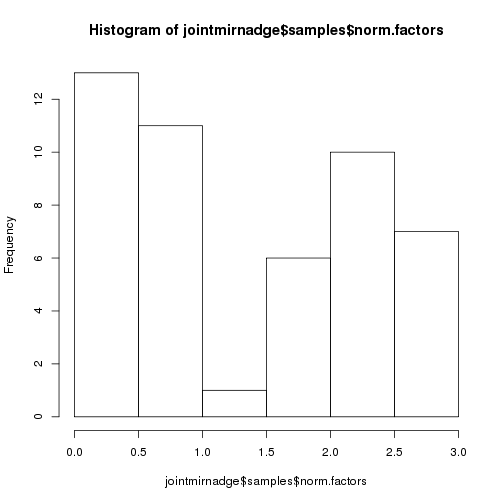
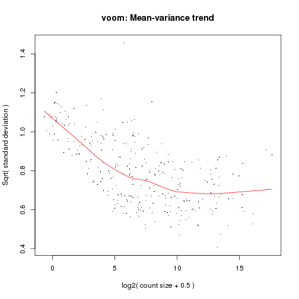
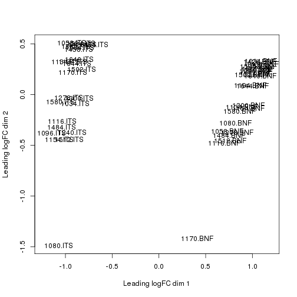
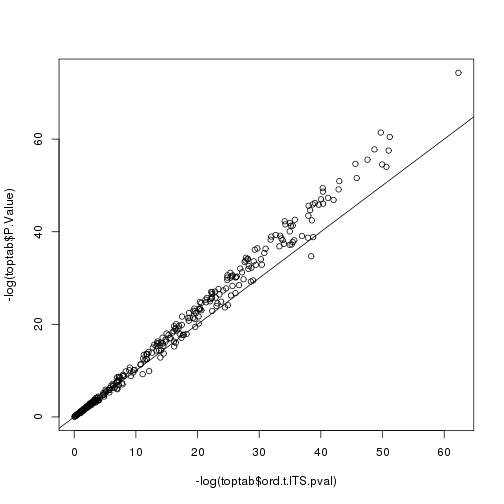
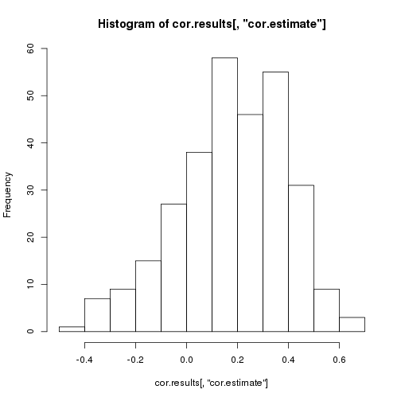
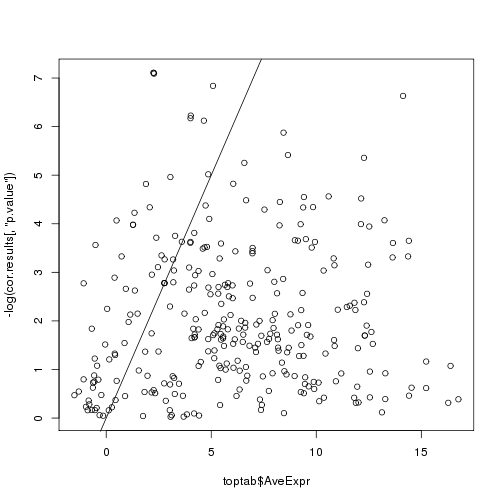
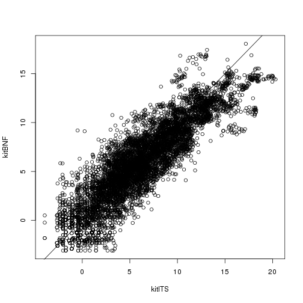
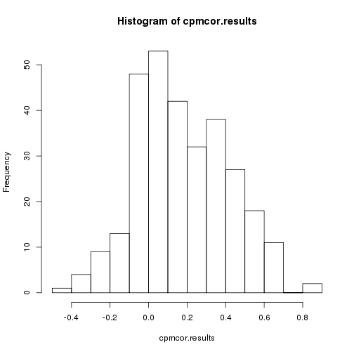
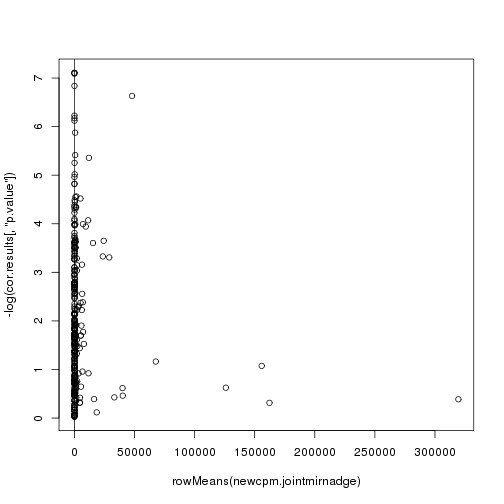
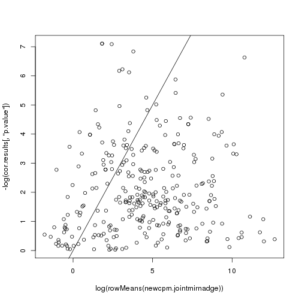

**Script:** `1_voom_de_analysis.R`

**Directory of Code:**  `/mnt/research/pigeqtl/analyses/microRNA/3_pcr_duplication_analysis/5_voom_de_analysis/scripts`

**Date:**  09/08/16

**Input File Directory:**  

1. `/mnt/research/pigeqtl/analyses/microRNA/3_pcr_duplication_analysis/4_join_datasets_dge_object`

**Input File(s):**

1. `3_joint_mirna_expression_df.Rdata`
2. `1_mature_mirna_annotation.Rdata`

**Output File Directory:** 

1. `/mnt/research/pigeqtl/analyses/microRNA/3_pcr_duplication_analysis/5_voom_de_analysis/`

**Output File(s):** 

1. `1_voom_de_analysis_cor.results.Rdata`

**Table of contents:**

1. [Objectives](#objectives)
2. [Install libraries](#install-libraries)
3. [Load data](#load-data)
4. [Analysis](#analysis)
5. [Save data](#save-data)
## Objectives
The objective of this script is to conduct a differential expression analysis of the 24 libraries sequenced with both the Illumina TruSeq kit and the Bioo Scientific NEXTFlex v2 library prep kit.
This analysis will utilize voom and the limma pipeline to compare cor.results with those obtained using edgeR.

## Install libraries


```r
library(methods)
library(limma)
library(edgeR)
library(qvalue)

sessionInfo()
```

```
## R version 3.2.0 (2015-04-16)
## Platform: x86_64-unknown-linux-gnu (64-bit)
## Running under: CentOS release 6.6 (Final)
## 
## locale:
##  [1] LC_CTYPE=en_US.UTF-8       LC_NUMERIC=C              
##  [3] LC_TIME=en_US.UTF-8        LC_COLLATE=en_US.UTF-8    
##  [5] LC_MONETARY=en_US.UTF-8    LC_MESSAGES=en_US.UTF-8   
##  [7] LC_PAPER=en_US.UTF-8       LC_NAME=C                 
##  [9] LC_ADDRESS=C               LC_TELEPHONE=C            
## [11] LC_MEASUREMENT=en_US.UTF-8 LC_IDENTIFICATION=C       
## 
## attached base packages:
## [1] methods   stats     graphics  grDevices utils     datasets  base     
## 
## other attached packages:
## [1] qvalue_2.2.2 edgeR_3.12.1 limma_3.26.9 knitr_1.14  
## 
## loaded via a namespace (and not attached):
##  [1] Rcpp_0.12.7      grid_3.2.0       plyr_1.8.4       gtable_0.2.0    
##  [5] magrittr_1.5     evaluate_0.9     scales_0.4.0     ggplot2_2.1.0   
##  [9] stringi_1.1.1    reshape2_1.4.1   splines_3.2.0    tools_3.2.0     
## [13] stringr_1.1.0    munsell_0.4.3    colorspace_1.2-6
```

## Load data


```r
rm(list=ls())

setwd("/mnt/research/pigeqtl/analyses/microRNA/3_pcr_duplication_analysis/5_voom_de_analysis/scripts")

load("../../4_join_datasets_dge_object/3_joint_mirna_expression_df.Rdata")

load("../../4_join_datasets_dge_object/1_mature_mirna_annotation.Rdata")
```

## Analysis


```r
dim(jointmirnaexp)
```

```
## [1] 411  48
```

```r
head(jointmirnaexp)
```

```
##               1034.ITS 1058.ITS 1080.ITS 1096.ITS 1116.ITS 1134.ITS
## ssc-let-7a       24174    53646     6014    57852    56632    61338
## ssc-let-7c        3001     5920     1765     8426     7084     6985
## ssc-let-7d-3p      211      232     2040      643      661      493
## ssc-let-7d-5p     1246     3067      364     3617     3382     3228
## ssc-let-7e        1026     2068      270     2582     2601     2377
## ssc-let-7f       13892    37998     2129    19620    25098    47539
##               1154.ITS 1170.ITS 1194.ITS 1240.ITS 1278.ITS 1300.ITS
## ssc-let-7a       59234    57940    35574    35545    39448    36966
## ssc-let-7c        8230     6396     3996     6624     6101     4591
## ssc-let-7d-3p      702      338      220     1540      518      407
## ssc-let-7d-5p     3280     3155     1868     2272     2115     2202
## ssc-let-7e        2446     2395     1102     1404     1569     1309
## ssc-let-7f       18634    41082    27064    25634    26353    20856
##               1426.ITS 1434.ITS 1458.ITS 1484.ITS 1502.ITS 1512.ITS
## ssc-let-7a       76446   219999    96168   106308    19862    14706
## ssc-let-7c        8332    29347    10912    13799     1940     2532
## ssc-let-7d-3p      337     1643      405     1110       95      580
## ssc-let-7d-5p     4586    11705     5192     5524     1245     1030
## ssc-let-7e        3011     8544     3578     4294      783      702
## ssc-let-7f       58404   203564    67330    37886    13534     7414
##               1534.ITS 1580.ITS 1594.ITS 1640.ITS 1644.ITS 1662.ITS
## ssc-let-7a       34628    78745   124874    42307    29834    47926
## ssc-let-7c        3603     9650    13632     3856     3160     5098
## ssc-let-7d-3p      156      524      624      213      170      245
## ssc-let-7d-5p     2010     5003     7418     2827     1795     2578
## ssc-let-7e        1382     3137     5032     1682     1503     1731
## ssc-let-7f       26159    38624   103978    35902    20510    36414
##               1034.BNF 1058.BNF 1080.BNF 1096.BNF 1116.BNF 1134.BNF
## ssc-let-7a       48132    40758    38799    35977    36678    59997
## ssc-let-7c       32745    34313    28022    20772    29022    45232
## ssc-let-7d-3p      381      778      774      440      710     1071
## ssc-let-7d-5p     4925     3472     3705     3259     3083     6661
## ssc-let-7e        2811     2512     2229     1898     2069     3942
## ssc-let-7f       35432    16512    19175    29076    13446    34402
##               1154.BNF 1170.BNF 1194.BNF 1240.BNF 1278.BNF 1300.BNF
## ssc-let-7a       49982     2366    30864    35912    15876    28829
## ssc-let-7c       37824     3077    17962    24015    14181    21753
## ssc-let-7d-3p      750      525      256      269     1033      652
## ssc-let-7d-5p     5225      175     2588     3037     1356     2545
## ssc-let-7e        2481       75     1716     1752      557     1383
## ssc-let-7f       29411      576    20800    27197    10064    18572
##               1426.BNF 1434.BNF 1458.BNF 1484.BNF 1502.BNF 1512.BNF
## ssc-let-7a       33168    28218    28524    32304    47522    20253
## ssc-let-7c       20260    18147    17704    24491    28812    17415
## ssc-let-7d-3p      170      212      147      566      383      979
## ssc-let-7d-5p     3037     2058     2518     2799     4754     1831
## ssc-let-7e        1968     1413     1225     1786     3047      996
## ssc-let-7f       24686    20088    20538    12570    35356    10026
##               1534.BNF 1580.BNF 1594.BNF 1640.BNF 1644.BNF 1662.BNF
## ssc-let-7a       27358    35516    36868    37179    38866    39304
## ssc-let-7c       16277    25721    22762    19671    24475    25909
## ssc-let-7d-3p      180      492      334      271      306      417
## ssc-let-7d-5p     2315     3304     3616     3814     3651     3820
## ssc-let-7e        1532     1880     2096     2017     2711     2262
## ssc-let-7f       20536    19231    27982    30385    27878    29883
```

### 1. Create the dge object


```r
jointmirnadge<-DGEList(counts=jointmirnaexp, genes=illumina24.total.mature.annot2)
names(jointmirnadge)
```

```
## [1] "counts"  "samples" "genes"
```

```r
dim(jointmirnadge$counts)
```

```
## [1] 411  48
```

```r
head(jointmirnadge$counts)
```

```
##               1034.ITS 1058.ITS 1080.ITS 1096.ITS 1116.ITS 1134.ITS
## ssc-let-7a       24174    53646     6014    57852    56632    61338
## ssc-let-7c        3001     5920     1765     8426     7084     6985
## ssc-let-7d-3p      211      232     2040      643      661      493
## ssc-let-7d-5p     1246     3067      364     3617     3382     3228
## ssc-let-7e        1026     2068      270     2582     2601     2377
## ssc-let-7f       13892    37998     2129    19620    25098    47539
##               1154.ITS 1170.ITS 1194.ITS 1240.ITS 1278.ITS 1300.ITS
## ssc-let-7a       59234    57940    35574    35545    39448    36966
## ssc-let-7c        8230     6396     3996     6624     6101     4591
## ssc-let-7d-3p      702      338      220     1540      518      407
## ssc-let-7d-5p     3280     3155     1868     2272     2115     2202
## ssc-let-7e        2446     2395     1102     1404     1569     1309
## ssc-let-7f       18634    41082    27064    25634    26353    20856
##               1426.ITS 1434.ITS 1458.ITS 1484.ITS 1502.ITS 1512.ITS
## ssc-let-7a       76446   219999    96168   106308    19862    14706
## ssc-let-7c        8332    29347    10912    13799     1940     2532
## ssc-let-7d-3p      337     1643      405     1110       95      580
## ssc-let-7d-5p     4586    11705     5192     5524     1245     1030
## ssc-let-7e        3011     8544     3578     4294      783      702
## ssc-let-7f       58404   203564    67330    37886    13534     7414
##               1534.ITS 1580.ITS 1594.ITS 1640.ITS 1644.ITS 1662.ITS
## ssc-let-7a       34628    78745   124874    42307    29834    47926
## ssc-let-7c        3603     9650    13632     3856     3160     5098
## ssc-let-7d-3p      156      524      624      213      170      245
## ssc-let-7d-5p     2010     5003     7418     2827     1795     2578
## ssc-let-7e        1382     3137     5032     1682     1503     1731
## ssc-let-7f       26159    38624   103978    35902    20510    36414
##               1034.BNF 1058.BNF 1080.BNF 1096.BNF 1116.BNF 1134.BNF
## ssc-let-7a       48132    40758    38799    35977    36678    59997
## ssc-let-7c       32745    34313    28022    20772    29022    45232
## ssc-let-7d-3p      381      778      774      440      710     1071
## ssc-let-7d-5p     4925     3472     3705     3259     3083     6661
## ssc-let-7e        2811     2512     2229     1898     2069     3942
## ssc-let-7f       35432    16512    19175    29076    13446    34402
##               1154.BNF 1170.BNF 1194.BNF 1240.BNF 1278.BNF 1300.BNF
## ssc-let-7a       49982     2366    30864    35912    15876    28829
## ssc-let-7c       37824     3077    17962    24015    14181    21753
## ssc-let-7d-3p      750      525      256      269     1033      652
## ssc-let-7d-5p     5225      175     2588     3037     1356     2545
## ssc-let-7e        2481       75     1716     1752      557     1383
## ssc-let-7f       29411      576    20800    27197    10064    18572
##               1426.BNF 1434.BNF 1458.BNF 1484.BNF 1502.BNF 1512.BNF
## ssc-let-7a       33168    28218    28524    32304    47522    20253
## ssc-let-7c       20260    18147    17704    24491    28812    17415
## ssc-let-7d-3p      170      212      147      566      383      979
## ssc-let-7d-5p     3037     2058     2518     2799     4754     1831
## ssc-let-7e        1968     1413     1225     1786     3047      996
## ssc-let-7f       24686    20088    20538    12570    35356    10026
##               1534.BNF 1580.BNF 1594.BNF 1640.BNF 1644.BNF 1662.BNF
## ssc-let-7a       27358    35516    36868    37179    38866    39304
## ssc-let-7c       16277    25721    22762    19671    24475    25909
## ssc-let-7d-3p      180      492      334      271      306      417
## ssc-let-7d-5p     2315     3304     3616     3814     3651     3820
## ssc-let-7e        1532     1880     2096     2017     2711     2262
## ssc-let-7f       20536    19231    27982    30385    27878    29883
```

```r
jointmirnadge$samples
```

```
##          group lib.size norm.factors
## 1034.ITS     1  1837116            1
## 1058.ITS     1  3712023            1
## 1080.ITS     1  1838011            1
## 1096.ITS     1  3533423            1
## 1116.ITS     1  3390992            1
## 1134.ITS     1  4031993            1
## 1154.ITS     1  3468560            1
## 1170.ITS     1  3452760            1
## 1194.ITS     1  3047581            1
## 1240.ITS     1  3941710            1
## 1278.ITS     1  2993782            1
## 1300.ITS     1  2477073            1
## 1426.ITS     1  4632932            1
## 1434.ITS     1 12115255            1
## 1458.ITS     1  7166260            1
## 1484.ITS     1  6026289            1
## 1502.ITS     1  1121402            1
## 1512.ITS     1  1255147            1
## 1534.ITS     1  2143878            1
## 1580.ITS     1  4633132            1
## 1594.ITS     1  8660105            1
## 1640.ITS     1  2775204            1
## 1644.ITS     1  2135040            1
## 1662.ITS     1  3449438            1
## 1034.BNF     1  1462358            1
## 1058.BNF     1  1257197            1
## 1080.BNF     1  1109738            1
## 1096.BNF     1  1182030            1
## 1116.BNF     1  1057987            1
## 1134.BNF     1  1582559            1
## 1154.BNF     1  1476707            1
## 1170.BNF     1   223934            1
## 1194.BNF     1   917965            1
## 1240.BNF     1  1133876            1
## 1278.BNF     1   765335            1
## 1300.BNF     1   958081            1
## 1426.BNF     1   961236            1
## 1434.BNF     1   823729            1
## 1458.BNF     1   910724            1
## 1484.BNF     1  1069564            1
## 1502.BNF     1  1088339            1
## 1512.BNF     1   650729            1
## 1534.BNF     1   700713            1
## 1580.BNF     1   939869            1
## 1594.BNF     1  1154715            1
## 1640.BNF     1   887635            1
## 1644.BNF     1   787899            1
## 1662.BNF     1  1181022            1
```

### 2. Filter the joint expression dataset (dge object)
First, eliminate miRNAs whose total expression is 0 among the datasets


```r
sum(rowSums(jointmirnadge$counts) == 0)
```

```
## [1] 78
```

So, 78 miRNAs have 0 expression among the datasets


```r
jointmirnadge<-jointmirnadge[rowSums(jointmirnadge$counts)>0,]
dim(jointmirnadge)
```

```
## [1] 333  48
```

Calculate the read counts per million in order to filter miRNAs by normalized expression:


```r
cpm.jointmirnadge<-cpm(jointmirnadge)
dim(cpm.jointmirnadge)
```

```
## [1] 333  48
```

```r
cpm.jointmirnadge[1:5,1:5]
```

```
##                 1034.ITS    1058.ITS  1080.ITS   1096.ITS   1116.ITS
## ssc-let-7a    13158.6683 14451.95787 3272.0152 16372.7920 16700.7177
## ssc-let-7c     1633.5387  1594.81770  960.2772  2384.6565  2089.0642
## ssc-let-7d-3p   114.8539    62.49961 1109.8954   181.9765   194.9282
## ssc-let-7d-5p   678.2370   826.23410  198.0402  1023.6533   997.3483
## ssc-let-7e      558.4841   557.10862  146.8979   730.7362   767.0322
```

Filter miRNAs with at least 1 cpm in at least 1/4 of the samples (24/4=6)


```r
filtercpm<-rowSums(cpm.jointmirnadge>=1)>=6
sum(filtercpm)
```

```
## [1] 299
```

```r
nrow(cpm.jointmirnadge) - sum(filtercpm)
```

```
## [1] 34
```

We are removing 34 miRNA profiles from the analysis

So, keep the miRNA profiles in dge based on those retained in the cpm-filtering step:

This retains the rounded, mean read counts, not the cpm (this will be done later):


```r
jointmirnadge<-jointmirnadge[filtercpm,]
names(jointmirnadge)
```

```
## [1] "counts"  "samples" "genes"
```

```r
jointmirnadge[1:5,1:5]
```

```
## An object of class "DGEList"
## $counts
##               1034.ITS 1058.ITS 1080.ITS 1096.ITS 1116.ITS
## ssc-let-7a       24174    53646     6014    57852    56632
## ssc-let-7c        3001     5920     1765     8426     7084
## ssc-let-7d-3p      211      232     2040      643      661
## ssc-let-7d-5p     1246     3067      364     3617     3382
## ssc-let-7e        1026     2068      270     2582     2601
## 
## $samples
##          group lib.size norm.factors
## 1034.ITS     1  1837116            1
## 1058.ITS     1  3712023            1
## 1080.ITS     1  1838011            1
## 1096.ITS     1  3533423            1
## 1116.ITS     1  3390992            1
## 
## $genes
##                        Name  chr0     start       end width strand  type
## ssc-let-7a       ssc-let-7a  chr3  44864443  44864464    22      + miRNA
## ssc-let-7c       ssc-let-7c chr13 191559351 191559372    22      + miRNA
## ssc-let-7d-3p ssc-let-7d-3p  chr3  44867331  44867352    22      + miRNA
## ssc-let-7d-5p ssc-let-7d-5p  chr3  44867277  44867298    22      + miRNA
## ssc-let-7e       ssc-let-7e  chr6  51858385  51858406    22      + miRNA
##                      Alias          Precursors
## ssc-let-7a    MIMAT0013865 MI0017984,MI0013085
## ssc-let-7c    MIMAT0002151           MI0002445
## ssc-let-7d-3p MIMAT0025357           MI0022120
## ssc-let-7d-5p MIMAT0025356           MI0022120
## ssc-let-7e    MIMAT0013866           MI0013086
```

```r
dim(jointmirnadge$counts)
```

```
## [1] 299  48
```

```r
if (sum(colnames(jointmirnadge)!=colnames(cpm.jointmirnadge))!=0) stop ("colnames not the same between dge and cpm.jointmirnadge")
```

Apply the TMM normalization (normalizes for RNA composition by finding a set of scaling factors for the library sizes that minimize the log-fold changes between the samples for the most genes):

The result is the effective library size, which is equal to the product of the original library size and the scaling factor. Effective library size is what is used in downstream analyses.


```r
jointmirnadge<-calcNormFactors(jointmirnadge)
jointmirnadge$samples
```

```
##          group lib.size norm.factors
## 1034.ITS     1  1837116    0.5858137
## 1058.ITS     1  3712023    0.4434860
## 1080.ITS     1  1838011    0.3657435
## 1096.ITS     1  3533423    0.5956029
## 1116.ITS     1  3390992    0.5951298
## 1134.ITS     1  4031993    0.4106749
## 1154.ITS     1  3468560    0.5835953
## 1170.ITS     1  3452760    0.5261668
## 1194.ITS     1  3047581    0.3469001
## 1240.ITS     1  3941710    0.6271393
## 1278.ITS     1  2993782    0.5798180
## 1300.ITS     1  2477073    0.5274844
## 1426.ITS     1  4632932    0.4446734
## 1434.ITS     1 12115255    0.6349976
## 1458.ITS     1  7166260    0.3679400
## 1484.ITS     1  6026289    0.5022787
## 1502.ITS     1  1121402    0.4536061
## 1512.ITS     1  1255147    0.5876734
## 1534.ITS     1  2143878    0.3535257
## 1580.ITS     1  4633132    0.4313204
## 1594.ITS     1  8660105    0.3655995
## 1640.ITS     1  2775204    0.3551187
## 1644.ITS     1  2135040    0.3096507
## 1662.ITS     1  3449438    0.3557918
## 1034.BNF     1  1462358    2.5755196
## 1058.BNF     1  1257197    2.7635060
## 1080.BNF     1  1109738    2.7181325
## 1096.BNF     1  1182030    2.1530688
## 1116.BNF     1  1057987    2.6468326
## 1134.BNF     1  1582559    2.7060602
## 1154.BNF     1  1476707    2.9002032
## 1170.BNF     1   223934    1.1036254
## 1194.BNF     1   917965    2.1222083
## 1240.BNF     1  1133876    1.9743159
## 1278.BNF     1   765335    1.8946419
## 1300.BNF     1   958081    2.2021523
## 1426.BNF     1   961236    2.0393939
## 1434.BNF     1   823729    2.1485872
## 1458.BNF     1   910724    2.1852161
## 1484.BNF     1  1069564    2.8491267
## 1502.BNF     1  1088339    1.9256647
## 1512.BNF     1   650729    1.8755739
## 1534.BNF     1   700713    1.6815548
## 1580.BNF     1   939869    2.3927425
## 1594.BNF     1  1154715    2.1591441
## 1640.BNF     1   887635    2.0219513
## 1644.BNF     1   787899    1.9084893
## 1662.BNF     1  1181022    2.1150624
```

```r
hist(jointmirnadge$samples$norm.factors)
```



```r
summary(jointmirnadge$samples$norm.factors)
```

```
##    Min. 1st Qu.  Median    Mean 3rd Qu.    Max. 
##  0.3097  0.4514  0.8693  1.3420  2.1500  2.9000
```

This function (estimateCommonDisp) applies normalization factors, caluclates normalized expression based on robust count of normalized reads.

estimateCommonDisp estimates the quantile-adjusted conditional maximum likelihood (qCML) common dispersion.

This creates a matrix of pseudo-counts, used internally to speed up computation of conditional likelihood used for dispersion estimation & exact tests in the limma pipeline.
Pseudo-counts represent the equivalent counts that would have been observed had the library sizes all been equal, assuming the fitted model.
DO NOT INTERPRET PSEUDO-COUNTS AS GENERAL-PURPOSE NORMALIZED COUNTS.


```r
jointmirnadge<-estimateCommonDisp(jointmirnadge,verbose=TRUE)
```

```
## Disp = 0.58339 , BCV = 0.7638
```

```r
jointmirnadge$common.dispersion
```

```
## [1] 0.5833887
```

```r
newcpm.jointmirnadge<-cpm(jointmirnadge)
head(newcpm.jointmirnadge)
```

```
##                 1034.ITS  1058.ITS  1080.ITS   1096.ITS  1116.ITS
## ssc-let-7a    22462.2057 32587.177 8946.2018 27489.4440 28062.311
## ssc-let-7c     2788.4951  3596.095 2625.5481  4003.7692  3510.266
## ssc-let-7d-3p   196.0588   140.928 3034.6278   305.5333   327.539
## ssc-let-7d-5p  1157.7690  1863.044  541.4728  1718.6842  1675.850
## ssc-let-7e      953.3475  1256.203  401.6419  1226.8849  1288.849
## ssc-let-7f    12908.2883 23081.824 3167.0209  9322.8046 12436.571
##                 1134.ITS   1154.ITS   1170.ITS   1194.ITS   1240.ITS
## ssc-let-7a    37043.4753 29262.4065 31892.5078 33649.0674 14379.0383
## ssc-let-7c     4218.4074  4065.7326  3520.6158  3779.7738  2679.6103
## ssc-let-7d-3p   297.7344   346.7976   186.0488   208.0957   622.9770
## ssc-let-7d-5p  1949.4659  1620.3649  1736.6390  1766.9213   919.0934
## ssc-let-7e     1435.5268  1208.3575  1318.3044  1042.3701   567.9609
## ssc-let-7f    28709.9314  9205.4510 22613.1861 25599.5491 10369.7360
##                 1278.ITS   1300.ITS  1426.ITS   1434.ITS  1458.ITS
## ssc-let-7a    22725.4831 28291.3724 37107.158 28596.7087 36472.124
## ssc-let-7c     3514.7073  3513.6528  4044.382  3814.6883  4138.423
## ssc-let-7d-3p   298.4131   311.4913   163.581   213.5664   153.598
## ssc-let-7d-5p  1218.4242  1685.2676  2226.061  1521.4818  1969.088
## ssc-let-7e      903.8806  1001.8235  1461.550  1110.5972  1356.972
## ssc-let-7f    15181.6228 15961.8261 28349.507 26460.3949 25535.190
##                 1484.ITS   1502.ITS   1512.ITS   1534.ITS   1580.ITS
## ssc-let-7a    35121.3492 39046.5612 19937.1892 45688.4451 39404.7303
## ssc-let-7c     4558.8243  3813.8319  3432.6780  4753.8255  4828.9497
## ssc-let-7d-3p   366.7146   186.7598   786.3165   205.8276   262.2145
## ssc-let-7d-5p  1824.9834  2447.5364  1396.3896  2652.0092  2503.5477
## ssc-let-7e     1418.6239  1539.2940   951.7141  1823.4213  1569.7840
## ssc-let-7f    12516.5315 26606.3921 10051.2934 34514.3825 19327.8088
##                1594.ITS   1640.ITS   1644.ITS   1662.ITS   1034.BNF
## ssc-let-7a    39440.573 42928.3113 45126.6852 39050.5228 12779.5436
## ssc-let-7c     4305.571  3912.6284  4779.7924  4153.8949  8694.1360
## ssc-let-7d-3p   197.086   216.1281   257.1407   199.6281   101.1594
## ssc-let-7d-5p  2342.923  2868.5167  2715.1036  2100.5769  1307.6384
## ssc-let-7e     1589.322  1706.7015  2273.4266  1410.4339   746.3496
## ssc-let-7f    32840.719 36429.2489 31023.2725 29670.4448  9407.5623
##                 1058.BNF   1080.BNF   1096.BNF   1116.BNF   1134.BNF
## ssc-let-7a    11731.3806 12862.6203 14136.3904 13097.8145 14009.8078
## ssc-let-7c     9876.3154  9289.8359  8161.9118 10363.8359 10562.0552
## ssc-let-7d-3p   223.9318   256.5960   172.8886   253.5429   250.0876
## ssc-let-7d-5p   999.3462  1228.2793  1280.5541  1100.9478  1555.3999
## ssc-let-7e      723.0293   738.9567   745.7784   738.8456   920.4904
## ssc-let-7f     4752.6512  6356.8840 11424.7905  4801.6035  8033.1585
##                 1154.BNF   1170.BNF   1194.BNF   1240.BNF   1278.BNF
## ssc-let-7a    11670.5379  9573.5504 15843.0240 16041.9588 10948.6956
## ssc-let-7c     8831.7080 12450.4710  9220.2047 10727.5462  9779.7589
## ssc-let-7d-3p   175.1211  2124.3085   131.4092   120.1628   712.3962
## ssc-let-7d-5p  1220.0104   708.1028  1328.4651  1356.6337   935.1494
## ssc-let-7e      579.3006   303.4726   880.8524   782.6217   384.1285
## ssc-let-7f     6867.3161  2330.6699 10676.9991 12148.9517  6940.5186
##                 1300.BNF   1426.BNF   1434.BNF    1458.BNF   1484.BNF
## ssc-let-7a    13664.0678 16919.5241 15943.6919 14332.74132 10600.7784
## ssc-let-7c    10310.2593 10334.9481 10253.3906  8895.90703  8036.8890
## ssc-let-7d-3p   309.0281    86.7197   119.7839    73.86457   185.7368
## ssc-let-7d-5p  1206.2525  1549.2220  1162.8081  1265.24480   918.5110
## ssc-let-7e      655.4999  1003.9081   798.3711   615.53808   586.0881
## ssc-let-7f     8802.5622 12592.7210 11350.0915 10319.93553  4124.9314
##                 1502.BNF   1512.BNF   1534.BNF   1580.BNF   1594.BNF
## ssc-let-7a    22675.1336 16594.1503 23218.4456 15792.8588 14787.4451
## ssc-let-7c    13747.6527 14268.8554 13814.1180 11437.3275  9129.6470
## ssc-let-7d-3p   182.7485   802.1366   152.7641   218.7771   133.9646
## ssc-let-7d-5p  2268.3722  1500.2167  1964.7160  1469.1859  1450.3472
## ssc-let-7e     1453.8768   816.0655  1300.1922   835.9774   840.6880
## ssc-let-7f    16870.1238  8214.7312 17428.6863  8551.4266 11223.3451
##                 1640.BNF   1644.BNF   1662.BNF
## ssc-let-7a    20715.3650 25846.9661 15734.5953
## ssc-let-7c    10960.2718 16276.5527 10372.1664
## ssc-let-7d-3p   150.9956   203.4985   166.9379
## ssc-let-7d-5p  2125.0814  2428.0161  1529.2630
## ssc-let-7e     1123.8304  1802.8901   905.5479
## ssc-let-7f    16929.8896 18539.6419 11963.0804
```

### 3. Apply the voom transformation and build the design matrix

First, create factors of individual and kit to create the design matrix:


```r
indiv<-factor(substr(colnames(jointmirnadge$counts), 1, 4))
head(indiv)
```

```
## [1] 1034 1058 1080 1096 1116 1134
## 24 Levels: 1034 1058 1080 1096 1116 1134 1154 1170 1194 1240 1278 ... 1662
```

```r
str(indiv)
```

```
##  Factor w/ 24 levels "1034","1058",..: 1 2 3 4 5 6 7 8 9 10 ...
```

```r
kit<-factor(rep(c("ITS", "BNF"), c(24,24)))
kit
```

```
##  [1] ITS ITS ITS ITS ITS ITS ITS ITS ITS ITS ITS ITS ITS ITS ITS ITS ITS
## [18] ITS ITS ITS ITS ITS ITS ITS BNF BNF BNF BNF BNF BNF BNF BNF BNF BNF
## [35] BNF BNF BNF BNF BNF BNF BNF BNF BNF BNF BNF BNF BNF BNF
## Levels: BNF ITS
```

```r
str(kit)
```

```
##  Factor w/ 2 levels "BNF","ITS": 2 2 2 2 2 2 2 2 2 2 ...
```

View this as a data.frame to check for correctness:


```r
data.frame(Sample=colnames(jointmirnadge$counts), indiv, kit)
```

```
##      Sample indiv kit
## 1  1034.ITS  1034 ITS
## 2  1058.ITS  1058 ITS
## 3  1080.ITS  1080 ITS
## 4  1096.ITS  1096 ITS
## 5  1116.ITS  1116 ITS
## 6  1134.ITS  1134 ITS
## 7  1154.ITS  1154 ITS
## 8  1170.ITS  1170 ITS
## 9  1194.ITS  1194 ITS
## 10 1240.ITS  1240 ITS
## 11 1278.ITS  1278 ITS
## 12 1300.ITS  1300 ITS
## 13 1426.ITS  1426 ITS
## 14 1434.ITS  1434 ITS
## 15 1458.ITS  1458 ITS
## 16 1484.ITS  1484 ITS
## 17 1502.ITS  1502 ITS
## 18 1512.ITS  1512 ITS
## 19 1534.ITS  1534 ITS
## 20 1580.ITS  1580 ITS
## 21 1594.ITS  1594 ITS
## 22 1640.ITS  1640 ITS
## 23 1644.ITS  1644 ITS
## 24 1662.ITS  1662 ITS
## 25 1034.BNF  1034 BNF
## 26 1058.BNF  1058 BNF
## 27 1080.BNF  1080 BNF
## 28 1096.BNF  1096 BNF
## 29 1116.BNF  1116 BNF
## 30 1134.BNF  1134 BNF
## 31 1154.BNF  1154 BNF
## 32 1170.BNF  1170 BNF
## 33 1194.BNF  1194 BNF
## 34 1240.BNF  1240 BNF
## 35 1278.BNF  1278 BNF
## 36 1300.BNF  1300 BNF
## 37 1426.BNF  1426 BNF
## 38 1434.BNF  1434 BNF
## 39 1458.BNF  1458 BNF
## 40 1484.BNF  1484 BNF
## 41 1502.BNF  1502 BNF
## 42 1512.BNF  1512 BNF
## 43 1534.BNF  1534 BNF
## 44 1580.BNF  1580 BNF
## 45 1594.BNF  1594 BNF
## 46 1640.BNF  1640 BNF
## 47 1644.BNF  1644 BNF
## 48 1662.BNF  1662 BNF
```

Use the model.matrix() command to create the design matrix for this analysis:


```r
design <- model.matrix(~indiv+kit)
rownames(design)<-colnames(jointmirnadge$counts)
design
```

```
##          (Intercept) indiv1058 indiv1080 indiv1096 indiv1116 indiv1134
## 1034.ITS           1         0         0         0         0         0
## 1058.ITS           1         1         0         0         0         0
## 1080.ITS           1         0         1         0         0         0
## 1096.ITS           1         0         0         1         0         0
## 1116.ITS           1         0         0         0         1         0
## 1134.ITS           1         0         0         0         0         1
## 1154.ITS           1         0         0         0         0         0
## 1170.ITS           1         0         0         0         0         0
## 1194.ITS           1         0         0         0         0         0
## 1240.ITS           1         0         0         0         0         0
## 1278.ITS           1         0         0         0         0         0
## 1300.ITS           1         0         0         0         0         0
## 1426.ITS           1         0         0         0         0         0
## 1434.ITS           1         0         0         0         0         0
## 1458.ITS           1         0         0         0         0         0
## 1484.ITS           1         0         0         0         0         0
## 1502.ITS           1         0         0         0         0         0
## 1512.ITS           1         0         0         0         0         0
## 1534.ITS           1         0         0         0         0         0
## 1580.ITS           1         0         0         0         0         0
## 1594.ITS           1         0         0         0         0         0
## 1640.ITS           1         0         0         0         0         0
## 1644.ITS           1         0         0         0         0         0
## 1662.ITS           1         0         0         0         0         0
## 1034.BNF           1         0         0         0         0         0
## 1058.BNF           1         1         0         0         0         0
## 1080.BNF           1         0         1         0         0         0
## 1096.BNF           1         0         0         1         0         0
## 1116.BNF           1         0         0         0         1         0
## 1134.BNF           1         0         0         0         0         1
## 1154.BNF           1         0         0         0         0         0
## 1170.BNF           1         0         0         0         0         0
## 1194.BNF           1         0         0         0         0         0
## 1240.BNF           1         0         0         0         0         0
## 1278.BNF           1         0         0         0         0         0
## 1300.BNF           1         0         0         0         0         0
## 1426.BNF           1         0         0         0         0         0
## 1434.BNF           1         0         0         0         0         0
## 1458.BNF           1         0         0         0         0         0
## 1484.BNF           1         0         0         0         0         0
## 1502.BNF           1         0         0         0         0         0
## 1512.BNF           1         0         0         0         0         0
## 1534.BNF           1         0         0         0         0         0
## 1580.BNF           1         0         0         0         0         0
## 1594.BNF           1         0         0         0         0         0
## 1640.BNF           1         0         0         0         0         0
## 1644.BNF           1         0         0         0         0         0
## 1662.BNF           1         0         0         0         0         0
##          indiv1154 indiv1170 indiv1194 indiv1240 indiv1278 indiv1300
## 1034.ITS         0         0         0         0         0         0
## 1058.ITS         0         0         0         0         0         0
## 1080.ITS         0         0         0         0         0         0
## 1096.ITS         0         0         0         0         0         0
## 1116.ITS         0         0         0         0         0         0
## 1134.ITS         0         0         0         0         0         0
## 1154.ITS         1         0         0         0         0         0
## 1170.ITS         0         1         0         0         0         0
## 1194.ITS         0         0         1         0         0         0
## 1240.ITS         0         0         0         1         0         0
## 1278.ITS         0         0         0         0         1         0
## 1300.ITS         0         0         0         0         0         1
## 1426.ITS         0         0         0         0         0         0
## 1434.ITS         0         0         0         0         0         0
## 1458.ITS         0         0         0         0         0         0
## 1484.ITS         0         0         0         0         0         0
## 1502.ITS         0         0         0         0         0         0
## 1512.ITS         0         0         0         0         0         0
## 1534.ITS         0         0         0         0         0         0
## 1580.ITS         0         0         0         0         0         0
## 1594.ITS         0         0         0         0         0         0
## 1640.ITS         0         0         0         0         0         0
## 1644.ITS         0         0         0         0         0         0
## 1662.ITS         0         0         0         0         0         0
## 1034.BNF         0         0         0         0         0         0
## 1058.BNF         0         0         0         0         0         0
## 1080.BNF         0         0         0         0         0         0
## 1096.BNF         0         0         0         0         0         0
## 1116.BNF         0         0         0         0         0         0
## 1134.BNF         0         0         0         0         0         0
## 1154.BNF         1         0         0         0         0         0
## 1170.BNF         0         1         0         0         0         0
## 1194.BNF         0         0         1         0         0         0
## 1240.BNF         0         0         0         1         0         0
## 1278.BNF         0         0         0         0         1         0
## 1300.BNF         0         0         0         0         0         1
## 1426.BNF         0         0         0         0         0         0
## 1434.BNF         0         0         0         0         0         0
## 1458.BNF         0         0         0         0         0         0
## 1484.BNF         0         0         0         0         0         0
## 1502.BNF         0         0         0         0         0         0
## 1512.BNF         0         0         0         0         0         0
## 1534.BNF         0         0         0         0         0         0
## 1580.BNF         0         0         0         0         0         0
## 1594.BNF         0         0         0         0         0         0
## 1640.BNF         0         0         0         0         0         0
## 1644.BNF         0         0         0         0         0         0
## 1662.BNF         0         0         0         0         0         0
##          indiv1426 indiv1434 indiv1458 indiv1484 indiv1502 indiv1512
## 1034.ITS         0         0         0         0         0         0
## 1058.ITS         0         0         0         0         0         0
## 1080.ITS         0         0         0         0         0         0
## 1096.ITS         0         0         0         0         0         0
## 1116.ITS         0         0         0         0         0         0
## 1134.ITS         0         0         0         0         0         0
## 1154.ITS         0         0         0         0         0         0
## 1170.ITS         0         0         0         0         0         0
## 1194.ITS         0         0         0         0         0         0
## 1240.ITS         0         0         0         0         0         0
## 1278.ITS         0         0         0         0         0         0
## 1300.ITS         0         0         0         0         0         0
## 1426.ITS         1         0         0         0         0         0
## 1434.ITS         0         1         0         0         0         0
## 1458.ITS         0         0         1         0         0         0
## 1484.ITS         0         0         0         1         0         0
## 1502.ITS         0         0         0         0         1         0
## 1512.ITS         0         0         0         0         0         1
## 1534.ITS         0         0         0         0         0         0
## 1580.ITS         0         0         0         0         0         0
## 1594.ITS         0         0         0         0         0         0
## 1640.ITS         0         0         0         0         0         0
## 1644.ITS         0         0         0         0         0         0
## 1662.ITS         0         0         0         0         0         0
## 1034.BNF         0         0         0         0         0         0
## 1058.BNF         0         0         0         0         0         0
## 1080.BNF         0         0         0         0         0         0
## 1096.BNF         0         0         0         0         0         0
## 1116.BNF         0         0         0         0         0         0
## 1134.BNF         0         0         0         0         0         0
## 1154.BNF         0         0         0         0         0         0
## 1170.BNF         0         0         0         0         0         0
## 1194.BNF         0         0         0         0         0         0
## 1240.BNF         0         0         0         0         0         0
## 1278.BNF         0         0         0         0         0         0
## 1300.BNF         0         0         0         0         0         0
## 1426.BNF         1         0         0         0         0         0
## 1434.BNF         0         1         0         0         0         0
## 1458.BNF         0         0         1         0         0         0
## 1484.BNF         0         0         0         1         0         0
## 1502.BNF         0         0         0         0         1         0
## 1512.BNF         0         0         0         0         0         1
## 1534.BNF         0         0         0         0         0         0
## 1580.BNF         0         0         0         0         0         0
## 1594.BNF         0         0         0         0         0         0
## 1640.BNF         0         0         0         0         0         0
## 1644.BNF         0         0         0         0         0         0
## 1662.BNF         0         0         0         0         0         0
##          indiv1534 indiv1580 indiv1594 indiv1640 indiv1644 indiv1662
## 1034.ITS         0         0         0         0         0         0
## 1058.ITS         0         0         0         0         0         0
## 1080.ITS         0         0         0         0         0         0
## 1096.ITS         0         0         0         0         0         0
## 1116.ITS         0         0         0         0         0         0
## 1134.ITS         0         0         0         0         0         0
## 1154.ITS         0         0         0         0         0         0
## 1170.ITS         0         0         0         0         0         0
## 1194.ITS         0         0         0         0         0         0
## 1240.ITS         0         0         0         0         0         0
## 1278.ITS         0         0         0         0         0         0
## 1300.ITS         0         0         0         0         0         0
## 1426.ITS         0         0         0         0         0         0
## 1434.ITS         0         0         0         0         0         0
## 1458.ITS         0         0         0         0         0         0
## 1484.ITS         0         0         0         0         0         0
## 1502.ITS         0         0         0         0         0         0
## 1512.ITS         0         0         0         0         0         0
## 1534.ITS         1         0         0         0         0         0
## 1580.ITS         0         1         0         0         0         0
## 1594.ITS         0         0         1         0         0         0
## 1640.ITS         0         0         0         1         0         0
## 1644.ITS         0         0         0         0         1         0
## 1662.ITS         0         0         0         0         0         1
## 1034.BNF         0         0         0         0         0         0
## 1058.BNF         0         0         0         0         0         0
## 1080.BNF         0         0         0         0         0         0
## 1096.BNF         0         0         0         0         0         0
## 1116.BNF         0         0         0         0         0         0
## 1134.BNF         0         0         0         0         0         0
## 1154.BNF         0         0         0         0         0         0
## 1170.BNF         0         0         0         0         0         0
## 1194.BNF         0         0         0         0         0         0
## 1240.BNF         0         0         0         0         0         0
## 1278.BNF         0         0         0         0         0         0
## 1300.BNF         0         0         0         0         0         0
## 1426.BNF         0         0         0         0         0         0
## 1434.BNF         0         0         0         0         0         0
## 1458.BNF         0         0         0         0         0         0
## 1484.BNF         0         0         0         0         0         0
## 1502.BNF         0         0         0         0         0         0
## 1512.BNF         0         0         0         0         0         0
## 1534.BNF         1         0         0         0         0         0
## 1580.BNF         0         1         0         0         0         0
## 1594.BNF         0         0         1         0         0         0
## 1640.BNF         0         0         0         1         0         0
## 1644.BNF         0         0         0         0         1         0
## 1662.BNF         0         0         0         0         0         1
##          kitITS
## 1034.ITS      1
## 1058.ITS      1
## 1080.ITS      1
## 1096.ITS      1
## 1116.ITS      1
## 1134.ITS      1
## 1154.ITS      1
## 1170.ITS      1
## 1194.ITS      1
## 1240.ITS      1
## 1278.ITS      1
## 1300.ITS      1
## 1426.ITS      1
## 1434.ITS      1
## 1458.ITS      1
## 1484.ITS      1
## 1502.ITS      1
## 1512.ITS      1
## 1534.ITS      1
## 1580.ITS      1
## 1594.ITS      1
## 1640.ITS      1
## 1644.ITS      1
## 1662.ITS      1
## 1034.BNF      0
## 1058.BNF      0
## 1080.BNF      0
## 1096.BNF      0
## 1116.BNF      0
## 1134.BNF      0
## 1154.BNF      0
## 1170.BNF      0
## 1194.BNF      0
## 1240.BNF      0
## 1278.BNF      0
## 1300.BNF      0
## 1426.BNF      0
## 1434.BNF      0
## 1458.BNF      0
## 1484.BNF      0
## 1502.BNF      0
## 1512.BNF      0
## 1534.BNF      0
## 1580.BNF      0
## 1594.BNF      0
## 1640.BNF      0
## 1644.BNF      0
## 1662.BNF      0
## attr(,"assign")
##  [1] 0 1 1 1 1 1 1 1 1 1 1 1 1 1 1 1 1 1 1 1 1 1 1 1 2
## attr(,"contrasts")
## attr(,"contrasts")$indiv
## [1] "contr.treatment"
## 
## attr(,"contrasts")$kit
## [1] "contr.treatment"
```

Apply the voom transformation to the dataset


```r
v <- voom(jointmirnadge, design=design, plot=TRUE)
```



```r
names(v)
```

```
## [1] "genes"   "targets" "E"       "weights" "design"
```

```r
dim(v$E)
```

```
## [1] 299  48
```

```r
v$E[1:5,1:5]
```

```
##                1034.ITS 1058.ITS  1080.ITS  1096.ITS  1116.ITS
## ssc-let-7a    14.455240 14.99203 13.127177 14.746602 14.776358
## ssc-let-7c    11.445510 11.81234 11.358809 11.967228 11.777466
## ssc-let-7d-3p  7.618556  7.14192 11.567655  8.256307  8.356613
## ssc-let-7d-5p 10.177709 10.86368  9.082723 10.747288 10.710890
## ssc-let-7e     9.897560 10.29520  8.652433 10.261063 10.332144
```

```r
dim(v$genes)
```

```
## [1] 299   9
```

```r
v$genes[1:5,1:5]
```

```
##                        Name  chr0     start       end width
## ssc-let-7a       ssc-let-7a  chr3  44864443  44864464    22
## ssc-let-7c       ssc-let-7c chr13 191559351 191559372    22
## ssc-let-7d-3p ssc-let-7d-3p  chr3  44867331  44867352    22
## ssc-let-7d-5p ssc-let-7d-5p  chr3  44867277  44867298    22
## ssc-let-7e       ssc-let-7e  chr6  51858385  51858406    22
```

```r
dim(v$weights)
```

```
## [1] 299  48
```

```r
v$weights[1:5,1:5]
```

```
##          [,1]     [,2]     [,3]     [,4]     [,5]
## [1,] 4.434305 4.325550 4.607936 4.277621 4.290733
## [2,] 4.564099 4.657157 4.495777 4.652159 4.651025
## [3,] 3.173222 3.590923 4.143075 3.985525 4.128023
## [4,] 4.433276 4.532074 4.062128 4.582444 4.560713
## [5,] 4.384077 4.490804 3.807967 4.528700 4.524883
```

```r
dim(v$targets)
```

```
## [1] 48  3
```

```r
v$targets[1:5,]
```

```
##          group  lib.size norm.factors
## 1034.ITS     1 1076207.8    0.5858137
## 1058.ITS     1 1646230.4    0.4434860
## 1080.ITS     1  672240.6    0.3657435
## 1096.ITS     1 2104516.9    0.5956029
## 1116.ITS     1 2018080.4    0.5951298
```

```r
dim(v$design)
```

```
## [1] 48 25
```

```r
v$design[1:5,]
```

```
##          (Intercept) indiv1058 indiv1080 indiv1096 indiv1116 indiv1134
## 1034.ITS           1         0         0         0         0         0
## 1058.ITS           1         1         0         0         0         0
## 1080.ITS           1         0         1         0         0         0
## 1096.ITS           1         0         0         1         0         0
## 1116.ITS           1         0         0         0         1         0
##          indiv1154 indiv1170 indiv1194 indiv1240 indiv1278 indiv1300
## 1034.ITS         0         0         0         0         0         0
## 1058.ITS         0         0         0         0         0         0
## 1080.ITS         0         0         0         0         0         0
## 1096.ITS         0         0         0         0         0         0
## 1116.ITS         0         0         0         0         0         0
##          indiv1426 indiv1434 indiv1458 indiv1484 indiv1502 indiv1512
## 1034.ITS         0         0         0         0         0         0
## 1058.ITS         0         0         0         0         0         0
## 1080.ITS         0         0         0         0         0         0
## 1096.ITS         0         0         0         0         0         0
## 1116.ITS         0         0         0         0         0         0
##          indiv1534 indiv1580 indiv1594 indiv1640 indiv1644 indiv1662
## 1034.ITS         0         0         0         0         0         0
## 1058.ITS         0         0         0         0         0         0
## 1080.ITS         0         0         0         0         0         0
## 1096.ITS         0         0         0         0         0         0
## 1116.ITS         0         0         0         0         0         0
##          kitITS
## 1034.ITS      1
## 1058.ITS      1
## 1080.ITS      1
## 1096.ITS      1
## 1116.ITS      1
```

Now be super paranoid that no NAs or missing data exists...


```r
sum(is.na(v$E))
```

```
## [1] 0
```

```r
sum(is.na(v$weights))
```

```
## [1] 0
```

```r
sum(v$E == "NA")
```

```
## [1] 0
```

```r
sum(v$weights == "NA")
```

```
## [1] 0
```

```r
sum(v$E == "NaN")
```

```
## [1] 0
```

```r
sum(v$weights == "NaN")
```

```
## [1] 0
```

... And we're good! Carry on.
Examine the samples for outliers and for other relationships by using the function plotMDS():

This function draws a multi-dimensional scaling plot of the RNA samples in which distances correspond to leading log-fold-changes between each pair of RNA samples.
The leading log-fold-change is the average (root-mean-square) of the largest absolute log-fold-changes between each pair of samples. Can be viewed as unsupervised clustering.


```r
plotMDS(v)
```



### 4. Perform the DE analysis


```r
fit<-lmFit(v, design=design)
names(fit)
```

```
##  [1] "coefficients"     "stdev.unscaled"   "sigma"           
##  [4] "df.residual"      "cov.coefficients" "pivot"           
##  [7] "rank"             "genes"            "Amean"           
## [10] "method"           "design"
```

Residual standard deviations for each gene:


```r
head(fit$sigma)
```

```
## [1] 0.7877583 0.4783440 1.7446601 0.7432025 0.8426782 1.2970885
```

```r
summary(fit$sigma)
```

```
##    Min. 1st Qu.  Median    Mean 3rd Qu.    Max. 
##  0.3538  0.7440  0.9308  1.0050  1.1890  3.4550
```

Compute moderated t-statistics, moderated F-statistics, and log-odds of DE by empirical Bayes moderation of standard errors towards a common value:


```r
fitmodt<-eBayes(fit)
```

```
## Warning in ebayes(fit = fit, proportion = proportion, stdev.coef.lim =
## stdev.coef.lim, : Estimation of var.prior failed - set to default value
```

```r
names(fitmodt)
```

```
##  [1] "coefficients"     "stdev.unscaled"   "sigma"           
##  [4] "df.residual"      "cov.coefficients" "pivot"           
##  [7] "rank"             "genes"            "Amean"           
## [10] "method"           "design"           "df.prior"        
## [13] "s2.prior"         "var.prior"        "proportion"      
## [16] "s2.post"          "t"                "df.total"        
## [19] "p.value"          "lods"             "F"               
## [22] "F.p.value"
```

Summarize the differentially expressed genes between the sequencing kits using tobTable.
The argument "adjust.method = "BH" means using the FDR method to correct for multiple testing.


```r
toptab<-(topTable(fitmodt, coef=ncol(design), n=Inf, adjust.method="BH"))
dim(toptab)
```

```
## [1] 299  15
```

```r
head(toptab)
```

```
##                        Name  chr0    start      end width strand  type
## ssc-miR-22-3p ssc-miR-22-3p  <NA>       NA       NA    NA   <NA>  <NA>
## ssc-miR-191     ssc-miR-191 chr13 34898650 34898672    23      - miRNA
## ssc-miR-206     ssc-miR-206  chr7 52426494 52426515    22      + miRNA
## ssc-miR-152     ssc-miR-152 chr12 24289551 24289571    21      - miRNA
## ssc-miR-26a     ssc-miR-26a  <NA>       NA       NA    NA   <NA>  <NA>
## ssc-miR-1468   ssc-miR-1468  chrX 56757096 56757117    22      - miRNA
##                      Alias Precursors     logFC   AveExpr         t
## ssc-miR-22-3p         <NA>       <NA>  6.680243 14.535158  62.81641
## ssc-miR-191   MIMAT0013876  MI0013095  6.558142 12.550127  40.37406
## ssc-miR-206   MIMAT0013864  MI0013084 -4.271507 12.271906 -39.08351
## ssc-miR-152   MIMAT0013887  MI0013104 -4.502881  8.203495 -35.61736
## ssc-miR-26a           <NA>       <NA>  3.265551 15.232115  35.30260
## ssc-miR-1468  MIMAT0025386  MI0022160  3.639527  9.290465  32.97279
##                    P.Value    adj.P.Val        B
## ssc-miR-22-3p 5.260788e-33 1.572976e-30 64.93152
## ssc-miR-191   2.119949e-27 3.169324e-25 52.65132
## ssc-miR-206   5.440780e-27 5.422645e-25 51.73180
## ssc-miR-152   7.998216e-26 5.978666e-24 49.04401
## ssc-miR-26a   1.033556e-25 6.180662e-24 48.82053
## ssc-miR-1468  7.398920e-25 3.687129e-23 46.86277
```

```r
rownames(toptab)[1:5]
```

```
## [1] "ssc-miR-22-3p" "ssc-miR-191"   "ssc-miR-206"   "ssc-miR-152"  
## [5] "ssc-miR-26a"
```

```r
sum(toptab$adj.P.Val <= 0.05)
```

```
## [1] 240
```

```r
sum(toptab$adj.P.Val <= 0.01)
```

```
## [1] 219
```

The eBayes function is giving a warning message that the var.prior cannot be estimated. 
Investigate manually calculating the unmoderated ("ordinary") t-statistic from the lmFit cor.results and compare the cor.results to the eBayes moderated t-statistics p-values (var.prior = default value)

Manual calculation of t-statistics from lmFit:


```r
ordt<-fit$coef/fit$stdev.unscaled/fit$sigma
rownames(ordt)[1:5]
```

```
## [1] "ssc-let-7a"    "ssc-let-7c"    "ssc-let-7d-3p" "ssc-let-7d-5p"
## [5] "ssc-let-7e"
```

```r
head(ordt)
```

```
##               (Intercept)  indiv1058   indiv1080  indiv1096  indiv1116
## ssc-let-7a       49.83629  0.5509326 -1.79744123  0.5824570  0.4743622
## ssc-let-7c       79.66402  1.2288564  0.02211955  0.9853952  1.3008569
## ssc-let-7d-3p    10.26450  0.4171868  2.93143663  0.8046118  1.1750958
## ssc-let-7d-5p    40.02505  0.4053402 -1.57453111  0.7588414  0.3930323
## ssc-let-7e       32.70798  0.4355368 -1.41593512  0.4505581  0.5229765
## ssc-let-7f       29.13979 -0.1130388 -2.12433720 -0.1366955 -0.8327054
##               indiv1134   indiv1154   indiv1170 indiv1194   indiv1240
## ssc-let-7a    1.1337420  0.33470517  0.09705229 1.1897816 -0.38881327
## ssc-let-7c    1.9620460  1.28829480  1.90050120 1.1740969  0.53247592
## ssc-let-7d-3p 1.0940974  0.91398880  1.99134368 0.2661618  1.12874448
## ssc-let-7d-5p 1.4253224  0.53679649 -0.23244652 0.8886670 -0.42418826
## ssc-let-7e    1.1189071 -0.03855435 -0.66655985 0.4560376 -0.87078937
## ssc-let-7f    0.7575966 -0.76172830 -0.95497871 0.9575017  0.06611625
##                indiv1278  indiv1300  indiv1426 indiv1434  indiv1458
## ssc-let-7a    -0.2730214  0.5735982  1.4939367 0.8921879  1.1367561
## ssc-let-7c     1.1287004  1.2909591  1.7577441 1.5307274  1.3573350
## ssc-let-7d-3p  1.8953090  1.2820526 -0.2236337 0.2532634 -0.3857851
## ssc-let-7d-5p -0.5994522  0.5921699  1.6915134 0.3064658  1.0201264
## ssc-let-7e    -1.2634341 -0.1499050  1.3062378 0.3891274  0.2938924
## ssc-let-7f    -0.1636358  0.1775901  1.2628525 1.0484438  0.9054096
##                indiv1484 indiv1502  indiv1512 indiv1534 indiv1580
## ssc-let-7a     0.4838310 2.1598913  0.2814430 2.5115213 1.4737328
## ssc-let-7c     1.3571509 2.4623320  2.2600091 3.2011432 2.6528957
## ssc-let-7d-3p  1.0272493 0.4575873  2.8205821 0.3720018 0.8636310
## ssc-let-7d-5p  0.2000484 2.6748914  0.6548086 2.5331388 1.8268059
## ssc-let-7e     0.2827328 2.0776896  0.1547559 2.1663380 1.1064656
## ssc-let-7f    -1.0070118 1.5372734 -0.4502617 1.8847449 0.3650359
##               indiv1594 indiv1640 indiv1644 indiv1662     kitITS
## ssc-let-7a    1.3400753 2.1666715 2.6896695 1.4580051   9.241455
## ssc-let-7c    1.5656688 1.8337054 3.7295604 1.8555964 -22.566321
## ssc-let-7d-3p 0.2518695 0.4036575 0.7677593 0.4305683   1.800877
## ssc-let-7d-5p 1.6651883 2.8667375 3.0254779 1.5397518   3.631260
## ssc-let-7e    1.1448252 1.7887186 3.1676170 1.0532857   5.310808
## ssc-let-7f    1.2880777 1.9063415 1.8307819 1.2601975   5.703516
```

Sort the t-statistics to match the order of the toptab rows and extract the kitITS column


```r
ordtkitITS<-ordt[rownames(toptab),"kitITS"]
head(ordtkitITS)
```

```
## ssc-miR-22-3p   ssc-miR-191   ssc-miR-206   ssc-miR-152   ssc-miR-26a 
##      66.40154      38.22624     -40.75243     -36.52655      40.42484 
##  ssc-miR-1468 
##      34.74705
```

Make sure the rownames match between the two datasets:


```r
sum(rownames(ordtkitITS) != rownames(toptab))
```

```
## [1] 0
```

Compute the p-value using the tail area probability function (make sure to multiply by 2 to get both tails, df= n-p = 48-25 = 23)

To get the correct p-values for all t-statistics doing a two-sided test, take the negative of the absolute value of the t-statistics


```r
ordtpval<-2*pt(-abs(ordtkitITS), df=23)
head(ordtpval)
```

```
## ssc-miR-22-3p   ssc-miR-191   ssc-miR-206   ssc-miR-152   ssc-miR-26a 
##  8.733412e-28  2.552883e-22  5.980676e-23  7.149505e-22  7.182973e-23 
##  ssc-miR-1468 
##  2.211238e-21
```

Make sure the rownames match between the two datasets:


```r
sum(rownames(ordtpval) != rownames(ordtkitITS))
```

```
## [1] 0
```

```r
sum(rownames(ordtpval) != rownames(toptab))
```

```
## [1] 0
```

Join the ordinary t-statistic and their associated p-values to the toptab object.


```r
toptab$ord.t.ITS<-ordtkitITS
toptab$ord.t.ITS.pval<-ordtpval

head(toptab)
```

```
##                        Name  chr0    start      end width strand  type
## ssc-miR-22-3p ssc-miR-22-3p  <NA>       NA       NA    NA   <NA>  <NA>
## ssc-miR-191     ssc-miR-191 chr13 34898650 34898672    23      - miRNA
## ssc-miR-206     ssc-miR-206  chr7 52426494 52426515    22      + miRNA
## ssc-miR-152     ssc-miR-152 chr12 24289551 24289571    21      - miRNA
## ssc-miR-26a     ssc-miR-26a  <NA>       NA       NA    NA   <NA>  <NA>
## ssc-miR-1468   ssc-miR-1468  chrX 56757096 56757117    22      - miRNA
##                      Alias Precursors     logFC   AveExpr         t
## ssc-miR-22-3p         <NA>       <NA>  6.680243 14.535158  62.81641
## ssc-miR-191   MIMAT0013876  MI0013095  6.558142 12.550127  40.37406
## ssc-miR-206   MIMAT0013864  MI0013084 -4.271507 12.271906 -39.08351
## ssc-miR-152   MIMAT0013887  MI0013104 -4.502881  8.203495 -35.61736
## ssc-miR-26a           <NA>       <NA>  3.265551 15.232115  35.30260
## ssc-miR-1468  MIMAT0025386  MI0022160  3.639527  9.290465  32.97279
##                    P.Value    adj.P.Val        B ord.t.ITS ord.t.ITS.pval
## ssc-miR-22-3p 5.260788e-33 1.572976e-30 64.93152  66.40154   8.733412e-28
## ssc-miR-191   2.119949e-27 3.169324e-25 52.65132  38.22624   2.552883e-22
## ssc-miR-206   5.440780e-27 5.422645e-25 51.73180 -40.75243   5.980676e-23
## ssc-miR-152   7.998216e-26 5.978666e-24 49.04401 -36.52655   7.149505e-22
## ssc-miR-26a   1.033556e-25 6.180662e-24 48.82053  40.42484   7.182973e-23
## ssc-miR-1468  7.398920e-25 3.687129e-23 46.86277  34.74705   2.211238e-21
```

Plot the -log10 p-values from the test statistics, both moderated and unmoderated


```r
plot(-log(toptab$ord.t.ITS.pval), -log(toptab$P.Value))
abline(0,1)
```



The cor.results are highly correlated


```r
cor.test(-log(toptab$ord.t.ITS.pval), -log(toptab$P.Value))
```

```
## 
## 	Pearson's product-moment correlation
## 
## data:  -log(toptab$ord.t.ITS.pval) and -log(toptab$P.Value)
## t = 177.93, df = 297, p-value < 2.2e-16
## alternative hypothesis: true correlation is not equal to 0
## 95 percent confidence interval:
##  0.9941536 0.9962893
## sample estimates:
##      cor 
## 0.995342
```

So, since the two p-values are so similar, either method can be used. 

For this analysis, we will continue using the eBayes method. 
----------------------------------------------
The next step is to compute the gene-wise correlation analysis for the two kits.
For this analysis, I will use the voom log2 cpm for each library

Using the cor.test function on the voom log2 cpm objects to obtain gene-wise correlations between samples in the ITS and BFN kits. 

We will use the alternative hypothesis of "greater than", as we expect there would be positive association between the two gene expression datasets.


```r
head(v$E)
```

```
##                1034.ITS 1058.ITS  1080.ITS  1096.ITS  1116.ITS  1134.ITS
## ssc-let-7a    14.455240 14.99203 13.127177 14.746602 14.776358 15.176943
## ssc-let-7c    11.445510 11.81234 11.358809 11.967228 11.777466 12.042585
## ssc-let-7d-3p  7.618556  7.14192 11.567655  8.256307  8.356613  8.219344
## ssc-let-7d-5p 10.177709 10.86368  9.082723 10.747288 10.710890 10.929086
## ssc-let-7e     9.897560 10.29520  8.652433 10.261063 10.332144 10.487667
## ssc-let-7f    13.656061 14.49449 11.629247 13.186584 13.602329 14.809277
##                1154.ITS  1170.ITS  1194.ITS  1240.ITS  1278.ITS  1300.ITS
## ssc-let-7a    14.836772 14.960942 15.038298 13.811699 14.472041 14.788093
## ssc-let-7c    11.989387 11.781724 11.884263 11.387916 11.779306 11.778912
## ssc-let-7d-3p  8.438977  7.541669  7.704377  9.283503  8.222558  8.284818
## ssc-let-7d-5p 10.662322 10.762310 10.787407  9.844385 10.251141 10.719088
## ssc-let-7e    10.239126 10.364768 10.026305  9.150161  9.820447  9.968962
## ssc-let-7f    13.168311 14.464893 14.643856 13.340119 13.890065 13.962372
##                1426.ITS 1434.ITS  1458.ITS  1484.ITS  1502.ITS  1512.ITS
## ssc-let-7a    15.179419 14.80356 15.154514 15.100067 15.252941 14.283222
## ssc-let-7c    11.981789 11.89737 12.014931 12.154498 11.897394 11.745402
## ssc-let-7d-3p  7.355999  7.73898  7.264795  8.519163  7.552611  9.620207
## ssc-let-7d-5p 11.120434 10.57132 10.943450 10.833798 11.257691 10.448184
## ssc-let-7e    10.513522 10.11720 10.406376 10.470444 10.588971  9.895410
## ssc-let-7f    14.791048 14.69155 14.640209 13.611566 14.699536 13.295189
##                1534.ITS  1580.ITS  1594.ITS  1640.ITS  1644.ITS  1662.ITS
## ssc-let-7a    15.479561 15.266090 15.267398 15.389657 15.461715 15.253068
## ssc-let-7c    12.215072 12.237568 12.072041 11.934108 12.222958 12.020389
## ssc-let-7d-3p  7.689907  8.035979  7.623837  7.759124  8.010649  7.644111
## ssc-let-7d-5p 11.373227 11.289902 11.194191 11.486343 11.407191 11.036848
## ssc-let-7e    10.832952 10.616580 10.634338 10.737422 11.151130 10.462339
## ssc-let-7f    15.074936 14.238408 15.003205 15.152828 14.921096 14.856758
##                1034.BNF  1058.BNF  1080.BNF  1096.BNF  1116.BNF  1134.BNF
## ssc-let-7a    13.641563 13.518102 13.650915 13.787146 13.677058 13.774161
## ssc-let-7c    13.085849 13.269778 13.181463 12.994726 13.339295 13.366619
## ssc-let-7d-3p  6.662379  7.807842  8.004286  7.435337  7.987101  7.966963
## ssc-let-7d-5p 10.352894  9.965048 10.262617 10.322773 10.104764 10.603178
## ssc-let-7e     9.543964  9.498197  9.529669  9.542983  9.529477  9.846442
## ssc-let-7f    13.199625 12.214560 12.634141 13.479904 12.229354 12.971772
##                1154.BNF  1170.BNF  1194.BNF  1240.BNF  1278.BNF  1300.BNF
## ssc-let-7a    13.510598 13.225137 13.951583 13.969582 13.418516 13.738124
## ssc-let-7c    13.108495 13.604141 13.170622 13.389062 13.255633 13.331825
## ssc-let-7d-3p  7.453170 11.054145  7.040737  6.911525  9.477233  8.272700
## ssc-let-7d-5p 10.252815  9.471925 10.375823 10.406052  9.869584 10.236599
## ssc-let-7e     9.178459  8.255003  9.783176  9.612582  8.586739  9.356972
## ssc-let-7f    12.745555 11.187775 13.382253 13.568570 12.760898 13.103746
##                1426.BNF  1434.BNF  1458.BNF  1484.BNF  1502.BNF  1512.BNF
## ssc-let-7a    14.046422 13.960723 13.807052 13.371904 14.468838 14.018422
## ssc-let-7c    13.335278 13.323852 13.118966 12.972450 13.746922 13.800622
## ssc-let-7d-3p  6.442524  6.907688  6.211709  7.538389  7.515598  9.648440
## ssc-let-7d-5p 10.597565 10.183747 10.305487  9.843410 11.147593 10.551348
## ssc-let-7e     9.971777  9.641425  9.266292  9.195377 10.505925  9.673264
## ssc-let-7f    13.620331 13.470451 13.333181 12.010211 14.042203 13.004068
##                1534.BNF  1580.BNF  1594.BNF  1640.BNF  1644.BNF  1662.BNF
## ssc-let-7a    14.503009 13.947004 13.852104 14.338432 14.657725 13.941670
## ssc-let-7c    13.753899 13.481490 13.156374 13.420032 13.990536 13.340457
## ssc-let-7d-3p  7.259162  7.774783  7.067865  7.241021  7.671229  7.384896
## ssc-let-7d-5p 10.940415 10.521019 10.502382 11.053491 11.245759 10.578809
## ssc-let-7e    10.344979  9.707703  9.715770 10.134565 10.816361  9.822965
## ssc-let-7f    14.089210 13.061986 13.454240 14.047308 14.178351 13.546325
```

```r
itscpm<-v$E[,1:24]
dim(itscpm)
```

```
## [1] 299  24
```

```r
bnfcpm<-v$E[,25:ncol(v$E)]
dim(bnfcpm)
```

```
## [1] 299  24
```

Make sure the samples are in the same order in each subset


```r
sum(substr(colnames(itscpm), 1, 4) != substr(colnames(bnfcpm), 1, 4))
```

```
## [1] 0
```

Create an empty matrix to fill with the correlation results:


```r
cor.results<-matrix(NA, nrow(itscpm), 3)
```

This for loop conducts the gene-wise correlation analysis for the 299 miRNAs between the two kits:


```r
for (i in 1:nrow(itscpm)){
	x<-cor.test(itscpm[i,], bnfcpm[i,], alternative="greater")
	cor.results[i,1]<-x$estimate
	cor.results[i,2]<-x$statistic
	cor.results[i,3]<-x$p.value
}

rownames(cor.results)<-rownames(itscpm)
colnames(cor.results)<-c("cor.estimate", "t.statistic", "p.value")

dim(cor.results)
```

```
## [1] 299   3
```

```r
head(cor.results)
```

```
##               cor.estimate t.statistic    p.value
## ssc-let-7a       0.3740310   1.8916651 0.03588667
## ssc-let-7c       0.2037070   0.9759338 0.16985363
## ssc-let-7d-3p    0.2361110   1.1396822 0.13333785
## ssc-let-7d-5p    0.4687407   2.4889617 0.01043184
## ssc-let-7e       0.3992599   2.0425586 0.02663027
## ssc-let-7f       0.3974792   2.0317352 0.02721545
```

```r
summary(cor.results[,"cor.estimate"])
```

```
##     Min.  1st Qu.   Median     Mean  3rd Qu.     Max. 
## -0.40200  0.04168  0.19580  0.18070  0.34020  0.60760
```

Check a histogram of the correlation coefficients:


```r
hist(cor.results[,"cor.estimate"])
```



```r
colnames(cor.results)
```

```
## [1] "cor.estimate" "t.statistic"  "p.value"
```

Adjust the p.values from the correlation analysis for multiple tests:


```r
qcor.results<-qvalue(cor.results[,"p.value"])
names(qcor.results)
```

```
## [1] "call"       "pi0"        "qvalues"    "pvalues"    "lfdr"      
## [6] "pi0.lambda" "lambda"     "pi0.smooth"
```

Check the summary of the q-value results to check pi0 (want it close to 0) and the number of significant calls (q<0.05)


```r
summary(qcor.results)
```

```
## 
## Call:
## qvalue(p = cor.results[, "p.value"])
## 
## pi0:	0.2747973	
## 
## Cumulative number of significant calls:
## 
##           <1e-04 <0.001 <0.01 <0.025 <0.05 <0.1  <1
## p-value        0      3    16     39    74  108 299
## q-value        0      0     0      8    66  168 299
## local FDR      0      0     0      5    27   79 299
```

Reorder the cor.results dataframe to match the toptable rownames for plotting:


```r
cor.results<-cor.results[rownames(toptab),]
dim(cor.results)
```

```
## [1] 299   3
```

```r
head(cor.results)
```

```
##               cor.estimate t.statistic     p.value
## ssc-miR-22-3p  -0.01903684 -0.08930689 0.535176968
## ssc-miR-191    -0.08479568 -0.39916464 0.653189867
## ssc-miR-206     0.51855727  2.84459315 0.004714122
## ssc-miR-152     0.14474110  0.68612110 0.249902263
## ssc-miR-26a     0.10519863  0.49617848 0.312344750
## ssc-miR-1468    0.16354046  0.77754109 0.222560523
```

Plot the average expression of the gene (from the toptable object) vs the -log10 pvalue of the correlation to see the relationship between expression and correlation:


```r
plot(toptab$AveExpr, -log(cor.results[,"p.value"]))
abline(0,1)
```



This for loop conducts the individual-wise correlation analysis for the 24 individuals between the two kits:


```r
corind<-NULL

for (i in 1:ncol(itscpm)){
	corind[i]<-cor(itscpm[,i], bnfcpm[,i])
}
corind
```

```
##  [1] 0.8763428 0.8913210 0.8273887 0.8400244 0.9055017 0.8873559 0.8795600
##  [8] 0.8435656 0.8871495 0.8641793 0.8886985 0.8956092 0.8996947 0.9021285
## [15] 0.8978561 0.9122926 0.8961294 0.9026025 0.8965140 0.8972551 0.9029193
## [22] 0.8901121 0.8914206 0.8900557
```

```r
summary(corind)
```

```
##    Min. 1st Qu.  Median    Mean 3rd Qu.    Max. 
##  0.8274  0.8853  0.8914  0.8861  0.8983  0.9123
```

Create the vectors of correlation between individuals in the different kits:

1034.ITS vs all of ITS:


```r
cor1ITS<-cor(itscpm[,"1034.ITS"], itscpm[,2:ncol(itscpm)])
cor1ITS
```

```
##       1058.ITS  1080.ITS  1096.ITS  1116.ITS  1134.ITS  1154.ITS  1170.ITS
## [1,] 0.9762837 0.9176331 0.9792961 0.9830777 0.9750431 0.9817388 0.9827885
##       1194.ITS  1240.ITS 1278.ITS  1300.ITS  1426.ITS 1434.ITS  1458.ITS
## [1,] 0.9741392 0.9688136 0.977556 0.9829932 0.9705999 0.958543 0.9749868
##       1484.ITS  1502.ITS  1512.ITS  1534.ITS  1580.ITS  1594.ITS  1640.ITS
## [1,] 0.9813732 0.9720553 0.9692685 0.9698651 0.9761862 0.9718893 0.9754565
##       1644.ITS  1662.ITS
## [1,] 0.9757096 0.9722068
```

```r
mean(cor1ITS)
```

```
## [1] 0.9725001
```

```r
range(cor1ITS)
```

```
## [1] 0.9176331 0.9830777
```

1034.ITS vs all of BNF:


```r
cor1ITSBNF<-cor(itscpm[,"1034.ITS"], bnfcpm[,2:ncol(bnfcpm)])
cor1ITSBNF
```

```
##       1058.BNF 1080.BNF  1096.BNF  1116.BNF  1134.BNF  1154.BNF  1170.BNF
## [1,] 0.9089835 0.902229 0.8727093 0.9087812 0.8988867 0.8975182 0.8552664
##       1194.BNF  1240.BNF  1278.BNF  1300.BNF 1426.BNF  1434.BNF  1458.BNF
## [1,] 0.8859441 0.8735979 0.8795825 0.8856567 0.871268 0.8635291 0.8725039
##       1484.BNF  1502.BNF 1512.BNF  1534.BNF  1580.BNF  1594.BNF  1640.BNF
## [1,] 0.9081933 0.8793884 0.892327 0.8703476 0.8989519 0.8731666 0.8688921
##       1644.BNF  1662.BNF
## [1,] 0.8796174 0.8682856
```

```r
mean(cor1ITSBNF)
```

```
## [1] 0.8832881
```

```r
range(cor1ITSBNF)
```

```
## [1] 0.8552664 0.9089835
```

1034.BNF vs all of BNF:


```r
cor1BNF<-cor(bnfcpm[,"1034.BNF"], bnfcpm[,2:ncol(bnfcpm)])
cor1BNF
```

```
##       1058.BNF  1080.BNF  1096.BNF  1116.BNF  1134.BNF 1154.BNF  1170.BNF
## [1,] 0.9585962 0.9713372 0.9845022 0.9575504 0.9753317 0.978125 0.8514425
##       1194.BNF 1240.BNF  1278.BNF  1300.BNF  1426.BNF  1434.BNF  1458.BNF
## [1,] 0.9810145  0.98116 0.9578039 0.9755104 0.9836584 0.9768904 0.9812451
##       1484.BNF  1502.BNF  1512.BNF  1534.BNF 1580.BNF  1594.BNF  1640.BNF
## [1,] 0.9568273 0.9755946 0.9546431 0.9742211 0.964159 0.9801002 0.9792928
##       1644.BNF  1662.BNF
## [1,] 0.9750286 0.9802669
```

```r
mean(cor1BNF)
```

```
## [1] 0.9675783
```

```r
range(cor1BNF)
```

```
## [1] 0.8514425 0.9845022
```

1034.BNF vs all of ITS:


```r
cor1BNFITS<-cor(bnfcpm[,"1034.BNF"], itscpm[,2:ncol(itscpm)])
cor1BNFITS
```

```
##       1058.ITS  1080.ITS  1096.ITS  1116.ITS  1134.ITS  1154.ITS 1170.ITS
## [1,] 0.8885275 0.7618019 0.8425063 0.8584006 0.8770192 0.8514964 0.888856
##       1194.ITS  1240.ITS  1278.ITS  1300.ITS  1426.ITS  1434.ITS  1458.ITS
## [1,] 0.8861239 0.8598393 0.8724873 0.8836188 0.8933715 0.8938686 0.8934872
##       1484.ITS  1502.ITS  1512.ITS  1534.ITS  1580.ITS  1594.ITS  1640.ITS
## [1,] 0.8565247 0.8780209 0.8435946 0.8871405 0.8566466 0.8951281 0.8885145
##       1644.ITS 1662.ITS
## [1,] 0.8801943 0.885231
```

```r
mean(cor1BNFITS)
```

```
## [1] 0.8705391
```

```r
range(cor1BNFITS)
```

```
## [1] 0.7618019 0.8951281
```

Plot the expression of each miRNA in the two datasets:


```r
plot(v$E[,1:24], v$E[,25:48], xlab="kitITS", ylab="kitBNF")
abline(0,1)
```



----------------------------------------------

Reorder the cpm.jointmirnadge object to compute the correlations:


```r
newcpm.jointmirnadge<-newcpm.jointmirnadge[rownames(toptab),]
nrow(newcpm.jointmirnadge)
```

```
## [1] 299
```

```r
nrow(cor.results)
```

```
## [1] 299
```

```r
sum(rownames(newcpm.jointmirnadge) != rownames(cor.results))
```

```
## [1] 0
```

```r
rowMeans(newcpm.jointmirnadge)[1:5]
```

```
## ssc-miR-22-3p   ssc-miR-191   ssc-miR-206   ssc-miR-152   ssc-miR-26a 
##   125981.3028    33212.3486    12060.3476      756.6313    67734.8598
```

```r
rowSums(newcpm.jointmirnadge)[1:5]
```

```
## ssc-miR-22-3p   ssc-miR-191   ssc-miR-206   ssc-miR-152   ssc-miR-26a 
##     6047102.5     1594192.7      578896.7       36318.3     3251273.3
```

```r
rowSums(newcpm.jointmirnadge)[1:5]/ncol(newcpm.jointmirnadge)
```

```
## ssc-miR-22-3p   ssc-miR-191   ssc-miR-206   ssc-miR-152   ssc-miR-26a 
##   125981.3028    33212.3486    12060.3476      756.6313    67734.8598
```

```r
head(newcpm.jointmirnadge)[1:5, 1:5]
```

```
##                   1034.ITS     1058.ITS     1080.ITS     1096.ITS
## ssc-miR-22-3p 175945.58230 241762.03160 103825.92314 192499.28414
## ssc-miR-191    54694.82985  66675.35823  18493.37894  53135.70972
## ssc-miR-206      779.58925   1410.49517    307.92547   1123.77334
## ssc-miR-152       59.46807     85.65022     16.36319     53.69403
## ssc-miR-26a   111036.18193 145257.31246  51200.41906 125836.95472
##                   1116.ITS
## ssc-miR-22-3p 181855.48887
## ssc-miR-191    59794.94140
## ssc-miR-206      708.59416
## ssc-miR-152       58.96693
## ssc-miR-26a   101994.94466
```

```r
newitscpm<-newcpm.jointmirnadge[,1:24]
newbnfcpm<-newcpm.jointmirnadge[,25:ncol(newcpm.jointmirnadge)]
```

Compute the correlations similarly to those above, but with the cpm counts and not the voom transformed values:

First, going column-wise (individuals) between the two kits:


```r
corindcpm<-NULL

for (i in 1:ncol(newitscpm)){
	corindcpm[i]<-cor(newitscpm[,i], newbnfcpm[,i])
}
corindcpm
```

```
##  [1] 0.3114093 0.5470621 0.4720389 0.3109479 0.6488368 0.4943400 0.5373457
##  [8] 0.4347491 0.3538391 0.2820837 0.4690565 0.3553508 0.2638478 0.2904490
## [15] 0.2890094 0.7023767 0.2702072 0.5785019 0.2054251 0.4362985 0.2944332
## [22] 0.2343432 0.2423808 0.2817223
```

```r
summary(corindcpm)
```

```
##    Min. 1st Qu.  Median    Mean 3rd Qu.    Max. 
##  0.2054  0.2820  0.3326  0.3878  0.4776  0.7024
```

Create the vectors of correlation between individuals in the different kits:

1034.ITS vs all of ITS:


```r
cor1ITScpm<-cor(newitscpm[,"1034.ITS"], newitscpm[,2:ncol(newitscpm)])
cor1ITScpm
```

```
##       1058.ITS  1080.ITS  1096.ITS 1116.ITS 1134.ITS  1154.ITS  1170.ITS
## [1,] 0.9917904 0.4335888 0.9102921 0.936028 0.960705 0.8607397 0.9681118
##       1194.ITS  1240.ITS  1278.ITS  1300.ITS  1426.ITS  1434.ITS  1458.ITS
## [1,] 0.9954294 0.6411807 0.7995289 0.8845121 0.9953858 0.8697974 0.9911856
##       1484.ITS  1502.ITS  1512.ITS  1534.ITS  1580.ITS 1594.ITS  1640.ITS
## [1,] 0.9118224 0.9928552 0.7148487 0.9939177 0.9485222 0.988701 0.9838221
##       1644.ITS  1662.ITS
## [1,] 0.9847598 0.9883933
```

```r
mean(cor1ITScpm)
```

```
## [1] 0.9019964
```

```r
range(cor1ITScpm)
```

```
## [1] 0.4335888 0.9954294
```

1034.ITS vs all of BNF:


```r
cor1ITSBNFcpm<-cor(newitscpm[,"1034.ITS"], newbnfcpm[,2:ncol(newbnfcpm)])
cor1ITSBNFcpm
```

```
##       1058.BNF  1080.BNF  1096.BNF  1116.BNF  1134.BNF 1154.BNF  1170.BNF
## [1,] 0.5858771 0.5464043 0.2795511 0.5812577 0.4848515 0.505146 0.4107828
##       1194.BNF  1240.BNF  1278.BNF  1300.BNF  1426.BNF  1434.BNF  1458.BNF
## [1,] 0.3575006 0.2886897 0.3556455 0.3097868 0.2667189 0.2787622 0.3028915
##       1484.BNF  1502.BNF  1512.BNF  1534.BNF  1580.BNF  1594.BNF  1640.BNF
## [1,] 0.6316297 0.2759355 0.4066913 0.2140294 0.3825865 0.2989909 0.2576585
##       1644.BNF  1662.BNF
## [1,] 0.2654148 0.2914346
```

```r
mean(cor1ITSBNFcpm)
```

```
## [1] 0.3729668
```

```r
range(cor1ITSBNFcpm)
```

```
## [1] 0.2140294 0.6316297
```

1034.BNF vs all of BNF:


```r
cor1BNFcpm<-cor(newbnfcpm[,"1034.BNF"], newbnfcpm[,2:ncol(newbnfcpm)])
cor1BNFcpm
```

```
##      1058.BNF  1080.BNF  1096.BNF  1116.BNF 1134.BNF  1154.BNF  1170.BNF
## [1,] 0.837902 0.8906482 0.9906847 0.8114068 0.930031 0.9442714 0.4447878
##       1194.BNF  1240.BNF  1278.BNF 1300.BNF  1426.BNF  1434.BNF  1458.BNF
## [1,] 0.9946651 0.9931958 0.9500292 0.986642 0.9966289 0.9934659 0.9954188
##       1484.BNF  1502.BNF  1512.BNF  1534.BNF  1580.BNF  1594.BNF  1640.BNF
## [1,] 0.7772241 0.9924789 0.9309434 0.9824986 0.9622595 0.9962224 0.9893843
##      1644.BNF  1662.BNF
## [1,] 0.983625 0.9970385
```

```r
mean(cor1BNFcpm)
```

```
## [1] 0.9291936
```

```r
range(cor1BNFcpm)
```

```
## [1] 0.4447878 0.9970385
```

1034.BNF vs all of ITS:


```r
cor1BNFITScpm<-cor(newbnfcpm[,"1034.BNF"], newitscpm[,2:ncol(newitscpm)])
cor1BNFITScpm
```

```
##       1058.ITS  1080.ITS  1096.ITS  1116.ITS  1134.ITS  1154.ITS  1170.ITS
## [1,] 0.3001112 0.2217233 0.3312757 0.3254683 0.3089274 0.3278249 0.3130416
##       1194.ITS  1240.ITS  1278.ITS  1300.ITS  1426.ITS  1434.ITS  1458.ITS
## [1,] 0.3072807 0.2845299 0.3007664 0.3149343 0.3073373 0.3206837 0.2950536
##       1484.ITS  1502.ITS  1512.ITS  1534.ITS  1580.ITS  1594.ITS  1640.ITS
## [1,] 0.3280236 0.3073453 0.3033263 0.3017241 0.3266868 0.3039209 0.2883865
##       1644.ITS  1662.ITS
## [1,] 0.2912129 0.3000768
```

```r
mean(cor1BNFITScpm)
```

```
## [1] 0.3047679
```

```r
range(cor1BNFITScpm)
```

```
## [1] 0.2217233 0.3312757
```

Re-do the gene-wise correlation analysis with the cpm counts as well:

Create an empty matrix to fill with the correlation results:


```r
cpmcor.results<-NULL
```

This for loop conducts the gene-wise correlation analysis for the 299 miRNAs between the two kits:


```r
for (i in 1:nrow(newitscpm)){
    cpmcor.results[i]<-cor(newitscpm[i,], newbnfcpm[i,])
}
```

```
## Warning in cor(newitscpm[i, ], newbnfcpm[i, ]): the standard deviation is
## zero
```

```r
names(cpmcor.results)<-rownames(newitscpm)
summary(cpmcor.results)
```

```
##       Min.    1st Qu.     Median       Mean    3rd Qu.       Max. 
## -0.4057000  0.0000702  0.1426000  0.1763000  0.3433000  0.8250000 
##       NA's 
##          1
```

```r
hist(cpmcor.results)
```



----------------------------------------------

Plot the average expression of the gene vs the -log10 pvalue of the correlation to see the relationship between expression and correlation:

Plotting just the raw rowMeans of the cpm jointmirnadge object:


```r
plot(rowMeans(newcpm.jointmirnadge), -log(cor.results[,"p.value"]))
abline(0,1)
```



Plotting the log of the rowMeans of the cpm jointmirnadge object:


```r
plot(log(rowMeans(newcpm.jointmirnadge)), -log(cor.results[,"p.value"]))
abline(0,1)
```



## Save data


```r
save(v, fit, toptab, cor.results, qcor.results, file="../1_voom_de_analysis_cor.results.Rdata")
save(jointmirnadge, design, file="../2_dge_object_design_mx.Rdata")
```

