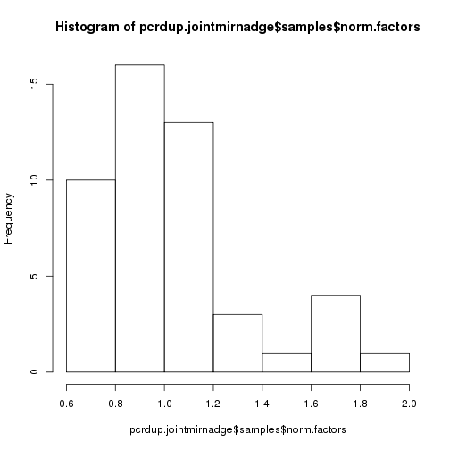
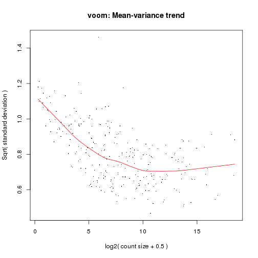
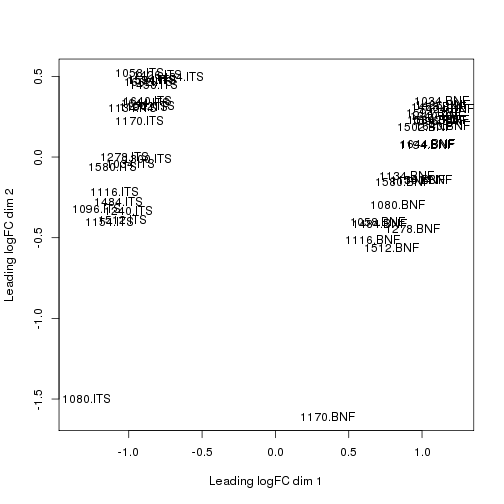
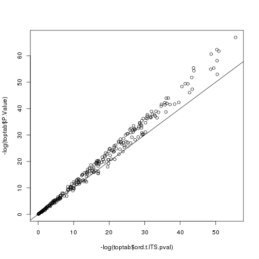
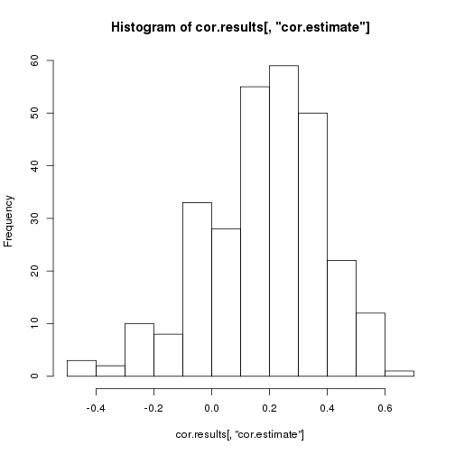
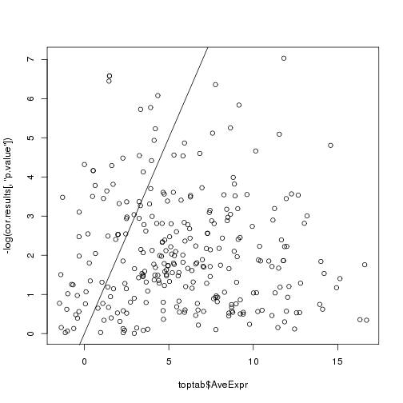

**Script:** `1_24bioosci_PCRDUP_join_mirna_expression_datasets_create_dge.R`

**Directory of Code:**  `/mnt/research/pigeqtl/analyses/microRNA/3_pcr_duplication_analysis/7_join_illumina_bioosciPCRDUP_datasets/scripts`

**Date:**  9/23/16

**Input File Directory:**  

1. `/mnt/research/pigeqtl/analyses/microRNA/3_pcr_duplication_analysis/2_24illumina_mirna_expression_characterization`
2. `/mnt/research/pigeqtl/analyses/microRNA/3_pcr_duplication_analysis/6_process_24bioosci_PCRDUP_samples/4_24bioosci_PCRDUP_mirna_expression_matrix`
3. `/mnt/research/pigeqtl/analyses/microRNA/3_pcr_duplication_analysis/4_join_datasets_dge_object`

**Input File(s):**

1. `1_24illumina_rounded_mean_mature_mirna_exp.Rdata`
2. `1_24bioosci_PCRDUP_rounded_mean_mature_mirna_expression.Rdata`
3. `1_mature_mirna_annotation.Rdata`

**Output File Directory:** `/mnt/research/pigeqtl/analyses/microRNA/3_pcr_duplication_analysis /7_join_illumina_bioosciPCRDUP_datasets`

**Output File(s):** 
1. `1_24illumina_24bioosci_PCRDUP_joint_mirna_expression_df.Rdata`
2. `2_24illumina_24bioosci_PCRDUP_joint_mirna_dge_object.Rdata`
3. `3_24illumina_24bioosci_PCRDUP_joint_mirna_voom_deanalysis_results.Rdata`

**Table of contents:**

1. [Objectives](#objectives)
2. [Install libraries](#install-libraries)
3. [Load data](#load-data)
4. [Analysis](#analysis)
5. [Save data](#save-data)

## Objectives
The objective of this script is to (1) join the two miRNA expression datasets into one and (2) make them into a dge object. 
This dge object will then (3) be filtered for miRNA expression: first, the read counts of the miRNAs will be normalized using the cpm function of edgeR, then filtered for expression (rough filter: < 1cpm in > 6 libraries removed) 
and the calcNormFactors and estimateCommonDisp functions of edgeR will be applied to the non-cpm read counts prior to the differential expression analysis of the read counts using the voom function. 

THIS ANALYSIS COMPLETED WITH R/3.2.0
## Install libraries


```r
library(methods)
library(limma)
library(edgeR)
library(statmod)
library(qvalue)

rm(list=ls())

setwd("/mnt/research/pigeqtl/analyses/microRNA/3_pcr_duplication_analysis/7_join_illumina_bioosciPCRDUP_datasets_de_analysis/scripts")
```

## Load data
Load the miRDeep2 read count data for the 24 Illumina libraries


```r
load("../../2_24illumina_mirna_expression_characterization/1_24illumina_rounded_mean_mature_mirna_exp.Rdata")
```

Load the miRDeep2 read count data for the 24 Bioo Scientific libraries containing PCR DUPLICATES


```r
load("../../6_process_24bioosci_PCRDUP_samples/4_24bioosci_PCRDUP_mirna_expression_matrix/1_24bioosci_PCRDUP_rounded_mean_mature_mirna_expression.Rdata")
```

Load the annotation file for the 24 Illumina libraries 


```r
load("../../4_join_datasets_dge_object/1_mature_mirna_annotation.Rdata")
ls()
```

```
## [1] "illumina24.dfmeanrcround"       "illumina24.total.mature.annot2"
## [3] "pcrdup.bioo24.dfmeanrcround"
```

## Analysis

### 1. Join the two expression datasets (rounded, mean mature miRNA expression)

Make a matrix of miRNA read counts from the Illumina prepped libraries


```r
illumina24.dfmeanrcround<-as.matrix(illumina24.dfmeanrcround)
dim(illumina24.dfmeanrcround)
```

```
## [1] 411  24
```

Make the sample IDs more descriptive (ITS = Illumina TruSeq)


```r
colnames(illumina24.dfmeanrcround)<-paste(colnames(illumina24.dfmeanrcround), ".ITS", sep = "")
illumina24.dfmeanrcround[1:5,1:5]
```

```
##               1034.ITS 1058.ITS 1080.ITS 1096.ITS 1116.ITS
## ssc-let-7a       24174    53646     6014    57852    56632
## ssc-let-7c        3001     5920     1765     8426     7084
## ssc-let-7d-3p      211      232     2040      643      661
## ssc-let-7d-5p     1246     3067      364     3617     3382
## ssc-let-7e        1026     2068      270     2582     2601
```

Define which miRNAs have zero expression in the Bioo prepped libraries:


```r
illumina24zeromir<-rownames(illumina24.dfmeanrcround[rowSums(illumina24.dfmeanrcround)==0,])
length(illumina24zeromir)
```

```
## [1] 86
```

```r
illumina24zeromir
```

```
##  [1] "ssc-miR-1224"    "ssc-miR-124a"    "ssc-miR-1296-3p"
##  [4] "ssc-miR-146a-3p" "ssc-miR-194b-3p" "ssc-miR-218-3p" 
##  [7] "ssc-miR-219b-3p" "ssc-miR-371-5p"  "ssc-miR-376b"   
## [10] "ssc-miR-4334-5p" "ssc-miR-4335"    "ssc-miR-4338"   
## [13] "ssc-miR-4339"    "ssc-miR-484"     "ssc-miR-494"    
## [16] "ssc-miR-7136-3p" "ssc-miR-7141-3p" "ssc-miR-7144-3p"
## [19] "ssc-miR-92b-5p"  "ssc-miR-9784-5p" "ssc-miR-9786-3p"
## [22] "ssc-miR-9787-3p" "ssc-miR-9789-3p" "ssc-miR-9790-3p"
## [25] "ssc-miR-9791-3p" "ssc-miR-9792-5p" "ssc-miR-9793-5p"
## [28] "ssc-miR-9794-3p" "ssc-miR-9795-3p" "ssc-miR-9796-3p"
## [31] "ssc-miR-9797-3p" "ssc-miR-9798-3p" "ssc-miR-9799-3p"
## [34] "ssc-miR-9800-3p" "ssc-miR-9801-5p" "ssc-miR-9802-3p"
## [37] "ssc-miR-9803-5p" "ssc-miR-9804-5p" "ssc-miR-9805-3p"
## [40] "ssc-miR-9806-5p" "ssc-miR-9808-3p" "ssc-miR-9809-3p"
## [43] "ssc-miR-9811-5p" "ssc-miR-9812-3p" "ssc-miR-9813-5p"
## [46] "ssc-miR-9814-3p" "ssc-miR-9815-3p" "ssc-miR-9816-3p"
## [49] "ssc-miR-9817-5p" "ssc-miR-9818-3p" "ssc-miR-9819-5p"
## [52] "ssc-miR-9821-5p" "ssc-miR-9823-5p" "ssc-miR-9824-5p"
## [55] "ssc-miR-9825-5p" "ssc-miR-9826-5p" "ssc-miR-9827-5p"
## [58] "ssc-miR-9828-3p" "ssc-miR-9829-5p" "ssc-miR-9830-5p"
## [61] "ssc-miR-9831-3p" "ssc-miR-9832-3p" "ssc-miR-9833-5p"
## [64] "ssc-miR-9834-5p" "ssc-miR-9836-3p" "ssc-miR-9837-5p"
## [67] "ssc-miR-9838-5p" "ssc-miR-9839-5p" "ssc-miR-9840-3p"
## [70] "ssc-miR-9842-5p" "ssc-miR-9844-3p" "ssc-miR-9845-5p"
## [73] "ssc-miR-9846-3p" "ssc-miR-9847-3p" "ssc-miR-9848-3p"
## [76] "ssc-miR-9849-5p" "ssc-miR-9850-5p" "ssc-miR-9852-3p"
## [79] "ssc-miR-9853-5p" "ssc-miR-9854-5p" "ssc-miR-9855-5p"
## [82] "ssc-miR-9856-3p" "ssc-miR-9857-5p" "ssc-miR-9859-3p"
## [85] "ssc-miR-9861-5p" "ssc-miR-9862-3p"
```

Make a matrix of miRNA read counts from the Bioo prepped libraries


```r
pcrdup.bioosci24libmirnaexp<-as.matrix(pcrdup.bioo24.dfmeanrcround)
dim(pcrdup.bioosci24libmirnaexp)
```

```
## [1] 411  24
```

Make the sample IDs more descriptive (BNF = Bioo Scientific Next Flex)


```r
colnames(pcrdup.bioosci24libmirnaexp)<-paste(colnames(pcrdup.bioosci24libmirnaexp), ".BNF", sep = "")
pcrdup.bioosci24libmirnaexp[1:5,1:5]
```

```
##               1034.BNF 1058.BNF 1080.BNF 1096.BNF 1116.BNF
## ssc-let-7a      121871   120489    99532    70908    88434
## ssc-let-7c       52830    77943    51631    28774    52407
## ssc-let-7d-3p      489     1396     1213      535     1042
## ssc-let-7d-5p     7371     6641     6233     4304     4989
## ssc-let-7e        3636     4248     3334     2285     3023
```

Define which miRNAs have zero expression in the Bioo prepped libraries:


```r
pcrdup.bioozeromir<-rownames(pcrdup.bioosci24libmirnaexp[rowSums(pcrdup.bioosci24libmirnaexp)==0,])
length(pcrdup.bioozeromir)
```

```
## [1] 85
```

```r
pcrdup.bioozeromir
```

```
##  [1] "ssc-miR-1296-3p" "ssc-miR-146a-3p" "ssc-miR-155-3p" 
##  [4] "ssc-miR-1839-3p" "ssc-miR-194b-3p" "ssc-miR-218-3p" 
##  [7] "ssc-miR-371-5p"  "ssc-miR-376b"    "ssc-miR-4334-5p"
## [10] "ssc-miR-4335"    "ssc-miR-4338"    "ssc-miR-4339"   
## [13] "ssc-miR-484"     "ssc-miR-494"     "ssc-miR-7141-3p"
## [16] "ssc-miR-7141-5p" "ssc-miR-7143-5p" "ssc-miR-9786-3p"
## [19] "ssc-miR-9787-3p" "ssc-miR-9789-3p" "ssc-miR-9790-3p"
## [22] "ssc-miR-9791-3p" "ssc-miR-9792-5p" "ssc-miR-9793-5p"
## [25] "ssc-miR-9794-3p" "ssc-miR-9795-3p" "ssc-miR-9796-3p"
## [28] "ssc-miR-9797-3p" "ssc-miR-9798-3p" "ssc-miR-9799-3p"
## [31] "ssc-miR-9800-3p" "ssc-miR-9801-5p" "ssc-miR-9802-3p"
## [34] "ssc-miR-9803-5p" "ssc-miR-9804-5p" "ssc-miR-9805-3p"
## [37] "ssc-miR-9806-5p" "ssc-miR-9807-5p" "ssc-miR-9808-3p"
## [40] "ssc-miR-9809-3p" "ssc-miR-9812-3p" "ssc-miR-9813-5p"
## [43] "ssc-miR-9814-3p" "ssc-miR-9815-3p" "ssc-miR-9816-3p"
## [46] "ssc-miR-9817-5p" "ssc-miR-9818-3p" "ssc-miR-9819-5p"
## [49] "ssc-miR-9821-5p" "ssc-miR-9822-3p" "ssc-miR-9823-5p"
## [52] "ssc-miR-9824-5p" "ssc-miR-9825-5p" "ssc-miR-9826-5p"
## [55] "ssc-miR-9827-5p" "ssc-miR-9828-3p" "ssc-miR-9829-5p"
## [58] "ssc-miR-9830-5p" "ssc-miR-9831-3p" "ssc-miR-9832-3p"
## [61] "ssc-miR-9833-5p" "ssc-miR-9834-5p" "ssc-miR-9835-3p"
## [64] "ssc-miR-9836-3p" "ssc-miR-9837-5p" "ssc-miR-9838-5p"
## [67] "ssc-miR-9839-5p" "ssc-miR-9840-3p" "ssc-miR-9842-5p"
## [70] "ssc-miR-9844-3p" "ssc-miR-9845-5p" "ssc-miR-9846-3p"
## [73] "ssc-miR-9847-3p" "ssc-miR-9848-3p" "ssc-miR-9849-5p"
## [76] "ssc-miR-9850-5p" "ssc-miR-9852-3p" "ssc-miR-9853-5p"
## [79] "ssc-miR-9854-5p" "ssc-miR-9855-5p" "ssc-miR-9856-3p"
## [82] "ssc-miR-9857-5p" "ssc-miR-9859-3p" "ssc-miR-9861-5p"
## [85] "ssc-miR-9862-3p"
```

In total, 78 miRNAs are not expressed in either dataset:


```r
sum(illumina24zeromir %in% pcrdup.bioozeromir)
```

```
## [1] 78
```

miRNAs not expressed in either dataset:


```r
illumina24zeromir[illumina24zeromir %in% pcrdup.bioozeromir]
```

```
##  [1] "ssc-miR-1296-3p" "ssc-miR-146a-3p" "ssc-miR-194b-3p"
##  [4] "ssc-miR-218-3p"  "ssc-miR-371-5p"  "ssc-miR-376b"   
##  [7] "ssc-miR-4334-5p" "ssc-miR-4335"    "ssc-miR-4338"   
## [10] "ssc-miR-4339"    "ssc-miR-484"     "ssc-miR-494"    
## [13] "ssc-miR-7141-3p" "ssc-miR-9786-3p" "ssc-miR-9787-3p"
## [16] "ssc-miR-9789-3p" "ssc-miR-9790-3p" "ssc-miR-9791-3p"
## [19] "ssc-miR-9792-5p" "ssc-miR-9793-5p" "ssc-miR-9794-3p"
## [22] "ssc-miR-9795-3p" "ssc-miR-9796-3p" "ssc-miR-9797-3p"
## [25] "ssc-miR-9798-3p" "ssc-miR-9799-3p" "ssc-miR-9800-3p"
## [28] "ssc-miR-9801-5p" "ssc-miR-9802-3p" "ssc-miR-9803-5p"
## [31] "ssc-miR-9804-5p" "ssc-miR-9805-3p" "ssc-miR-9806-5p"
## [34] "ssc-miR-9808-3p" "ssc-miR-9809-3p" "ssc-miR-9812-3p"
## [37] "ssc-miR-9813-5p" "ssc-miR-9814-3p" "ssc-miR-9815-3p"
## [40] "ssc-miR-9816-3p" "ssc-miR-9817-5p" "ssc-miR-9818-3p"
## [43] "ssc-miR-9819-5p" "ssc-miR-9821-5p" "ssc-miR-9823-5p"
## [46] "ssc-miR-9824-5p" "ssc-miR-9825-5p" "ssc-miR-9826-5p"
## [49] "ssc-miR-9827-5p" "ssc-miR-9828-3p" "ssc-miR-9829-5p"
## [52] "ssc-miR-9830-5p" "ssc-miR-9831-3p" "ssc-miR-9832-3p"
## [55] "ssc-miR-9833-5p" "ssc-miR-9834-5p" "ssc-miR-9836-3p"
## [58] "ssc-miR-9837-5p" "ssc-miR-9838-5p" "ssc-miR-9839-5p"
## [61] "ssc-miR-9840-3p" "ssc-miR-9842-5p" "ssc-miR-9844-3p"
## [64] "ssc-miR-9845-5p" "ssc-miR-9846-3p" "ssc-miR-9847-3p"
## [67] "ssc-miR-9848-3p" "ssc-miR-9849-5p" "ssc-miR-9850-5p"
## [70] "ssc-miR-9852-3p" "ssc-miR-9853-5p" "ssc-miR-9854-5p"
## [73] "ssc-miR-9855-5p" "ssc-miR-9856-3p" "ssc-miR-9857-5p"
## [76] "ssc-miR-9859-3p" "ssc-miR-9861-5p" "ssc-miR-9862-3p"
```

(8) miRNAs not expressed only in the illumina24 dataset:


```r
illumina24zeromir[!illumina24zeromir %in% pcrdup.bioozeromir]
```

```
## [1] "ssc-miR-1224"    "ssc-miR-124a"    "ssc-miR-219b-3p" "ssc-miR-7136-3p"
## [5] "ssc-miR-7144-3p" "ssc-miR-92b-5p"  "ssc-miR-9784-5p" "ssc-miR-9811-5p"
```

(7) miRNAs not expressed only in the bioo dataset:


```r
pcrdup.bioozeromir[!pcrdup.bioozeromir %in% illumina24zeromir]
```

```
## [1] "ssc-miR-155-3p"  "ssc-miR-1839-3p" "ssc-miR-7141-5p" "ssc-miR-7143-5p"
## [5] "ssc-miR-9807-5p" "ssc-miR-9822-3p" "ssc-miR-9835-3p"
```

Check that the rownames are equal between the datasets


```r
if (sum(rownames(pcrdup.bioosci24libmirnaexp) != rownames(illumina24.dfmeanrcround)) != 0) stop ("rownames not equal between datasets")
```

Join the two datasets using cbind


```r
pcrdup.jointmirnaexp<-cbind(illumina24.dfmeanrcround,pcrdup.bioosci24libmirnaexp)
pcrdup.jointmirnaexp[1:10,1:30]
```

```
##               1034.ITS 1058.ITS 1080.ITS 1096.ITS 1116.ITS 1134.ITS
## ssc-let-7a       24174    53646     6014    57852    56632    61338
## ssc-let-7c        3001     5920     1765     8426     7084     6985
## ssc-let-7d-3p      211      232     2040      643      661      493
## ssc-let-7d-5p     1246     3067      364     3617     3382     3228
## ssc-let-7e        1026     2068      270     2582     2601     2377
## ssc-let-7f       13892    37998     2129    19620    25098    47539
## ssc-let-7g        5005    12008      945     9915    14049    12378
## ssc-let-7i        4073     9769      567     7695     6382     9685
## ssc-miR-1         2372    10823      821     2637     3576     8515
## ssc-miR-100      21034    35674     3049    38984    50318    38032
##               1154.ITS 1170.ITS 1194.ITS 1240.ITS 1278.ITS 1300.ITS
## ssc-let-7a       59234    57940    35574    35545    39448    36966
## ssc-let-7c        8230     6396     3996     6624     6101     4591
## ssc-let-7d-3p      702      338      220     1540      518      407
## ssc-let-7d-5p     3280     3155     1868     2272     2115     2202
## ssc-let-7e        2446     2395     1102     1404     1569     1309
## ssc-let-7f       18634    41082    27064    25634    26353    20856
## ssc-let-7g       10013    14907     7862     8610     7290     8306
## ssc-let-7i        6804     8039     5283     6200     5791     5233
## ssc-miR-1         2385     7491     8255    11787     5484     3256
## ssc-miR-100      31860    42734    11779     9324    10703     9756
##               1426.ITS 1434.ITS 1458.ITS 1484.ITS 1502.ITS 1512.ITS
## ssc-let-7a       76446   219999    96168   106308    19862    14706
## ssc-let-7c        8332    29347    10912    13799     1940     2532
## ssc-let-7d-3p      337     1643      405     1110       95      580
## ssc-let-7d-5p     4586    11705     5192     5524     1245     1030
## ssc-let-7e        3011     8544     3578     4294      783      702
## ssc-let-7f       58404   203564    67330    37886    13534     7414
## ssc-let-7g       18454    59183    22547    18443     4954     4024
## ssc-let-7i       12545    59193    13765    13265     2895     1460
## ssc-miR-1        16871    62677    22416     3422     2824     2970
## ssc-miR-100       7882    48273    46953    27257     3580     2294
##               1534.ITS 1580.ITS 1594.ITS 1640.ITS 1644.ITS 1662.ITS
## ssc-let-7a       34628    78745   124874    42307    29834    47926
## ssc-let-7c        3603     9650    13632     3856     3160     5098
## ssc-let-7d-3p      156      524      624      213      170      245
## ssc-let-7d-5p     2010     5003     7418     2827     1795     2578
## ssc-let-7e        1382     3137     5032     1682     1503     1731
## ssc-let-7f       26159    38624   103978    35902    20510    36414
## ssc-let-7g        9258    15106    35493    16101     9251    12034
## ssc-let-7i        4369    11173    16054     5323     3447     6876
## ssc-miR-1         6708     6318    24153     8237     3628     7483
## ssc-miR-100       3518     8140    24204     8534     6178     9680
##               1034.BNF 1058.BNF 1080.BNF 1096.BNF 1116.BNF 1134.BNF
## ssc-let-7a      121871   120489    99532    70908    88434   184955
## ssc-let-7c       52830    77943    51631    28774    52407    90522
## ssc-let-7d-3p      489     1396     1213      535     1042     1594
## ssc-let-7d-5p     7371     6641     6233     4304     4989    11692
## ssc-let-7e        3636     4248     3334     2285     3023     5894
## ssc-let-7f       79784    36098    38866    56124    24332    82877
## ssc-let-7g       33758    25786    26002    24050    16175    45276
## ssc-let-7i       16206    10927     9434     8780     6770    16013
## ssc-miR-1      3000633   560629   635504  3194495   350213  1521754
## ssc-miR-100      14875    40497    24024     5421    19104    22891
```

```r
dim(pcrdup.jointmirnaexp)
```

```
## [1] 411  48
```

```r
str(pcrdup.jointmirnaexp)
```

```
##  num [1:411, 1:48] 24174 3001 211 1246 1026 ...
##  - attr(*, "dimnames")=List of 2
##   ..$ : chr [1:411] "ssc-let-7a" "ssc-let-7c" "ssc-let-7d-3p" "ssc-let-7d-5p" ...
##   ..$ : chr [1:48] "1034.ITS" "1058.ITS" "1080.ITS" "1096.ITS" ...
```

Check that the data remained the same between the datasets (no shuffling took place):


```r
for (i in colnames(illumina24.dfmeanrcround)){
        print(sum(illumina24.dfmeanrcround[,i] != pcrdup.jointmirnaexp[,i]))
}
```

```
## [1] 0
## [1] 0
## [1] 0
## [1] 0
## [1] 0
## [1] 0
## [1] 0
## [1] 0
## [1] 0
## [1] 0
## [1] 0
## [1] 0
## [1] 0
## [1] 0
## [1] 0
## [1] 0
## [1] 0
## [1] 0
## [1] 0
## [1] 0
## [1] 0
## [1] 0
## [1] 0
## [1] 0
```

```r
for (i in colnames(pcrdup.bioosci24libmirnaexp)){
        print(sum(pcrdup.bioosci24libmirnaexp[,i] != pcrdup.jointmirnaexp[,i]))
}
```

```
## [1] 0
## [1] 0
## [1] 0
## [1] 0
## [1] 0
## [1] 0
## [1] 0
## [1] 0
## [1] 0
## [1] 0
## [1] 0
## [1] 0
## [1] 0
## [1] 0
## [1] 0
## [1] 0
## [1] 0
## [1] 0
## [1] 0
## [1] 0
## [1] 0
## [1] 0
## [1] 0
## [1] 0
```

```r
if (sum(rownames(illumina24.dfmeanrcround) != rownames(pcrdup.jointmirnaexp)) != 0) stop ("rownames not equal between datasets")
if (sum(rownames(pcrdup.bioosci24libmirnaexp) != rownames(pcrdup.jointmirnaexp)) != 0) stop ("rownames not equal between datasets")
```

### 2. Create dge object for the joint miRNA expression dataset, including a group option with the library preparation kit determining the groups.


```r
pcrdup.jointmirnadge<-DGEList(counts=pcrdup.jointmirnaexp, genes=illumina24.total.mature.annot2)
names(pcrdup.jointmirnadge)
```

```
## [1] "counts"  "samples" "genes"
```

```r
dim(pcrdup.jointmirnadge$counts)
```

```
## [1] 411  48
```

```r
head(pcrdup.jointmirnadge$counts)
```

```
##               1034.ITS 1058.ITS 1080.ITS 1096.ITS 1116.ITS 1134.ITS
## ssc-let-7a       24174    53646     6014    57852    56632    61338
## ssc-let-7c        3001     5920     1765     8426     7084     6985
## ssc-let-7d-3p      211      232     2040      643      661      493
## ssc-let-7d-5p     1246     3067      364     3617     3382     3228
## ssc-let-7e        1026     2068      270     2582     2601     2377
## ssc-let-7f       13892    37998     2129    19620    25098    47539
##               1154.ITS 1170.ITS 1194.ITS 1240.ITS 1278.ITS 1300.ITS
## ssc-let-7a       59234    57940    35574    35545    39448    36966
## ssc-let-7c        8230     6396     3996     6624     6101     4591
## ssc-let-7d-3p      702      338      220     1540      518      407
## ssc-let-7d-5p     3280     3155     1868     2272     2115     2202
## ssc-let-7e        2446     2395     1102     1404     1569     1309
## ssc-let-7f       18634    41082    27064    25634    26353    20856
##               1426.ITS 1434.ITS 1458.ITS 1484.ITS 1502.ITS 1512.ITS
## ssc-let-7a       76446   219999    96168   106308    19862    14706
## ssc-let-7c        8332    29347    10912    13799     1940     2532
## ssc-let-7d-3p      337     1643      405     1110       95      580
## ssc-let-7d-5p     4586    11705     5192     5524     1245     1030
## ssc-let-7e        3011     8544     3578     4294      783      702
## ssc-let-7f       58404   203564    67330    37886    13534     7414
##               1534.ITS 1580.ITS 1594.ITS 1640.ITS 1644.ITS 1662.ITS
## ssc-let-7a       34628    78745   124874    42307    29834    47926
## ssc-let-7c        3603     9650    13632     3856     3160     5098
## ssc-let-7d-3p      156      524      624      213      170      245
## ssc-let-7d-5p     2010     5003     7418     2827     1795     2578
## ssc-let-7e        1382     3137     5032     1682     1503     1731
## ssc-let-7f       26159    38624   103978    35902    20510    36414
##               1034.BNF 1058.BNF 1080.BNF 1096.BNF 1116.BNF 1134.BNF
## ssc-let-7a      121871   120489    99532    70908    88434   184955
## ssc-let-7c       52830    77943    51631    28774    52407    90522
## ssc-let-7d-3p      489     1396     1213      535     1042     1594
## ssc-let-7d-5p     7371     6641     6233     4304     4989    11692
## ssc-let-7e        3636     4248     3334     2285     3023     5894
## ssc-let-7f       79784    36098    38866    56124    24332    82877
##               1154.BNF 1170.BNF 1194.BNF 1240.BNF 1278.BNF 1300.BNF
## ssc-let-7a      105338     4604    56074    74954    31466    62566
## ssc-let-7c       69993     6221    23344    35784    24846    36361
## ssc-let-7d-3p     1123     1166      290      340     1786      936
## ssc-let-7d-5p     8054      334     3189     4127     2278     3911
## ssc-let-7e        3186      146     1995     2174      871     1929
## ssc-let-7f       53897     1090    33522    52904    18376    35596
##               1426.BNF 1434.BNF 1458.BNF 1484.BNF 1502.BNF 1512.BNF
## ssc-let-7a       61593    50682    42404    66980   128323    44154
## ssc-let-7c       26465    24293    22798    39871    48683    32208
## ssc-let-7d-3p      189      244      161      742      549     1740
## ssc-let-7d-5p     3813     2523     2967     4139     7365     3184
## ssc-let-7e        2255     1625     1326     2430     4168     1566
## ssc-let-7f       41933    32378    28576    20309    85063    18608
##               1534.BNF 1580.BNF 1594.BNF 1640.BNF 1644.BNF 1662.BNF
## ssc-let-7a       47459    75309    79047    99398    96866    96218
## ssc-let-7c       20438    39214    33516    32698    39353    42164
## ssc-let-7d-3p      195      671      412      393      413      635
## ssc-let-7d-5p     2772     4662     5003     6280     5437     5834
## ssc-let-7e        1708     2362     2635     2883     3592     3155
## ssc-let-7f       32601    33098    54375    79049    63528    66254
```

```r
pcrdup.jointmirnadge$samples
```

```
##          group lib.size norm.factors
## 1034.ITS     1  1837116            1
## 1058.ITS     1  3712023            1
## 1080.ITS     1  1838011            1
## 1096.ITS     1  3533423            1
## 1116.ITS     1  3390992            1
## 1134.ITS     1  4031993            1
## 1154.ITS     1  3468560            1
## 1170.ITS     1  3452760            1
## 1194.ITS     1  3047581            1
## 1240.ITS     1  3941710            1
## 1278.ITS     1  2993782            1
## 1300.ITS     1  2477073            1
## 1426.ITS     1  4632932            1
## 1434.ITS     1 12115255            1
## 1458.ITS     1  7166260            1
## 1484.ITS     1  6026289            1
## 1502.ITS     1  1121402            1
## 1512.ITS     1  1255147            1
## 1534.ITS     1  2143878            1
## 1580.ITS     1  4633132            1
## 1594.ITS     1  8660105            1
## 1640.ITS     1  2775204            1
## 1644.ITS     1  2135040            1
## 1662.ITS     1  3449438            1
## 1034.BNF     1  6071222            1
## 1058.BNF     1  4788265            1
## 1080.BNF     1  3648754            1
## 1096.BNF     1  5242376            1
## 1116.BNF     1  3330069            1
## 1134.BNF     1  6083725            1
## 1154.BNF     1  5321499            1
## 1170.BNF     1   907228            1
## 1194.BNF     1  2574715            1
## 1240.BNF     1  4858886            1
## 1278.BNF     1  2847081            1
## 1300.BNF     1  3953149            1
## 1426.BNF     1  3166545            1
## 1434.BNF     1  2385628            1
## 1458.BNF     1  2927940            1
## 1484.BNF     1  2913776            1
## 1502.BNF     1  4641909            1
## 1512.BNF     1  2263253            1
## 1534.BNF     1  2298493            1
## 1580.BNF     1  2844359            1
## 1594.BNF     1  4755125            1
## 1640.BNF     1  4179418            1
## 1644.BNF     1  3091322            1
## 1662.BNF     1  5460376            1
```

Check that the data remained the same between the datasets (no shuffling took place):


```r
if (sum(rownames(illumina24.dfmeanrcround) != rownames(pcrdup.jointmirnadge)) != 0) stop ("rownames not equal between datasets")
if (sum(rownames(pcrdup.bioosci24libmirnaexp) != rownames(pcrdup.jointmirnadge)) != 0) stop ("rownames not equal between datasets")

for (i in colnames(illumina24.dfmeanrcround)){
        print(sum(illumina24.dfmeanrcround[,i] != pcrdup.jointmirnadge$counts[,i]))
}
```

```
## [1] 0
## [1] 0
## [1] 0
## [1] 0
## [1] 0
## [1] 0
## [1] 0
## [1] 0
## [1] 0
## [1] 0
## [1] 0
## [1] 0
## [1] 0
## [1] 0
## [1] 0
## [1] 0
## [1] 0
## [1] 0
## [1] 0
## [1] 0
## [1] 0
## [1] 0
## [1] 0
## [1] 0
```

```r
for (i in colnames(pcrdup.bioosci24libmirnaexp)){
        print(sum(pcrdup.bioosci24libmirnaexp[,i] != pcrdup.jointmirnadge$counts[,i]))
}
```

```
## [1] 0
## [1] 0
## [1] 0
## [1] 0
## [1] 0
## [1] 0
## [1] 0
## [1] 0
## [1] 0
## [1] 0
## [1] 0
## [1] 0
## [1] 0
## [1] 0
## [1] 0
## [1] 0
## [1] 0
## [1] 0
## [1] 0
## [1] 0
## [1] 0
## [1] 0
## [1] 0
## [1] 0
```

### 3. Filter the joint expression dataset (dge object)
First, eliminate miRNAs whose total expression is 0 among the datasets


```r
sum(rowSums(pcrdup.jointmirnadge$counts) == 0)
```

```
## [1] 78
```

So, 78 miRNAs have 0 expression among the datasets


```r
pcrdup.jointmirnadge<-pcrdup.jointmirnadge[rowSums(pcrdup.jointmirnadge$counts)>0,]
dim(pcrdup.jointmirnadge)
```

```
## [1] 333  48
```

Calculate the read counts per million in order to filter miRNAs by normalized expression:


```r
cpm.pcrdup.jointmirnadge<-cpm(pcrdup.jointmirnadge)
dim(cpm.pcrdup.jointmirnadge)
```

```
## [1] 333  48
```

```r
cpm.pcrdup.jointmirnadge[1:5,1:5]
```

```
##                 1034.ITS    1058.ITS  1080.ITS   1096.ITS   1116.ITS
## ssc-let-7a    13158.6683 14451.95787 3272.0152 16372.7920 16700.7177
## ssc-let-7c     1633.5387  1594.81770  960.2772  2384.6565  2089.0642
## ssc-let-7d-3p   114.8539    62.49961 1109.8954   181.9765   194.9282
## ssc-let-7d-5p   678.2370   826.23410  198.0402  1023.6533   997.3483
## ssc-let-7e      558.4841   557.10862  146.8979   730.7362   767.0322
```

```r
if (sum(colnames(illumina24.dfmeanrcround)!=colnames(cpm.pcrdup.jointmirnadge[1:24]))!=0) stop ("animal ids not the same between read counts and cpm")
if (sum(rownames(illumina24.dfmeanrcround)!=rownames(illumina24.total.mature.annot2))!=0) stop ("miRNAs not the same between read counts and annotation")

if (sum(colnames(pcrdup.bioosci24libmirnaexp)!=colnames(cpm.pcrdup.jointmirnadge[25:ncol(cpm.pcrdup.jointmirnadge)]))!=0) stop ("animal ids not the same between read counts and cpm")
if (sum(rownames(pcrdup.bioosci24libmirnaexp)!=rownames(illumina24.total.mature.annot2))!=0) stop ("miRNAs not the same between read counts and annotation")
```

Filter miRNAs with at least 1 cpm in at least 1/4 of the samples (24/4=6)


```r
filtercpm<-rowSums(cpm.pcrdup.jointmirnadge>=1)>=6
sum(filtercpm)
```

```
## [1] 283
```

```r
nrow(cpm.pcrdup.jointmirnadge) - sum(filtercpm)
```

```
## [1] 50
```

We are removing 50 miRNA profiles from the analysis

So, keep the miRNA profiles in dge based on those retained in the cpm-filtering step:

This retains the rounded, mean read counts, not the cpm (this will be done later):


```r
pcrdup.jointmirnadge<-pcrdup.jointmirnadge[filtercpm,]
names(pcrdup.jointmirnadge)
```

```
## [1] "counts"  "samples" "genes"
```

```r
pcrdup.jointmirnadge[1:5,1:5]
```

```
## An object of class "DGEList"
## $counts
##               1034.ITS 1058.ITS 1080.ITS 1096.ITS 1116.ITS
## ssc-let-7a       24174    53646     6014    57852    56632
## ssc-let-7c        3001     5920     1765     8426     7084
## ssc-let-7d-3p      211      232     2040      643      661
## ssc-let-7d-5p     1246     3067      364     3617     3382
## ssc-let-7e        1026     2068      270     2582     2601
## 
## $samples
##          group lib.size norm.factors
## 1034.ITS     1  1837116            1
## 1058.ITS     1  3712023            1
## 1080.ITS     1  1838011            1
## 1096.ITS     1  3533423            1
## 1116.ITS     1  3390992            1
## 
## $genes
##                        Name  chr0     start       end width strand  type
## ssc-let-7a       ssc-let-7a  chr3  44864443  44864464    22      + miRNA
## ssc-let-7c       ssc-let-7c chr13 191559351 191559372    22      + miRNA
## ssc-let-7d-3p ssc-let-7d-3p  chr3  44867331  44867352    22      + miRNA
## ssc-let-7d-5p ssc-let-7d-5p  chr3  44867277  44867298    22      + miRNA
## ssc-let-7e       ssc-let-7e  chr6  51858385  51858406    22      + miRNA
##                      Alias          Precursors
## ssc-let-7a    MIMAT0013865 MI0017984,MI0013085
## ssc-let-7c    MIMAT0002151           MI0002445
## ssc-let-7d-3p MIMAT0025357           MI0022120
## ssc-let-7d-5p MIMAT0025356           MI0022120
## ssc-let-7e    MIMAT0013866           MI0013086
```

```r
dim(pcrdup.jointmirnadge$counts)
```

```
## [1] 283  48
```

```r
if (sum(colnames(pcrdup.jointmirnadge)!=colnames(cpm.pcrdup.jointmirnadge))!=0) stop ("colnames not the same between dge and cpm.pcrdup.jointmirnadge")
```

Apply the TMM normalization (normalizes for RNA composition by finding a set of scaling factors for the library sizes that minimize the log-fold changes between the samples for the most genes):

The result is the effective library size, which is equal to the product of the original library size and the scaling factor. Effective library size is what is used in downstream analyses.


```r
pcrdup.jointmirnadge<-calcNormFactors(pcrdup.jointmirnadge)
pcrdup.jointmirnadge$samples
```

```
##          group lib.size norm.factors
## 1034.ITS     1  1837116    1.0550630
## 1058.ITS     1  3712023    0.9022627
## 1080.ITS     1  1838011    0.8605546
## 1096.ITS     1  3533423    0.9299257
## 1116.ITS     1  3390992    1.0001681
## 1134.ITS     1  4031993    0.8835106
## 1154.ITS     1  3468560    1.0465325
## 1170.ITS     1  3452760    0.9921946
## 1194.ITS     1  3047581    0.7561192
## 1240.ITS     1  3941710    1.0629727
## 1278.ITS     1  2993782    1.0323144
## 1300.ITS     1  2477073    0.9236088
## 1426.ITS     1  4632932    0.8075207
## 1434.ITS     1 12115255    1.0851748
## 1458.ITS     1  7166260    0.6983235
## 1484.ITS     1  6026289    0.7613389
## 1502.ITS     1  1121402    0.7907865
## 1512.ITS     1  1255147    1.0337375
## 1534.ITS     1  2143878    0.7512163
## 1580.ITS     1  4633132    0.9083911
## 1594.ITS     1  8660105    0.7925674
## 1640.ITS     1  2775204    0.8203346
## 1644.ITS     1  2135040    0.6481642
## 1662.ITS     1  3449438    0.7621454
## 1034.BNF     1  6071222    1.0828671
## 1058.BNF     1  4788265    1.8678261
## 1080.BNF     1  3648754    1.7131271
## 1096.BNF     1  5242376    0.8671100
## 1116.BNF     1  3330069    1.7127471
## 1134.BNF     1  6083725    1.4777315
## 1154.BNF     1  5321499    1.6676754
## 1170.BNF     1   907228    0.7585127
## 1194.BNF     1  2574715    1.2562387
## 1240.BNF     1  4858886    0.8463357
## 1278.BNF     1  2847081    1.1870920
## 1300.BNF     1  3953149    1.0300220
## 1426.BNF     1  3166545    1.0173611
## 1434.BNF     1  2385628    1.1499933
## 1458.BNF     1  2927940    1.0324825
## 1484.BNF     1  2913776    1.7860671
## 1502.BNF     1  4641909    0.9453752
## 1512.BNF     1  2263253    1.2206648
## 1534.BNF     1  2298493    0.7727433
## 1580.BNF     1  2844359    1.3621987
## 1594.BNF     1  4755125    0.9653181
## 1640.BNF     1  4179418    0.8494095
## 1644.BNF     1  3091322    0.8667543
## 1662.BNF     1  5460376    0.9602284
```

```r
hist(pcrdup.jointmirnadge$samples$norm.factors)
```



```r
pcrdup.jointmirnadge$samples$norm.factors
```

```
##  [1] 1.0550630 0.9022627 0.8605546 0.9299257 1.0001681 0.8835106 1.0465325
##  [8] 0.9921946 0.7561192 1.0629727 1.0323144 0.9236088 0.8075207 1.0851748
## [15] 0.6983235 0.7613389 0.7907865 1.0337375 0.7512163 0.9083911 0.7925674
## [22] 0.8203346 0.6481642 0.7621454 1.0828671 1.8678261 1.7131271 0.8671100
## [29] 1.7127471 1.4777315 1.6676754 0.7585127 1.2562387 0.8463357 1.1870920
## [36] 1.0300220 1.0173611 1.1499933 1.0324825 1.7860671 0.9453752 1.2206648
## [43] 0.7727433 1.3621987 0.9653181 0.8494095 0.8667543 0.9602284
```

This function (estimateCommonDisp) applies normalization factors, caluclates normalized expression based on robust count of normalized reads.

estimateCommonDisp estimates the quantile-adjusted conditional maximum likelihood (qCML) common dispersion.

This creates a matrix of pseudo-counts, used internally to speed up computation of conditional likelihood used for dispersion estimation & exact tests in the limma pipeline.
Pseudo-counts represent the equivalent counts that would have been observed had the library sizes all been equal, assuming the fitted model.
DO NOT INTERPRET PSEUDO-COUNTS AS GENERAL-PURPOSE NORMALIZED COUNTS.


```r
pcrdup.jointmirnadge<-estimateCommonDisp(pcrdup.jointmirnadge,verbose=TRUE)
```

```
## Disp = 0.59676 , BCV = 0.7725
```

```r
pcrdup.jointmirnadge$common.dispersion
```

```
## [1] 0.5967647
```

### 4. Perform the DE analysis (following the case study in edgeR User Guide: "edgeR: differential expression analysis of digital gene expression data")

Apply the voom transformation and build the design matrix

First, create factors of individual and kit to create the design matrix:


```r
indiv<-factor(substr(colnames(pcrdup.jointmirnadge$counts), 1, 4))
head(indiv)
```

```
## [1] 1034 1058 1080 1096 1116 1134
## 24 Levels: 1034 1058 1080 1096 1116 1134 1154 1170 1194 1240 1278 ... 1662
```

```r
str(indiv)
```

```
##  Factor w/ 24 levels "1034","1058",..: 1 2 3 4 5 6 7 8 9 10 ...
```

```r
kit<-factor(rep(c("ITS", "BNF"), c(24,24)))
kit
```

```
##  [1] ITS ITS ITS ITS ITS ITS ITS ITS ITS ITS ITS ITS ITS ITS ITS ITS ITS
## [18] ITS ITS ITS ITS ITS ITS ITS BNF BNF BNF BNF BNF BNF BNF BNF BNF BNF
## [35] BNF BNF BNF BNF BNF BNF BNF BNF BNF BNF BNF BNF BNF BNF
## Levels: BNF ITS
```

```r
str(kit)
```

```
##  Factor w/ 2 levels "BNF","ITS": 2 2 2 2 2 2 2 2 2 2 ...
```

View this as a data.frame to check for correctness:


```r
data.frame(Sample=colnames(pcrdup.jointmirnadge$counts), indiv, kit)
```

```
##      Sample indiv kit
## 1  1034.ITS  1034 ITS
## 2  1058.ITS  1058 ITS
## 3  1080.ITS  1080 ITS
## 4  1096.ITS  1096 ITS
## 5  1116.ITS  1116 ITS
## 6  1134.ITS  1134 ITS
## 7  1154.ITS  1154 ITS
## 8  1170.ITS  1170 ITS
## 9  1194.ITS  1194 ITS
## 10 1240.ITS  1240 ITS
## 11 1278.ITS  1278 ITS
## 12 1300.ITS  1300 ITS
## 13 1426.ITS  1426 ITS
## 14 1434.ITS  1434 ITS
## 15 1458.ITS  1458 ITS
## 16 1484.ITS  1484 ITS
## 17 1502.ITS  1502 ITS
## 18 1512.ITS  1512 ITS
## 19 1534.ITS  1534 ITS
## 20 1580.ITS  1580 ITS
## 21 1594.ITS  1594 ITS
## 22 1640.ITS  1640 ITS
## 23 1644.ITS  1644 ITS
## 24 1662.ITS  1662 ITS
## 25 1034.BNF  1034 BNF
## 26 1058.BNF  1058 BNF
## 27 1080.BNF  1080 BNF
## 28 1096.BNF  1096 BNF
## 29 1116.BNF  1116 BNF
## 30 1134.BNF  1134 BNF
## 31 1154.BNF  1154 BNF
## 32 1170.BNF  1170 BNF
## 33 1194.BNF  1194 BNF
## 34 1240.BNF  1240 BNF
## 35 1278.BNF  1278 BNF
## 36 1300.BNF  1300 BNF
## 37 1426.BNF  1426 BNF
## 38 1434.BNF  1434 BNF
## 39 1458.BNF  1458 BNF
## 40 1484.BNF  1484 BNF
## 41 1502.BNF  1502 BNF
## 42 1512.BNF  1512 BNF
## 43 1534.BNF  1534 BNF
## 44 1580.BNF  1580 BNF
## 45 1594.BNF  1594 BNF
## 46 1640.BNF  1640 BNF
## 47 1644.BNF  1644 BNF
## 48 1662.BNF  1662 BNF
```

Use the model.matrix() command to create the design matrix for this analysis:


```r
design <- model.matrix(~indiv+kit)
rownames(design)<-colnames(pcrdup.jointmirnadge$counts)
design
```

```
##          (Intercept) indiv1058 indiv1080 indiv1096 indiv1116 indiv1134
## 1034.ITS           1         0         0         0         0         0
## 1058.ITS           1         1         0         0         0         0
## 1080.ITS           1         0         1         0         0         0
## 1096.ITS           1         0         0         1         0         0
## 1116.ITS           1         0         0         0         1         0
## 1134.ITS           1         0         0         0         0         1
## 1154.ITS           1         0         0         0         0         0
## 1170.ITS           1         0         0         0         0         0
## 1194.ITS           1         0         0         0         0         0
## 1240.ITS           1         0         0         0         0         0
## 1278.ITS           1         0         0         0         0         0
## 1300.ITS           1         0         0         0         0         0
## 1426.ITS           1         0         0         0         0         0
## 1434.ITS           1         0         0         0         0         0
## 1458.ITS           1         0         0         0         0         0
## 1484.ITS           1         0         0         0         0         0
## 1502.ITS           1         0         0         0         0         0
## 1512.ITS           1         0         0         0         0         0
## 1534.ITS           1         0         0         0         0         0
## 1580.ITS           1         0         0         0         0         0
## 1594.ITS           1         0         0         0         0         0
## 1640.ITS           1         0         0         0         0         0
## 1644.ITS           1         0         0         0         0         0
## 1662.ITS           1         0         0         0         0         0
## 1034.BNF           1         0         0         0         0         0
## 1058.BNF           1         1         0         0         0         0
## 1080.BNF           1         0         1         0         0         0
## 1096.BNF           1         0         0         1         0         0
## 1116.BNF           1         0         0         0         1         0
## 1134.BNF           1         0         0         0         0         1
## 1154.BNF           1         0         0         0         0         0
## 1170.BNF           1         0         0         0         0         0
## 1194.BNF           1         0         0         0         0         0
## 1240.BNF           1         0         0         0         0         0
## 1278.BNF           1         0         0         0         0         0
## 1300.BNF           1         0         0         0         0         0
## 1426.BNF           1         0         0         0         0         0
## 1434.BNF           1         0         0         0         0         0
## 1458.BNF           1         0         0         0         0         0
## 1484.BNF           1         0         0         0         0         0
## 1502.BNF           1         0         0         0         0         0
## 1512.BNF           1         0         0         0         0         0
## 1534.BNF           1         0         0         0         0         0
## 1580.BNF           1         0         0         0         0         0
## 1594.BNF           1         0         0         0         0         0
## 1640.BNF           1         0         0         0         0         0
## 1644.BNF           1         0         0         0         0         0
## 1662.BNF           1         0         0         0         0         0
##          indiv1154 indiv1170 indiv1194 indiv1240 indiv1278 indiv1300
## 1034.ITS         0         0         0         0         0         0
## 1058.ITS         0         0         0         0         0         0
## 1080.ITS         0         0         0         0         0         0
## 1096.ITS         0         0         0         0         0         0
## 1116.ITS         0         0         0         0         0         0
## 1134.ITS         0         0         0         0         0         0
## 1154.ITS         1         0         0         0         0         0
## 1170.ITS         0         1         0         0         0         0
## 1194.ITS         0         0         1         0         0         0
## 1240.ITS         0         0         0         1         0         0
## 1278.ITS         0         0         0         0         1         0
## 1300.ITS         0         0         0         0         0         1
## 1426.ITS         0         0         0         0         0         0
## 1434.ITS         0         0         0         0         0         0
## 1458.ITS         0         0         0         0         0         0
## 1484.ITS         0         0         0         0         0         0
## 1502.ITS         0         0         0         0         0         0
## 1512.ITS         0         0         0         0         0         0
## 1534.ITS         0         0         0         0         0         0
## 1580.ITS         0         0         0         0         0         0
## 1594.ITS         0         0         0         0         0         0
## 1640.ITS         0         0         0         0         0         0
## 1644.ITS         0         0         0         0         0         0
## 1662.ITS         0         0         0         0         0         0
## 1034.BNF         0         0         0         0         0         0
## 1058.BNF         0         0         0         0         0         0
## 1080.BNF         0         0         0         0         0         0
## 1096.BNF         0         0         0         0         0         0
## 1116.BNF         0         0         0         0         0         0
## 1134.BNF         0         0         0         0         0         0
## 1154.BNF         1         0         0         0         0         0
## 1170.BNF         0         1         0         0         0         0
## 1194.BNF         0         0         1         0         0         0
## 1240.BNF         0         0         0         1         0         0
## 1278.BNF         0         0         0         0         1         0
## 1300.BNF         0         0         0         0         0         1
## 1426.BNF         0         0         0         0         0         0
## 1434.BNF         0         0         0         0         0         0
## 1458.BNF         0         0         0         0         0         0
## 1484.BNF         0         0         0         0         0         0
## 1502.BNF         0         0         0         0         0         0
## 1512.BNF         0         0         0         0         0         0
## 1534.BNF         0         0         0         0         0         0
## 1580.BNF         0         0         0         0         0         0
## 1594.BNF         0         0         0         0         0         0
## 1640.BNF         0         0         0         0         0         0
## 1644.BNF         0         0         0         0         0         0
## 1662.BNF         0         0         0         0         0         0
##          indiv1426 indiv1434 indiv1458 indiv1484 indiv1502 indiv1512
## 1034.ITS         0         0         0         0         0         0
## 1058.ITS         0         0         0         0         0         0
## 1080.ITS         0         0         0         0         0         0
## 1096.ITS         0         0         0         0         0         0
## 1116.ITS         0         0         0         0         0         0
## 1134.ITS         0         0         0         0         0         0
## 1154.ITS         0         0         0         0         0         0
## 1170.ITS         0         0         0         0         0         0
## 1194.ITS         0         0         0         0         0         0
## 1240.ITS         0         0         0         0         0         0
## 1278.ITS         0         0         0         0         0         0
## 1300.ITS         0         0         0         0         0         0
## 1426.ITS         1         0         0         0         0         0
## 1434.ITS         0         1         0         0         0         0
## 1458.ITS         0         0         1         0         0         0
## 1484.ITS         0         0         0         1         0         0
## 1502.ITS         0         0         0         0         1         0
## 1512.ITS         0         0         0         0         0         1
## 1534.ITS         0         0         0         0         0         0
## 1580.ITS         0         0         0         0         0         0
## 1594.ITS         0         0         0         0         0         0
## 1640.ITS         0         0         0         0         0         0
## 1644.ITS         0         0         0         0         0         0
## 1662.ITS         0         0         0         0         0         0
## 1034.BNF         0         0         0         0         0         0
## 1058.BNF         0         0         0         0         0         0
## 1080.BNF         0         0         0         0         0         0
## 1096.BNF         0         0         0         0         0         0
## 1116.BNF         0         0         0         0         0         0
## 1134.BNF         0         0         0         0         0         0
## 1154.BNF         0         0         0         0         0         0
## 1170.BNF         0         0         0         0         0         0
## 1194.BNF         0         0         0         0         0         0
## 1240.BNF         0         0         0         0         0         0
## 1278.BNF         0         0         0         0         0         0
## 1300.BNF         0         0         0         0         0         0
## 1426.BNF         1         0         0         0         0         0
## 1434.BNF         0         1         0         0         0         0
## 1458.BNF         0         0         1         0         0         0
## 1484.BNF         0         0         0         1         0         0
## 1502.BNF         0         0         0         0         1         0
## 1512.BNF         0         0         0         0         0         1
## 1534.BNF         0         0         0         0         0         0
## 1580.BNF         0         0         0         0         0         0
## 1594.BNF         0         0         0         0         0         0
## 1640.BNF         0         0         0         0         0         0
## 1644.BNF         0         0         0         0         0         0
## 1662.BNF         0         0         0         0         0         0
##          indiv1534 indiv1580 indiv1594 indiv1640 indiv1644 indiv1662
## 1034.ITS         0         0         0         0         0         0
## 1058.ITS         0         0         0         0         0         0
## 1080.ITS         0         0         0         0         0         0
## 1096.ITS         0         0         0         0         0         0
## 1116.ITS         0         0         0         0         0         0
## 1134.ITS         0         0         0         0         0         0
## 1154.ITS         0         0         0         0         0         0
## 1170.ITS         0         0         0         0         0         0
## 1194.ITS         0         0         0         0         0         0
## 1240.ITS         0         0         0         0         0         0
## 1278.ITS         0         0         0         0         0         0
## 1300.ITS         0         0         0         0         0         0
## 1426.ITS         0         0         0         0         0         0
## 1434.ITS         0         0         0         0         0         0
## 1458.ITS         0         0         0         0         0         0
## 1484.ITS         0         0         0         0         0         0
## 1502.ITS         0         0         0         0         0         0
## 1512.ITS         0         0         0         0         0         0
## 1534.ITS         1         0         0         0         0         0
## 1580.ITS         0         1         0         0         0         0
## 1594.ITS         0         0         1         0         0         0
## 1640.ITS         0         0         0         1         0         0
## 1644.ITS         0         0         0         0         1         0
## 1662.ITS         0         0         0         0         0         1
## 1034.BNF         0         0         0         0         0         0
## 1058.BNF         0         0         0         0         0         0
## 1080.BNF         0         0         0         0         0         0
## 1096.BNF         0         0         0         0         0         0
## 1116.BNF         0         0         0         0         0         0
## 1134.BNF         0         0         0         0         0         0
## 1154.BNF         0         0         0         0         0         0
## 1170.BNF         0         0         0         0         0         0
## 1194.BNF         0         0         0         0         0         0
## 1240.BNF         0         0         0         0         0         0
## 1278.BNF         0         0         0         0         0         0
## 1300.BNF         0         0         0         0         0         0
## 1426.BNF         0         0         0         0         0         0
## 1434.BNF         0         0         0         0         0         0
## 1458.BNF         0         0         0         0         0         0
## 1484.BNF         0         0         0         0         0         0
## 1502.BNF         0         0         0         0         0         0
## 1512.BNF         0         0         0         0         0         0
## 1534.BNF         1         0         0         0         0         0
## 1580.BNF         0         1         0         0         0         0
## 1594.BNF         0         0         1         0         0         0
## 1640.BNF         0         0         0         1         0         0
## 1644.BNF         0         0         0         0         1         0
## 1662.BNF         0         0         0         0         0         1
##          kitITS
## 1034.ITS      1
## 1058.ITS      1
## 1080.ITS      1
## 1096.ITS      1
## 1116.ITS      1
## 1134.ITS      1
## 1154.ITS      1
## 1170.ITS      1
## 1194.ITS      1
## 1240.ITS      1
## 1278.ITS      1
## 1300.ITS      1
## 1426.ITS      1
## 1434.ITS      1
## 1458.ITS      1
## 1484.ITS      1
## 1502.ITS      1
## 1512.ITS      1
## 1534.ITS      1
## 1580.ITS      1
## 1594.ITS      1
## 1640.ITS      1
## 1644.ITS      1
## 1662.ITS      1
## 1034.BNF      0
## 1058.BNF      0
## 1080.BNF      0
## 1096.BNF      0
## 1116.BNF      0
## 1134.BNF      0
## 1154.BNF      0
## 1170.BNF      0
## 1194.BNF      0
## 1240.BNF      0
## 1278.BNF      0
## 1300.BNF      0
## 1426.BNF      0
## 1434.BNF      0
## 1458.BNF      0
## 1484.BNF      0
## 1502.BNF      0
## 1512.BNF      0
## 1534.BNF      0
## 1580.BNF      0
## 1594.BNF      0
## 1640.BNF      0
## 1644.BNF      0
## 1662.BNF      0
## attr(,"assign")
##  [1] 0 1 1 1 1 1 1 1 1 1 1 1 1 1 1 1 1 1 1 1 1 1 1 1 2
## attr(,"contrasts")
## attr(,"contrasts")$indiv
## [1] "contr.treatment"
## 
## attr(,"contrasts")$kit
## [1] "contr.treatment"
```

Apply the voom transformation to the dataset


```r
v <- voom(pcrdup.jointmirnadge, design=design, plot=TRUE)
```



```r
names(v)
```

```
## [1] "genes"   "targets" "E"       "weights" "design"
```

```r
dim(v$E)
```

```
## [1] 283  48
```

```r
v$E[1:5,1:5]
```

```
##                1034.ITS  1058.ITS 1080.ITS  1096.ITS  1116.ITS
## ssc-let-7a    13.606426 13.967371 11.89274 14.103837 14.027392
## ssc-let-7c    10.596695 10.787678 10.12438 11.324464 11.028500
## ssc-let-7d-3p  6.769741  6.117261 10.33322  7.613542  7.607647
## ssc-let-7d-5p  9.328895  9.839022  7.84829 10.104523  9.961924
## ssc-let-7e     9.048745  9.270544  7.41800  9.618298  9.583178
```

```r
dim(v$genes)
```

```
## [1] 283   9
```

```r
v$genes[1:5,1:5]
```

```
##                        Name  chr0     start       end width
## ssc-let-7a       ssc-let-7a  chr3  44864443  44864464    22
## ssc-let-7c       ssc-let-7c chr13 191559351 191559372    22
## ssc-let-7d-3p ssc-let-7d-3p  chr3  44867331  44867352    22
## ssc-let-7d-5p ssc-let-7d-5p  chr3  44867277  44867298    22
## ssc-let-7e       ssc-let-7e  chr6  51858385  51858406    22
```

```r
dim(v$weights)
```

```
## [1] 283  48
```

```r
v$weights[1:5,1:5]
```

```
##          [,1]     [,2]     [,3]     [,4]     [,5]
## [1,] 3.778246 3.663440 3.973536 3.641263 3.640792
## [2,] 4.044647 4.028513 4.031370 4.028378 4.026257
## [3,] 2.943117 3.294177 3.817611 3.524993 3.686169
## [4,] 4.036654 4.037503 3.753927 4.043906 4.042686
## [5,] 3.994092 4.032469 3.546119 4.032089 4.031031
```

```r
dim(v$targets)
```

```
## [1] 48  3
```

```r
v$targets[1:5,]
```

```
##          group lib.size norm.factors
## 1034.ITS     1  1938273    1.0550630
## 1058.ITS     1  3349220    0.9022627
## 1080.ITS     1  1581709    0.8605546
## 1096.ITS     1  3285821    0.9299257
## 1116.ITS     1  3391562    1.0001681
```

```r
dim(v$design)
```

```
## [1] 48 25
```

```r
v$design[1:5,]
```

```
##          (Intercept) indiv1058 indiv1080 indiv1096 indiv1116 indiv1134
## 1034.ITS           1         0         0         0         0         0
## 1058.ITS           1         1         0         0         0         0
## 1080.ITS           1         0         1         0         0         0
## 1096.ITS           1         0         0         1         0         0
## 1116.ITS           1         0         0         0         1         0
##          indiv1154 indiv1170 indiv1194 indiv1240 indiv1278 indiv1300
## 1034.ITS         0         0         0         0         0         0
## 1058.ITS         0         0         0         0         0         0
## 1080.ITS         0         0         0         0         0         0
## 1096.ITS         0         0         0         0         0         0
## 1116.ITS         0         0         0         0         0         0
##          indiv1426 indiv1434 indiv1458 indiv1484 indiv1502 indiv1512
## 1034.ITS         0         0         0         0         0         0
## 1058.ITS         0         0         0         0         0         0
## 1080.ITS         0         0         0         0         0         0
## 1096.ITS         0         0         0         0         0         0
## 1116.ITS         0         0         0         0         0         0
##          indiv1534 indiv1580 indiv1594 indiv1640 indiv1644 indiv1662
## 1034.ITS         0         0         0         0         0         0
## 1058.ITS         0         0         0         0         0         0
## 1080.ITS         0         0         0         0         0         0
## 1096.ITS         0         0         0         0         0         0
## 1116.ITS         0         0         0         0         0         0
##          kitITS
## 1034.ITS      1
## 1058.ITS      1
## 1080.ITS      1
## 1096.ITS      1
## 1116.ITS      1
```

Now be super paranoid that no NAs or missing data exists...


```r
sum(is.na(v$E))
```

```
## [1] 0
```

```r
sum(is.na(v$weights))
```

```
## [1] 0
```

```r
sum(v$E == "NA")
```

```
## [1] 0
```

```r
sum(v$weights == "NA")
```

```
## [1] 0
```

```r
sum(v$E == "NaN")
```

```
## [1] 0
```

```r
sum(v$weights == "NaN")
```

```
## [1] 0
```

... And we're good! Carry on.
Examine the samples for outliers and for other relationships by using the function plotMDS():

This function draws a multi-dimensional scaling plot of the RNA samples in which distances correspond to leading log-fold-changes between each pair of RNA samples.
The leading log-fold-change is the average (root-mean-square) of the largest absolute log-fold-changes between each pair of samples. Can be viewed as unsupervised clustering.


```r
plotMDS(v)
```



### 4. Perform the DE analysis


```r
fit<-lmFit(v, design=design)
names(fit)
```

```
##  [1] "coefficients"     "stdev.unscaled"   "sigma"           
##  [4] "df.residual"      "cov.coefficients" "pivot"           
##  [7] "rank"             "genes"            "Amean"           
## [10] "method"           "design"
```

Residual standard deviations for each gene:


```r
head(fit$sigma)
```

```
## [1] 0.9153131 0.5241647 1.7190933 0.8194985 0.9065966 1.3736776
```

```r
summary(fit$sigma)
```

```
##    Min. 1st Qu.  Median    Mean 3rd Qu.    Max. 
##  0.4274  0.7443  0.9388  0.9955  1.1880  3.3350
```

Compute moderated t-statistics, moderated F-statistics, and log-odds of DE by empirical Bayes moderation of standard errors towards a common value:


```r
fitmodt<-eBayes(fit)
```

```
## Warning in ebayes(fit = fit, proportion = proportion, stdev.coef.lim =
## stdev.coef.lim, : Estimation of var.prior failed - set to default value
```

```r
names(fitmodt)
```

```
##  [1] "coefficients"     "stdev.unscaled"   "sigma"           
##  [4] "df.residual"      "cov.coefficients" "pivot"           
##  [7] "rank"             "genes"            "Amean"           
## [10] "method"           "design"           "df.prior"        
## [13] "s2.prior"         "var.prior"        "proportion"      
## [16] "s2.post"          "t"                "df.total"        
## [19] "p.value"          "lods"             "F"               
## [22] "F.p.value"
```

Summarize the differentially expressed genes between the sequencing kits using tobTable.
The argument "adjust.method = "BH" means using the FDR method to correct for multiple testing.


```r
toptab<-(topTable(fitmodt, coef=ncol(design), n=Inf, adjust.method="BH"))
dim(toptab)
```

```
## [1] 283  15
```

```r
head(toptab)
```

```
##                        Name  chr0    start      end width strand  type
## ssc-miR-22-3p ssc-miR-22-3p  <NA>       NA       NA    NA   <NA>  <NA>
## ssc-miR-206     ssc-miR-206  chr7 52426494 52426515    22      + miRNA
## ssc-miR-152     ssc-miR-152 chr12 24289551 24289571    21      - miRNA
## ssc-miR-191     ssc-miR-191 chr13 34898650 34898672    23      - miRNA
## ssc-miR-95       ssc-miR-95  chr8  4277286  4277307    22      + miRNA
## ssc-miR-1         ssc-miR-1 chr17 69285417 69285437    21      - miRNA
##                      Alias Precursors     logFC   AveExpr         t
## ssc-miR-22-3p         <NA>       <NA>  5.689608 14.101753  47.28829
## ssc-miR-206   MIMAT0013864  MI0013084 -6.109050 12.262800 -40.46063
## ssc-miR-152   MIMAT0013887  MI0013104 -5.487636  7.769359 -39.67268
## ssc-miR-191   MIMAT0013876  MI0013095  6.089518 11.851955  38.19863
## ssc-miR-95    MIMAT0002142  MI0002436 -3.767813  8.169620 -35.11409
## ssc-miR-1     MIMAT0010187  MI0010682 -7.091487 14.575875 -32.00652
##                    P.Value    adj.P.Val        B
## ssc-miR-22-3p 8.544335e-30 2.418047e-27 57.90416
## ssc-miR-206   8.670203e-28 1.226834e-25 53.47296
## ssc-miR-152   1.550107e-27 1.462267e-25 52.85008
## ssc-miR-191   4.738619e-27 3.352573e-25 51.82478
## ssc-miR-95    5.651374e-26 3.198678e-24 49.37603
## ssc-miR-1     8.551273e-25 3.811338e-23 46.69731
```

```r
rownames(toptab)
```

```
##   [1] "ssc-miR-22-3p"    "ssc-miR-206"      "ssc-miR-152"     
##   [4] "ssc-miR-191"      "ssc-miR-95"       "ssc-miR-1"       
##   [7] "ssc-miR-374b-5p"  "ssc-miR-503"      "ssc-miR-374a-5p" 
##  [10] "ssc-miR-425-5p"   "ssc-miR-24-3p"    "ssc-miR-27b-3p"  
##  [13] "ssc-miR-500"      "ssc-miR-1468"     "ssc-miR-28-3p"   
##  [16] "ssc-let-7c"       "ssc-miR-146a-5p"  "ssc-miR-450b-3p" 
##  [19] "ssc-miR-382"      "ssc-miR-204"      "ssc-miR-363"     
##  [22] "ssc-miR-26a"      "ssc-miR-9843-3p"  "ssc-miR-30c-1-3p"
##  [25] "ssc-miR-130a"     "ssc-miR-365-3p"   "ssc-miR-450c-3p" 
##  [28] "ssc-miR-149"      "ssc-miR-24-2-5p"  "ssc-miR-532-5p"  
##  [31] "ssc-miR-29a"      "ssc-miR-7"        "ssc-miR-362"     
##  [34] "ssc-miR-369"      "ssc-miR-127"      "ssc-miR-151-5p"  
##  [37] "ssc-miR-664-5p"   "ssc-miR-181c"     "ssc-miR-148a-5p" 
##  [40] "ssc-miR-142-3p"   "ssc-miR-423-5p"   "ssc-miR-20a"     
##  [43] "ssc-miR-92b-3p"   "ssc-miR-424-5p"   "ssc-miR-126-3p"  
##  [46] "ssc-miR-32"       "ssc-miR-140-5p"   "ssc-miR-376a-5p" 
##  [49] "ssc-miR-146b"     "ssc-miR-186"      "ssc-miR-3613"    
##  [52] "ssc-miR-708-5p"   "ssc-miR-151-3p"   "ssc-miR-499-5p"  
##  [55] "ssc-miR-218b"     "ssc-miR-218"      "ssc-miR-218-5p"  
##  [58] "ssc-miR-29b"      "ssc-miR-10a-5p"   "ssc-miR-7139-5p" 
##  [61] "ssc-miR-769-5p"   "ssc-miR-148b-5p"  "ssc-miR-125a"    
##  [64] "ssc-miR-34a"      "ssc-miR-421-3p"   "ssc-miR-142-5p"  
##  [67] "ssc-miR-542-5p"   "ssc-miR-7137-5p"  "ssc-miR-7134-5p" 
##  [70] "ssc-miR-20b"      "ssc-miR-664-3p"   "ssc-miR-29c"     
##  [73] "ssc-miR-106a"     "ssc-miR-10b"      "ssc-miR-181a"    
##  [76] "ssc-miR-885-3p"   "ssc-miR-491"      "ssc-miR-23b"     
##  [79] "ssc-miR-30e-3p"   "ssc-miR-92a"      "ssc-miR-15b"     
##  [82] "ssc-miR-378"      "ssc-miR-455-5p"   "ssc-miR-671-3p"  
##  [85] "ssc-miR-1285"     "ssc-miR-208b"     "ssc-miR-378b-3p" 
##  [88] "ssc-miR-17-5p"    "ssc-miR-19b"      "ssc-miR-542-3p"  
##  [91] "ssc-miR-27a"      "ssc-miR-328"      "ssc-miR-215"     
##  [94] "ssc-miR-196b-5p"  "ssc-miR-1307"     "ssc-miR-138"     
##  [97] "ssc-miR-182"      "ssc-miR-411"      "ssc-miR-18a"     
## [100] "ssc-miR-450b-5p"  "ssc-miR-301"      "ssc-miR-7142-3p" 
## [103] "ssc-miR-1306-3p"  "ssc-miR-143-5p"   "ssc-miR-195"     
## [106] "ssc-miR-129a-3p"  "ssc-miR-744"      "ssc-miR-9"       
## [109] "ssc-miR-9-1"      "ssc-miR-9-2"      "ssc-miR-7138-5p" 
## [112] "ssc-miR-30a-5p"   "ssc-miR-199a-3p"  "ssc-miR-199b-3p" 
## [115] "ssc-miR-190a"     "ssc-miR-7134-3p"  "ssc-miR-342"     
## [118] "ssc-miR-324"      "ssc-miR-497"      "ssc-miR-2320-5p" 
## [121] "ssc-miR-9841-3p"  "ssc-miR-9851-3p"  "ssc-miR-99b"     
## [124] "ssc-miR-222"      "ssc-miR-193a-3p"  "ssc-miR-19a"     
## [127] "ssc-miR-128"      "ssc-miR-192"      "ssc-miR-376a-3p" 
## [130] "ssc-miR-432-5p"   "ssc-miR-221-5p"   "ssc-miR-615"     
## [133] "ssc-miR-1249"     "ssc-miR-423-3p"   "ssc-miR-194a"    
## [136] "ssc-miR-9810-3p"  "ssc-miR-769-3p"   "ssc-miR-133a-3p" 
## [139] "ssc-miR-140-3p"   "ssc-miR-652"      "ssc-miR-425-3p"  
## [142] "ssc-miR-376c"     "ssc-miR-99a"      "ssc-miR-130b"    
## [145] "ssc-miR-2320-3p"  "ssc-miR-148b-3p"  "ssc-miR-30c-3p"  
## [148] "ssc-miR-489"      "ssc-miR-126-5p"   "ssc-miR-4332"    
## [151] "ssc-miR-486"      "ssc-miR-21"       "ssc-miR-874"     
## [154] "ssc-miR-320"      "ssc-miR-671-5p"   "ssc-miR-183"     
## [157] "ssc-miR-100"      "ssc-miR-145-3p"   "ssc-miR-185"     
## [160] "ssc-miR-335"      "ssc-miR-30a-3p"   "ssc-miR-27b-5p"  
## [163] "ssc-miR-1839-5p"  "ssc-miR-323"      "ssc-miR-504"     
## [166] "ssc-miR-345-5p"   "ssc-miR-181b"     "ssc-miR-22-5p"   
## [169] "ssc-miR-125b"     "ssc-miR-16"       "ssc-miR-18b"     
## [172] "ssc-miR-212"      "ssc-miR-10a-3p"   "ssc-miR-196a"    
## [175] "ssc-miR-1343"     "ssc-miR-30e-5p"   "ssc-miR-202-5p"  
## [178] "ssc-miR-122"      "ssc-miR-1271"     "ssc-miR-296-3p"  
## [181] "ssc-miR-4331"     "ssc-miR-199b-5p"  "ssc-miR-450c-5p" 
## [184] "ssc-miR-28-5p"    "ssc-miR-345-3p"   "ssc-miR-139-3p"  
## [187] "ssc-miR-155-5p"   "ssc-miR-331-3p"   "ssc-miR-145-5p"  
## [190] "ssc-miR-331-5p"   "ssc-miR-708-3p"   "ssc-miR-545-5p"  
## [193] "ssc-miR-1296-5p"  "ssc-miR-214"      "ssc-miR-101"     
## [196] "ssc-miR-493-5p"   "ssc-miR-338"      "ssc-miR-107"     
## [199] "ssc-miR-143-3p"   "ssc-miR-490"      "ssc-miR-490-3p"  
## [202] "ssc-miR-1306-5p"  "ssc-miR-24-1-5p"  "ssc-miR-339-3p"  
## [205] "ssc-miR-30d"      "ssc-miR-30b-3p"   "ssc-miR-2483"    
## [208] "ssc-miR-15a"      "ssc-miR-150"      "ssc-miR-7135-5p" 
## [211] "ssc-miR-190b"     "ssc-miR-532-3p"   "ssc-miR-499-3p"  
## [214] "ssc-miR-758"      "ssc-miR-450a"     "ssc-miR-451"     
## [217] "ssc-miR-6782-3p"  "ssc-miR-136"      "ssc-miR-9785-5p" 
## [220] "ssc-miR-7137-3p"  "ssc-miR-144"      "ssc-miR-30b-5p"  
## [223] "ssc-miR-370"      "ssc-miR-184"      "ssc-miR-1277"    
## [226] "ssc-miR-7135-3p"  "ssc-miR-129a-5p"  "ssc-miR-129b"    
## [229] "ssc-miR-133a-5p"  "ssc-miR-935"      "ssc-miR-487b"    
## [232] "ssc-miR-31"       "ssc-miR-133b"     "ssc-miR-452"     
## [235] "ssc-miR-9860-5p"  "ssc-let-7i"       "ssc-miR-221-3p"  
## [238] "ssc-miR-7139-3p"  "ssc-miR-505"      "ssc-miR-296-5p"  
## [241] "ssc-miR-98"       "ssc-miR-429"      "ssc-miR-340"     
## [244] "ssc-miR-139-5p"   "ssc-miR-299"      "ssc-miR-210"     
## [247] "ssc-let-7g"       "ssc-miR-455-3p"   "ssc-miR-103"     
## [250] "ssc-miR-381"      "ssc-miR-196b-3p"  "ssc-miR-7144-5p" 
## [253] "ssc-let-7d-5p"    "ssc-miR-23a"      "ssc-miR-374b-3p" 
## [256] "ssc-let-7e"       "ssc-miR-339"      "ssc-miR-424-3p"  
## [259] "ssc-miR-148a-3p"  "ssc-miR-361-3p"   "ssc-miR-193a-5p" 
## [262] "ssc-miR-545-3p"   "ssc-miR-17-3p"    "ssc-miR-96-5p"   
## [265] "ssc-miR-30c-5p"   "ssc-miR-676-3p"   "ssc-miR-582"     
## [268] "ssc-miR-326"      "ssc-miR-628"      "ssc-miR-574"     
## [271] "ssc-miR-205"      "ssc-miR-493-3p"   "ssc-miR-181d-5p" 
## [274] "ssc-miR-361-5p"   "ssc-miR-132"      "ssc-let-7a"      
## [277] "ssc-miR-4334-3p"  "ssc-let-7f"       "ssc-miR-885-5p"  
## [280] "ssc-miR-374a-3p"  "ssc-miR-199a-5p"  "ssc-miR-339-5p"  
## [283] "ssc-let-7d-3p"
```

```r
sum(toptab$adj.P.Val <= 0.05)
```

```
## [1] 236
```

```r
sum(toptab$adj.P.Val <= 0.01)
```

```
## [1] 219
```

The eBayes function is giving a warning message that the var.prior cannot be estimated. 
Investigate manually calculating the unmoderated ("ordinary") t-statistic from the lmFit cor.results and compare the cor.results to the eBayes moderated t-statistics p-values (var.prior = default value)

Manual calculation of t-statistics from lmFit:


```r
ordt<-fit$coef/fit$stdev.unscaled/fit$sigma
rownames(ordt)
```

```
##   [1] "ssc-let-7a"       "ssc-let-7c"       "ssc-let-7d-3p"   
##   [4] "ssc-let-7d-5p"    "ssc-let-7e"       "ssc-let-7f"      
##   [7] "ssc-let-7g"       "ssc-let-7i"       "ssc-miR-1"       
##  [10] "ssc-miR-100"      "ssc-miR-101"      "ssc-miR-103"     
##  [13] "ssc-miR-106a"     "ssc-miR-107"      "ssc-miR-10a-3p"  
##  [16] "ssc-miR-10a-5p"   "ssc-miR-10b"      "ssc-miR-122"     
##  [19] "ssc-miR-1249"     "ssc-miR-125a"     "ssc-miR-125b"    
##  [22] "ssc-miR-126-3p"   "ssc-miR-126-5p"   "ssc-miR-127"     
##  [25] "ssc-miR-1271"     "ssc-miR-1277"     "ssc-miR-128"     
##  [28] "ssc-miR-1285"     "ssc-miR-1296-5p"  "ssc-miR-129a-3p" 
##  [31] "ssc-miR-129a-5p"  "ssc-miR-129b"     "ssc-miR-1306-3p" 
##  [34] "ssc-miR-1306-5p"  "ssc-miR-1307"     "ssc-miR-130a"    
##  [37] "ssc-miR-130b"     "ssc-miR-132"      "ssc-miR-133a-3p" 
##  [40] "ssc-miR-133a-5p"  "ssc-miR-133b"     "ssc-miR-1343"    
##  [43] "ssc-miR-136"      "ssc-miR-138"      "ssc-miR-139-3p"  
##  [46] "ssc-miR-139-5p"   "ssc-miR-140-3p"   "ssc-miR-140-5p"  
##  [49] "ssc-miR-142-3p"   "ssc-miR-142-5p"   "ssc-miR-143-3p"  
##  [52] "ssc-miR-143-5p"   "ssc-miR-144"      "ssc-miR-145-3p"  
##  [55] "ssc-miR-145-5p"   "ssc-miR-1468"     "ssc-miR-146a-5p" 
##  [58] "ssc-miR-146b"     "ssc-miR-148a-3p"  "ssc-miR-148a-5p" 
##  [61] "ssc-miR-148b-3p"  "ssc-miR-148b-5p"  "ssc-miR-149"     
##  [64] "ssc-miR-150"      "ssc-miR-151-3p"   "ssc-miR-151-5p"  
##  [67] "ssc-miR-152"      "ssc-miR-155-5p"   "ssc-miR-15a"     
##  [70] "ssc-miR-15b"      "ssc-miR-16"       "ssc-miR-17-3p"   
##  [73] "ssc-miR-17-5p"    "ssc-miR-181a"     "ssc-miR-181b"    
##  [76] "ssc-miR-181c"     "ssc-miR-181d-5p"  "ssc-miR-182"     
##  [79] "ssc-miR-183"      "ssc-miR-1839-5p"  "ssc-miR-184"     
##  [82] "ssc-miR-185"      "ssc-miR-186"      "ssc-miR-18a"     
##  [85] "ssc-miR-18b"      "ssc-miR-190a"     "ssc-miR-190b"    
##  [88] "ssc-miR-191"      "ssc-miR-192"      "ssc-miR-193a-3p" 
##  [91] "ssc-miR-193a-5p"  "ssc-miR-194a"     "ssc-miR-195"     
##  [94] "ssc-miR-196a"     "ssc-miR-196b-3p"  "ssc-miR-196b-5p" 
##  [97] "ssc-miR-199a-3p"  "ssc-miR-199a-5p"  "ssc-miR-199b-3p" 
## [100] "ssc-miR-199b-5p"  "ssc-miR-19a"      "ssc-miR-19b"     
## [103] "ssc-miR-202-5p"   "ssc-miR-204"      "ssc-miR-205"     
## [106] "ssc-miR-206"      "ssc-miR-208b"     "ssc-miR-20a"     
## [109] "ssc-miR-20b"      "ssc-miR-21"       "ssc-miR-210"     
## [112] "ssc-miR-212"      "ssc-miR-214"      "ssc-miR-215"     
## [115] "ssc-miR-218"      "ssc-miR-218-5p"   "ssc-miR-218b"    
## [118] "ssc-miR-221-3p"   "ssc-miR-221-5p"   "ssc-miR-222"     
## [121] "ssc-miR-22-3p"    "ssc-miR-22-5p"    "ssc-miR-2320-3p" 
## [124] "ssc-miR-2320-5p"  "ssc-miR-23a"      "ssc-miR-23b"     
## [127] "ssc-miR-24-1-5p"  "ssc-miR-24-2-5p"  "ssc-miR-24-3p"   
## [130] "ssc-miR-2483"     "ssc-miR-26a"      "ssc-miR-27a"     
## [133] "ssc-miR-27b-3p"   "ssc-miR-27b-5p"   "ssc-miR-28-3p"   
## [136] "ssc-miR-28-5p"    "ssc-miR-296-3p"   "ssc-miR-296-5p"  
## [139] "ssc-miR-299"      "ssc-miR-29a"      "ssc-miR-29b"     
## [142] "ssc-miR-29c"      "ssc-miR-301"      "ssc-miR-30a-3p"  
## [145] "ssc-miR-30a-5p"   "ssc-miR-30b-3p"   "ssc-miR-30b-5p"  
## [148] "ssc-miR-30c-1-3p" "ssc-miR-30c-3p"   "ssc-miR-30c-5p"  
## [151] "ssc-miR-30d"      "ssc-miR-30e-3p"   "ssc-miR-30e-5p"  
## [154] "ssc-miR-31"       "ssc-miR-32"       "ssc-miR-320"     
## [157] "ssc-miR-323"      "ssc-miR-324"      "ssc-miR-326"     
## [160] "ssc-miR-328"      "ssc-miR-331-3p"   "ssc-miR-331-5p"  
## [163] "ssc-miR-335"      "ssc-miR-338"      "ssc-miR-339"     
## [166] "ssc-miR-339-3p"   "ssc-miR-339-5p"   "ssc-miR-340"     
## [169] "ssc-miR-342"      "ssc-miR-345-3p"   "ssc-miR-345-5p"  
## [172] "ssc-miR-34a"      "ssc-miR-3613"     "ssc-miR-361-3p"  
## [175] "ssc-miR-361-5p"   "ssc-miR-362"      "ssc-miR-363"     
## [178] "ssc-miR-365-3p"   "ssc-miR-369"      "ssc-miR-370"     
## [181] "ssc-miR-374a-3p"  "ssc-miR-374a-5p"  "ssc-miR-374b-3p" 
## [184] "ssc-miR-374b-5p"  "ssc-miR-376a-3p"  "ssc-miR-376a-5p" 
## [187] "ssc-miR-376c"     "ssc-miR-378"      "ssc-miR-378b-3p" 
## [190] "ssc-miR-381"      "ssc-miR-382"      "ssc-miR-411"     
## [193] "ssc-miR-421-3p"   "ssc-miR-423-3p"   "ssc-miR-423-5p"  
## [196] "ssc-miR-424-3p"   "ssc-miR-424-5p"   "ssc-miR-425-3p"  
## [199] "ssc-miR-425-5p"   "ssc-miR-429"      "ssc-miR-432-5p"  
## [202] "ssc-miR-4331"     "ssc-miR-4332"     "ssc-miR-4334-3p" 
## [205] "ssc-miR-450a"     "ssc-miR-450b-3p"  "ssc-miR-450b-5p" 
## [208] "ssc-miR-450c-3p"  "ssc-miR-450c-5p"  "ssc-miR-451"     
## [211] "ssc-miR-452"      "ssc-miR-455-3p"   "ssc-miR-455-5p"  
## [214] "ssc-miR-486"      "ssc-miR-487b"     "ssc-miR-489"     
## [217] "ssc-miR-490"      "ssc-miR-490-3p"   "ssc-miR-491"     
## [220] "ssc-miR-493-3p"   "ssc-miR-493-5p"   "ssc-miR-497"     
## [223] "ssc-miR-499-3p"   "ssc-miR-499-5p"   "ssc-miR-500"     
## [226] "ssc-miR-503"      "ssc-miR-504"      "ssc-miR-505"     
## [229] "ssc-miR-532-3p"   "ssc-miR-532-5p"   "ssc-miR-542-3p"  
## [232] "ssc-miR-542-5p"   "ssc-miR-545-3p"   "ssc-miR-545-5p"  
## [235] "ssc-miR-574"      "ssc-miR-582"      "ssc-miR-615"     
## [238] "ssc-miR-628"      "ssc-miR-652"      "ssc-miR-664-3p"  
## [241] "ssc-miR-664-5p"   "ssc-miR-671-3p"   "ssc-miR-671-5p"  
## [244] "ssc-miR-676-3p"   "ssc-miR-6782-3p"  "ssc-miR-7"       
## [247] "ssc-miR-708-3p"   "ssc-miR-708-5p"   "ssc-miR-7134-3p" 
## [250] "ssc-miR-7134-5p"  "ssc-miR-7135-3p"  "ssc-miR-7135-5p" 
## [253] "ssc-miR-7137-3p"  "ssc-miR-7137-5p"  "ssc-miR-7138-5p" 
## [256] "ssc-miR-7139-3p"  "ssc-miR-7139-5p"  "ssc-miR-7142-3p" 
## [259] "ssc-miR-7144-5p"  "ssc-miR-744"      "ssc-miR-758"     
## [262] "ssc-miR-769-3p"   "ssc-miR-769-5p"   "ssc-miR-874"     
## [265] "ssc-miR-885-3p"   "ssc-miR-885-5p"   "ssc-miR-9"       
## [268] "ssc-miR-9-1"      "ssc-miR-9-2"      "ssc-miR-92a"     
## [271] "ssc-miR-92b-3p"   "ssc-miR-935"      "ssc-miR-95"      
## [274] "ssc-miR-96-5p"    "ssc-miR-9785-5p"  "ssc-miR-98"      
## [277] "ssc-miR-9810-3p"  "ssc-miR-9841-3p"  "ssc-miR-9843-3p" 
## [280] "ssc-miR-9851-3p"  "ssc-miR-9860-5p"  "ssc-miR-99a"     
## [283] "ssc-miR-99b"
```

```r
head(ordt)
```

```
##               (Intercept)     indiv1058 indiv1080  indiv1096  indiv1116
## ssc-let-7a      40.183315 -0.0732219097 -2.106326  0.2800371  0.1917302
## ssc-let-7c      66.540135  0.5786051711 -0.848331  0.8054888  1.1913948
## ssc-let-7d-3p    9.513716  0.3110241127  2.713049  0.8344871  1.1988331
## ssc-let-7d-5p   33.371169 -0.1015362203 -1.916896  0.6532396  0.3383592
## ssc-let-7e      27.529862  0.0004642228 -1.706684  0.4757064  0.5212286
## ssc-let-7f      25.586772 -0.6028175246 -2.421127 -0.1534164 -1.0064631
##               indiv1134  indiv1154  indiv1170  indiv1194   indiv1240
## ssc-let-7a    0.6488496 -0.2295406 -1.1302947 0.23838230 -0.58818241
## ssc-let-7c    1.2373015  1.0371705  0.8545719 0.04257048  0.27256272
## ssc-let-7d-3p 0.9167392  0.8851534  2.1230433 0.07185335  1.07230474
## ssc-let-7d-5p 0.8662454  0.2291177 -0.7364934 0.18357472 -0.49627167
## ssc-let-7e    0.6388191 -0.3079990 -0.8342154 0.01091909 -0.80303527
## ssc-let-7f    0.3774947 -1.0283378 -1.5790714 0.36346734 -0.07845386
##                indiv1278   indiv1300  indiv1426 indiv1434  indiv1458
## ssc-let-7a    -0.9850796  0.12946579  0.8035607 0.4521518  0.2411242
## ssc-let-7c     0.4532644  1.00802489  1.0819063 1.2656237  0.7947113
## ssc-let-7d-3p  1.9373830  1.30676144 -0.2844130 0.3097930 -0.4286071
## ssc-let-7d-5p -0.7883913  0.44039473  1.2376971 0.2241416  0.6110607
## ssc-let-7e    -1.2835166 -0.12479274  1.0431719 0.4348451  0.1082408
## ssc-let-7f    -0.6218890 -0.06853091  0.8770114 0.7551832  0.4002925
##                indiv1484 indiv1502   indiv1512 indiv1534   indiv1580
## ssc-let-7a     0.4041562 1.5715875 -0.36228587 1.3913441  0.69552579
## ssc-let-7c     1.7509441 1.8093451  1.63131689 1.9898625  1.70551412
## ssc-let-7d-3p  1.1762176 0.4264311  2.85282163 0.2348946  0.79399542
## ssc-let-7d-5p  0.5038495 2.0937298  0.42433980 1.7584980  1.21192026
## ssc-let-7e     0.6377715 1.6781289  0.08086254 1.6529342  0.69999250
## ssc-let-7f    -0.9893174 1.2505806 -0.82234001 1.2748485 -0.08459731
##                indiv1594 indiv1640 indiv1644 indiv1662       kitITS
## ssc-let-7a    0.46907940 1.2266659 1.8307349 0.5742141  -0.79104716
## ssc-let-7c    0.45074752 0.6153426 2.6685195 0.6396174 -27.89684947
## ssc-let-7d-3p 0.03780101 0.2227735 0.6815623 0.2989190  -0.04615065
## ssc-let-7d-5p 0.86816826 1.9701494 2.2905464 0.7333842  -1.68291702
## ssc-let-7e    0.57715764 1.1439704 2.5604694 0.4812284   1.49466604
## ssc-let-7f    0.74505382 1.4240190 1.4281329 0.7276663   0.45209335
```

Sort the t-statistics to match the order of the toptab rows and extract the kitITS column


```r
ordtkitITS<-ordt[rownames(toptab),"kitITS"]
head(ordtkitITS)
```

```
## ssc-miR-22-3p   ssc-miR-206   ssc-miR-152   ssc-miR-191    ssc-miR-95 
##      49.48561     -39.28294     -40.25245      36.57179     -39.36791 
##     ssc-miR-1 
##     -29.33013
```

Make sure the rownames match between the two datasets:


```r
sum(rownames(ordtkitITS) != rownames(toptab))
```

```
## [1] 0
```

Compute the p-value using the tail area probability function (make sure to multiply by 2 to get both tails, df= n-p = 48-25 = 23)

To get the correct p-values for all t-statistics doing a two-sided test, take the negative of the absolute value of the t-statistics


```r
ordtpval<-2*pt(-abs(ordtkitITS), df=23)
head(ordtpval)
```

```
## ssc-miR-22-3p   ssc-miR-206   ssc-miR-152   ssc-miR-191    ssc-miR-95 
##  7.217536e-25  1.375940e-22  7.914441e-23  6.952040e-22  1.310147e-22 
##     ssc-miR-1 
##  1.003445e-19
```

Make sure the rownames match between the two datasets:


```r
sum(rownames(ordtpval) != rownames(ordtkitITS))
```

```
## [1] 0
```

```r
sum(rownames(ordtpval) != rownames(toptab))
```

```
## [1] 0
```

Join the ordinary t-statistic and their associated p-values to the toptab object.


```r
toptab$ord.t.ITS<-ordtkitITS
toptab$ord.t.ITS.pval<-ordtpval

head(toptab)
```

```
##                        Name  chr0    start      end width strand  type
## ssc-miR-22-3p ssc-miR-22-3p  <NA>       NA       NA    NA   <NA>  <NA>
## ssc-miR-206     ssc-miR-206  chr7 52426494 52426515    22      + miRNA
## ssc-miR-152     ssc-miR-152 chr12 24289551 24289571    21      - miRNA
## ssc-miR-191     ssc-miR-191 chr13 34898650 34898672    23      - miRNA
## ssc-miR-95       ssc-miR-95  chr8  4277286  4277307    22      + miRNA
## ssc-miR-1         ssc-miR-1 chr17 69285417 69285437    21      - miRNA
##                      Alias Precursors     logFC   AveExpr         t
## ssc-miR-22-3p         <NA>       <NA>  5.689608 14.101753  47.28829
## ssc-miR-206   MIMAT0013864  MI0013084 -6.109050 12.262800 -40.46063
## ssc-miR-152   MIMAT0013887  MI0013104 -5.487636  7.769359 -39.67268
## ssc-miR-191   MIMAT0013876  MI0013095  6.089518 11.851955  38.19863
## ssc-miR-95    MIMAT0002142  MI0002436 -3.767813  8.169620 -35.11409
## ssc-miR-1     MIMAT0010187  MI0010682 -7.091487 14.575875 -32.00652
##                    P.Value    adj.P.Val        B ord.t.ITS ord.t.ITS.pval
## ssc-miR-22-3p 8.544335e-30 2.418047e-27 57.90416  49.48561   7.217536e-25
## ssc-miR-206   8.670203e-28 1.226834e-25 53.47296 -39.28294   1.375940e-22
## ssc-miR-152   1.550107e-27 1.462267e-25 52.85008 -40.25245   7.914441e-23
## ssc-miR-191   4.738619e-27 3.352573e-25 51.82478  36.57179   6.952040e-22
## ssc-miR-95    5.651374e-26 3.198678e-24 49.37603 -39.36791   1.310147e-22
## ssc-miR-1     8.551273e-25 3.811338e-23 46.69731 -29.33013   1.003445e-19
```

Plot the -log10 p-values from the test statistics, both moderated and unmoderated


```r
plot(-log(toptab$ord.t.ITS.pval), -log(toptab$P.Value))
abline(0,1)
```



The cor.results are highly correlated


```r
cor.test(-log(toptab$ord.t.ITS.pval), -log(toptab$P.Value))
```

```
## 
## 	Pearson's product-moment correlation
## 
## data:  -log(toptab$ord.t.ITS.pval) and -log(toptab$P.Value)
## t = 167.89, df = 281, p-value < 2.2e-16
## alternative hypothesis: true correlation is not equal to 0
## 95 percent confidence interval:
##  0.9937503 0.9960836
## sample estimates:
##       cor 
## 0.9950523
```

So, since the two p-values are so similar, either method can be used. 

For this analysis, we will continue using the eBayes method. 
----------------------------------------------
The next step is to compute the gene-wise correlation analysis for the two kits.
For this analysis, I will use the voom log2 cpm for each library

Using the cor.test function on the voom log2 cpm objects to obtain gene-wise correlations between samples in the ITS and BFN kits. 

We will use the alternative hypothesis of "greater than", as we expect there would be positive association between the two gene expression datasets.


```r
head(v$E)
```

```
##                1034.ITS  1058.ITS 1080.ITS  1096.ITS  1116.ITS  1134.ITS
## ssc-let-7a    13.606426 13.967371 11.89274 14.103837 14.027392 14.071692
## ssc-let-7c    10.596695 10.787678 10.12438 11.324464 11.028500 10.937335
## ssc-let-7d-3p  6.769741  6.117261 10.33322  7.613542  7.607647  7.114093
## ssc-let-7d-5p  9.328895  9.839022  7.84829 10.104523  9.961924  9.823836
## ssc-let-7e     9.048745  9.270544  7.41800  9.618298  9.583178  9.382417
## ssc-let-7f    12.807246 13.469829 10.39481 12.543820 12.853363 13.704026
##                1154.ITS  1170.ITS  1194.ITS  1240.ITS  1278.ITS  1300.ITS
## ssc-let-7a    13.994196 14.045839 13.914205 13.050453 13.639831 13.979940
## ssc-let-7c    11.146810 10.866622 10.760171 10.626669 10.947096 10.970759
## ssc-let-7d-3p  7.596400  6.626567  6.580284  8.522256  7.390348  7.476665
## ssc-let-7d-5p  9.819746  9.847207  9.663314  9.083138  9.418931  9.910935
## ssc-let-7e     9.396549  9.449666  8.902212  8.388914  8.988237  9.160810
## ssc-let-7f    12.325734 13.549791 13.519763 12.578873 13.057855 13.154219
##                1426.ITS  1434.ITS  1458.ITS  1484.ITS  1502.ITS  1512.ITS
## ssc-let-7a    14.318666 14.030460 14.230089 14.500017 14.451094 13.468439
## ssc-let-7c    11.121037 11.124270 11.090506 11.554448 11.095547 10.930619
## ssc-let-7d-3p  6.495247  6.965875  6.340370  7.919113  6.750763  8.805425
## ssc-let-7d-5p 10.259681  9.798218 10.019025 10.233747 10.455844  9.633401
## ssc-let-7e     9.652769  9.344100  9.481951  9.870394  9.787124  9.080627
## ssc-let-7f    13.930295 13.918446 13.715784 13.011515 13.897689 12.480406
##                1534.ITS  1580.ITS  1594.ITS  1640.ITS  1644.ITS  1662.ITS
## ssc-let-7a    14.392148 14.191536 14.151129 14.181747 14.395999 14.154036
## ssc-let-7c    11.127659 11.163014 10.955772 10.726198 11.157242 10.921357
## ssc-let-7d-3p  6.602495  6.961425  6.507567  6.551213  6.944932  6.545079
## ssc-let-7d-5p 10.285815 10.215348 10.077922 10.278432 10.341474  9.937816
## ssc-let-7e     9.745540  9.542026  9.518069  9.529512 10.085414  9.363307
## ssc-let-7f    13.987523 13.163855 13.886935 13.944918 13.855380 13.757725
##                1034.BNF  1058.BNF  1080.BNF  1096.BNF  1116.BNF  1134.BNF
## ssc-let-7a    14.178158 13.717685 13.958844 13.929163 13.920457 14.328479
## ssc-let-7c    12.972240 13.089278 13.011928 12.627995 13.165621 13.297650
## ssc-let-7d-3p  6.218322  7.286737  7.600922  6.880235  7.513967  7.470549
## ssc-let-7d-5p 10.130899  9.536430  9.961790  9.887122  9.772815 10.344957
## ssc-let-7e     9.111491  8.891875  9.059218  8.973786  9.050139  9.356815
## ssc-let-7f    13.566977 11.978788 12.602203 13.591835 12.058732 13.170354
##                1154.BNF  1170.BNF  1194.BNF  1240.BNF  1278.BNF  1300.BNF
## ssc-let-7a    13.535002 12.708044 14.081533 14.153800 13.184613 13.907425
## ssc-let-7c    12.945262 13.142262 12.817271 13.087119 12.843839 13.124446
## ssc-let-7d-3p  6.984113 10.727186  6.488871  6.371583  9.046005  7.845457
## ssc-let-7d-5p  9.825908  8.925078  9.945591  9.971125  9.396953  9.907828
## ssc-let-7e     8.488086  7.733972  9.269011  9.046540  8.010441  8.888334
## ssc-let-7f    12.568259 10.629990 13.339318 13.651175 12.408659 13.093770
##                1426.BNF  1434.BNF  1458.BNF  1484.BNF  1502.BNF  1512.BNF
## ssc-let-7a    14.222749 14.173205 13.775926 13.651777 14.835748 13.964207
## ssc-let-7c    13.004083 13.112288 12.880648 12.903394 13.437468 13.509088
## ssc-let-7d-3p  5.878312  6.477696  5.739387  7.156571  6.968298  9.299221
## ssc-let-7d-5p 10.209158  9.845215  9.939029  9.635564 10.712890 10.170786
## ssc-let-7e     9.451490  9.210673  8.777405  8.867361  9.891635  9.147264
## ssc-let-7f    13.668074 13.526753 13.206538 11.930191 14.242575 12.717609
##                1534.BNF  1580.BNF  1594.BNF  1640.BNF  1644.BNF  1662.BNF
## ssc-let-7a    14.705659 14.246503 14.071872 14.773102 15.141791 14.163577
## ssc-let-7c    13.490251 13.305058 12.834024 13.169102 13.842285 12.973291
## ssc-let-7d-3p  6.782275  7.437202  6.489690  6.792385  7.269824  6.921298
## ssc-let-7d-5p 10.608221 10.232847 10.090162 10.788829 10.986808 10.119943
## ssc-let-7e     9.909764  9.252057  9.165301  9.665771 10.388853  9.233203
## ssc-let-7f    14.163900 13.060437 13.532109 14.442634 14.533197 13.625281
```

```r
itscpm<-v$E[,1:24]
dim(itscpm)
```

```
## [1] 283  24
```

```r
bnfcpm<-v$E[,25:ncol(v$E)]
dim(bnfcpm)
```

```
## [1] 283  24
```

Make sure the samples are in the same order in each subset


```r
sum(substr(colnames(itscpm), 1, 4) != substr(colnames(bnfcpm), 1, 4))
```

```
## [1] 0
```

Create an empty matrix to fill with the correlation results:


```r
cor.results<-matrix(NA, nrow(itscpm), 3)
```

This for loop conducts the gene-wise correlation analysis for the 299 miRNAs between the two kits:


```r
for (i in 1:nrow(itscpm)){
	x<-cor.test(itscpm[i,], bnfcpm[i,], alternative="greater")
	cor.results[i,1]<-x$estimate
	cor.results[i,2]<-x$statistic
	cor.results[i,3]<-x$p.value
}

rownames(cor.results)<-rownames(itscpm)
colnames(cor.results)<-c("cor.estimate", "t.statistic", "p.value")

dim(cor.results)
```

```
## [1] 283   3
```

```r
head(cor.results)
```

```
##               cor.estimate t.statistic    p.value
## ssc-let-7a      0.21312420    1.023148 0.15867879
## ssc-let-7c      0.05709228    0.268224 0.39551293
## ssc-let-7d-3p   0.25565783    1.240362 0.11395385
## ssc-let-7d-5p   0.31834138    1.575096 0.06475321
## ssc-let-7e      0.28817885    1.411562 0.08603320
## ssc-let-7f      0.34472468    1.722484 0.04950630
```

```r
summary(cor.results[,"cor.estimate"])
```

```
##     Min.  1st Qu.   Median     Mean  3rd Qu.     Max. 
## -0.48800  0.05364  0.20330  0.18480  0.33370  0.60420
```

Check a histogram of the correlation coefficients:


```r
hist(cor.results[,"cor.estimate"])
```



```r
colnames(cor.results)
```

```
## [1] "cor.estimate" "t.statistic"  "p.value"
```

Adjust the p.values from the correlation analysis for multiple tests:


```r
qcor.results<-qvalue(cor.results[,"p.value"])
names(qcor.results)
```

```
## [1] "call"       "pi0"        "qvalues"    "pvalues"    "lfdr"      
## [6] "pi0.lambda" "lambda"     "pi0.smooth"
```

Check the summary of the q-value results to check pi0 (want it close to 0) and the number of significant calls (q<0.05)


```r
summary(qcor.results)
```

```
## 
## Call:
## qvalue(p = cor.results[, "p.value"])
## 
## pi0:	0.2587017	
## 
## Cumulative number of significant calls:
## 
##           <1e-04 <0.001 <0.01 <0.025 <0.05 <0.1  <1
## p-value        0      1    17     34    65  105 283
## q-value        0      0     0      0    56  174 283
## local FDR      0      0     0      5    25   83 283
```

Reorder the cor.results dataframe to match the toptable rownames for plotting:


```r
cor.results<-cor.results[rownames(toptab),]
dim(cor.results)
```

```
## [1] 283   3
```

```r
head(cor.results)
```

```
##               cor.estimate t.statistic    p.value
## ssc-miR-22-3p  -0.01989214 -0.09332086 0.53675334
## ssc-miR-206     0.39442773  2.01325036 0.02824140
## ssc-miR-152     0.05607642  0.26343623 0.39733302
## ssc-miR-191    -0.13857818 -0.65632179 0.74078821
## ssc-miR-95      0.28654092  1.40281907 0.08731313
## ssc-miR-1       0.48482583  2.60005355 0.00817180
```

Plot the average expression of the gene (from the toptable object) vs the -log10 pvalue of the correlation to see the relationship between expression and correlation:


```r
plot(toptab$AveExpr, -log(cor.results[,"p.value"]))
abline(0,1)
```



## Save data


```r
save(pcrdup.jointmirnaexp, file="../1_24illumina_24bioosci_PCRDUP_joint_mirna_expression_df.Rdata")
save(pcrdup.jointmirnadge, file="../2_24illumina_24bioosci_PCRDUP_joint_mirna_dge_object.Rdata")
save(v, fit, toptab, file="../3_24illumina_24bioosci_PCRDUP_joint_mirna_voom_deanalysis_results.Rdata")
save(cor.results, qcor.results, file="../4_24illumina_24bioosci_PCRDUP_joint_mirna_genewise_cor_results.Rdata")
```

