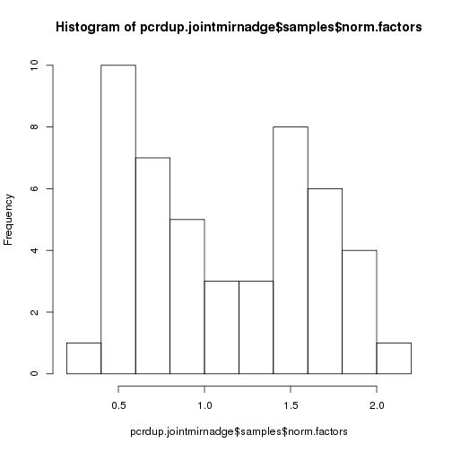
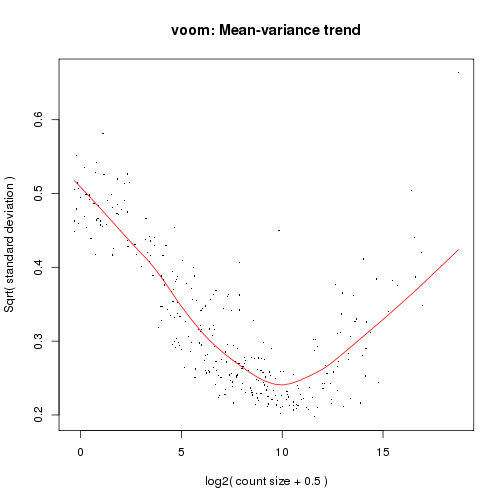
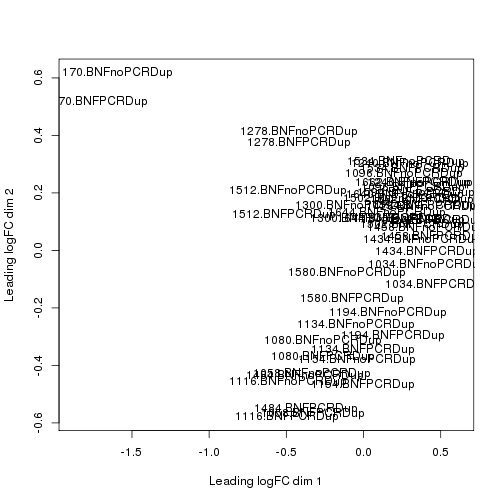
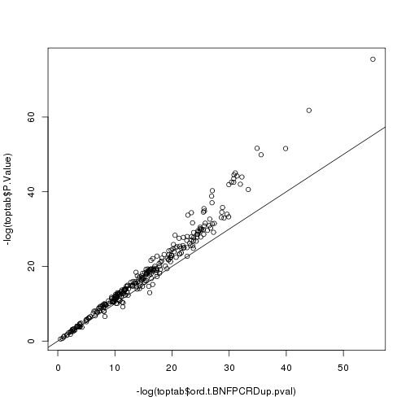
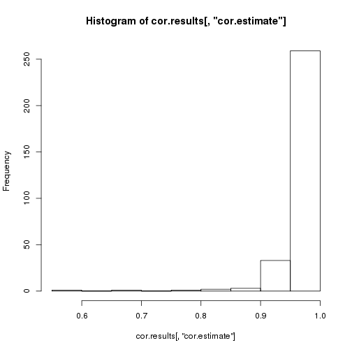
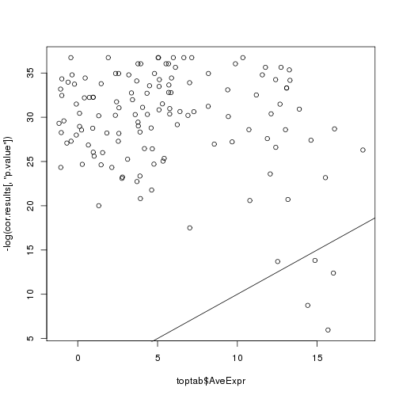
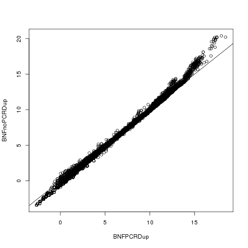

**Script:** `1_join_24Bioosci_PCRDUP_noPCRdup_datasets_dge_DE_analysis.R`

**Directory of Code:**  `/mnt/research/pigeqtl/analyses/microRNA/3_pcr_duplication_analysis/8_DE_analysis_BiooNextFlex_PCRDup_noPCRDup/scripts`

**Date:**  9/27/16

**Input File Directory:**  

1. `/mnt/research/pigeqtl/analyses/microRNA/3_pcr_duplication_analysis/3_24bioosci_mirna_expression_characterization`
2. `/mnt/research/pigeqtl/analyses/microRNA/3_pcr_duplication_analysis/6_process_24bioosci_PCRDUP_samples/4_24bioosci_PCRDUP_mirna_expression_matrix`
3. `/mnt/research/pigeqtl/analyses/microRNA/3_pcr_duplication_analysis/4_join_datasets_dge_object`

**Input File(s):**

1. `1_24bioosci_rounded_mean_mature_mirna_expression.Rdata`
2. `1_24bioosci_PCRDUP_rounded_mean_mature_mirna_expression.Rdata`
3. `1_mature_mirna_annotation.Rdata`

**Output File Directory:** `/mnt/research/pigeqtl/analyses/microRNA/3_pcr_duplication_analysis/8_DE_analysis_BiooNextFlex_PCRDup_noPCRDup`

**Output File(s):** 
1. `1_24bioosci_PCRDUP_noPCRDup_joint_mirna_expression_df.Rdata`
2. `2_24bioosci_PCRDUP_noPCRDup_joint_mirna_dge_object.Rdata`
3. `3_24bioosci_PCRDUP_noPCRDup_joint_mirna_voom_deanalysis_results.Rdata`

**Table of contents:**

1. [Objectives](#objectives)
2. [Install libraries](#install-libraries)
3. [Load data](#load-data)
4. [Analysis](#analysis)
5. [Save data](#save-data)

## Objectives
The objective of this script is to (1) join the two miRNA expression datasets into one and (2) make them into a dge object. 
This dge object will then (3) be filtered for miRNA expression: first, the read counts of the miRNAs will be normalized using the cpm function of edgeR, then filtered for expression (rough filter: < 1cpm in > 6 libraries removed) 
and the calcNormFactors and estimateCommonDisp functions of edgeR will be applied to the non-cpm read counts prior to the differential expression analysis of the read counts using the voom function. 

THIS ANALYSIS COMPLETED WITH R/3.2.0
## Install libraries


```r
library(methods)
library(limma)
library(edgeR)
library(statmod)
library(qvalue)

rm(list=ls())

setwd("/mnt/research/pigeqtl/analyses/microRNA/3_pcr_duplication_analysis/8_DE_analysis_BiooNextFlex_PCRDup_noPCRDup/scripts")
```

## Load data
Load the miRDeep2 read count data for the 24 Bioo Scientific libraries without PCR duplicates


```r
load("../../3_24bioosci_mirna_expression_characterization/1_24bioosci_rounded_mean_mature_mirna_expression.Rdata")
```

Load the miRDeep2 read count data for the 24 Bioo Scientific libraries containing PCR DUPLICATES


```r
load("../../6_process_24bioosci_PCRDUP_samples/4_24bioosci_PCRDUP_mirna_expression_matrix/1_24bioosci_PCRDUP_rounded_mean_mature_mirna_expression.Rdata")
```

Load the annotation file for the 24 Illumina libraries 


```r
load("../../4_join_datasets_dge_object/1_mature_mirna_annotation.Rdata")
ls()
```

```
## [1] "bioosci24libmirnaexp"           "illumina24.total.mature.annot2"
## [3] "pcrdup.bioo24.dfmeanrcround"
```

## Analysis

### 1. Join the two expression datasets (rounded, mean mature miRNA expression)

Make a matrix of miRNA read counts from the Bioo PCR duplicate-removed libraries


```r
nopcrdup.dfmeanrcround<-as.matrix(bioosci24libmirnaexp)
dim(nopcrdup.dfmeanrcround)
```

```
## [1] 411  24
```

Make the sample IDs more descriptive (BNFnoPCRDup = PCR Duplicate-removed libraries)


```r
colnames(nopcrdup.dfmeanrcround)<-paste(colnames(nopcrdup.dfmeanrcround), ".BNFnoPCRDup", sep = "")
nopcrdup.dfmeanrcround[1:5,1:5]
```

```
##               1034.BNFnoPCRDup 1058.BNFnoPCRDup 1080.BNFnoPCRDup
## ssc-let-7a               48132            40758            38799
## ssc-let-7c               32745            34313            28022
## ssc-let-7d-3p              381              778              774
## ssc-let-7d-5p             4925             3472             3705
## ssc-let-7e                2811             2512             2229
##               1096.BNFnoPCRDup 1116.BNFnoPCRDup
## ssc-let-7a               35977            36678
## ssc-let-7c               20772            29022
## ssc-let-7d-3p              440              710
## ssc-let-7d-5p             3259             3083
## ssc-let-7e                1898             2069
```

Define which miRNAs have zero expression in the Bioo PCR-dup-removed libraries:


```r
nopcrdupzeromir<-rownames(nopcrdup.dfmeanrcround[rowSums(nopcrdup.dfmeanrcround)==0,])
length(nopcrdupzeromir)
```

```
## [1] 85
```

```r
nopcrdupzeromir
```

```
##  [1] "ssc-miR-1296-3p" "ssc-miR-146a-3p" "ssc-miR-155-3p" 
##  [4] "ssc-miR-1839-3p" "ssc-miR-194b-3p" "ssc-miR-218-3p" 
##  [7] "ssc-miR-371-5p"  "ssc-miR-376b"    "ssc-miR-4334-5p"
## [10] "ssc-miR-4335"    "ssc-miR-4338"    "ssc-miR-4339"   
## [13] "ssc-miR-484"     "ssc-miR-494"     "ssc-miR-7141-3p"
## [16] "ssc-miR-7141-5p" "ssc-miR-7143-5p" "ssc-miR-9786-3p"
## [19] "ssc-miR-9787-3p" "ssc-miR-9789-3p" "ssc-miR-9790-3p"
## [22] "ssc-miR-9791-3p" "ssc-miR-9792-5p" "ssc-miR-9793-5p"
## [25] "ssc-miR-9794-3p" "ssc-miR-9795-3p" "ssc-miR-9796-3p"
## [28] "ssc-miR-9797-3p" "ssc-miR-9798-3p" "ssc-miR-9799-3p"
## [31] "ssc-miR-9800-3p" "ssc-miR-9801-5p" "ssc-miR-9802-3p"
## [34] "ssc-miR-9803-5p" "ssc-miR-9804-5p" "ssc-miR-9805-3p"
## [37] "ssc-miR-9806-5p" "ssc-miR-9807-5p" "ssc-miR-9808-3p"
## [40] "ssc-miR-9809-3p" "ssc-miR-9812-3p" "ssc-miR-9813-5p"
## [43] "ssc-miR-9814-3p" "ssc-miR-9815-3p" "ssc-miR-9816-3p"
## [46] "ssc-miR-9817-5p" "ssc-miR-9818-3p" "ssc-miR-9819-5p"
## [49] "ssc-miR-9821-5p" "ssc-miR-9822-3p" "ssc-miR-9823-5p"
## [52] "ssc-miR-9824-5p" "ssc-miR-9825-5p" "ssc-miR-9826-5p"
## [55] "ssc-miR-9827-5p" "ssc-miR-9828-3p" "ssc-miR-9829-5p"
## [58] "ssc-miR-9830-5p" "ssc-miR-9831-3p" "ssc-miR-9832-3p"
## [61] "ssc-miR-9833-5p" "ssc-miR-9834-5p" "ssc-miR-9835-3p"
## [64] "ssc-miR-9836-3p" "ssc-miR-9837-5p" "ssc-miR-9838-5p"
## [67] "ssc-miR-9839-5p" "ssc-miR-9840-3p" "ssc-miR-9842-5p"
## [70] "ssc-miR-9844-3p" "ssc-miR-9845-5p" "ssc-miR-9846-3p"
## [73] "ssc-miR-9847-3p" "ssc-miR-9848-3p" "ssc-miR-9849-5p"
## [76] "ssc-miR-9850-5p" "ssc-miR-9852-3p" "ssc-miR-9853-5p"
## [79] "ssc-miR-9854-5p" "ssc-miR-9855-5p" "ssc-miR-9856-3p"
## [82] "ssc-miR-9857-5p" "ssc-miR-9859-3p" "ssc-miR-9861-5p"
## [85] "ssc-miR-9862-3p"
```

Make a matrix of miRNA read counts from the Bioo prepped libraries


```r
pcrdup.bioosci24libmirnaexp<-as.matrix(pcrdup.bioo24.dfmeanrcround)
dim(pcrdup.bioosci24libmirnaexp)
```

```
## [1] 411  24
```

Make the sample IDs more descriptive (BNFPCRDup = Bioo Scientific Next Flex WITH PCR duplicates)


```r
colnames(pcrdup.bioosci24libmirnaexp)<-paste(colnames(pcrdup.bioosci24libmirnaexp), ".BNFPCRDup", sep = "")
pcrdup.bioosci24libmirnaexp[1:5,1:5]
```

```
##               1034.BNFPCRDup 1058.BNFPCRDup 1080.BNFPCRDup 1096.BNFPCRDup
## ssc-let-7a            121871         120489          99532          70908
## ssc-let-7c             52830          77943          51631          28774
## ssc-let-7d-3p            489           1396           1213            535
## ssc-let-7d-5p           7371           6641           6233           4304
## ssc-let-7e              3636           4248           3334           2285
##               1116.BNFPCRDup
## ssc-let-7a             88434
## ssc-let-7c             52407
## ssc-let-7d-3p           1042
## ssc-let-7d-5p           4989
## ssc-let-7e              3023
```

Define which miRNAs have zero expression in the Bioo prepped libraries:


```r
pcrdup.bioozeromir<-rownames(pcrdup.bioosci24libmirnaexp[rowSums(pcrdup.bioosci24libmirnaexp)==0,])
length(pcrdup.bioozeromir)
```

```
## [1] 85
```

```r
pcrdup.bioozeromir
```

```
##  [1] "ssc-miR-1296-3p" "ssc-miR-146a-3p" "ssc-miR-155-3p" 
##  [4] "ssc-miR-1839-3p" "ssc-miR-194b-3p" "ssc-miR-218-3p" 
##  [7] "ssc-miR-371-5p"  "ssc-miR-376b"    "ssc-miR-4334-5p"
## [10] "ssc-miR-4335"    "ssc-miR-4338"    "ssc-miR-4339"   
## [13] "ssc-miR-484"     "ssc-miR-494"     "ssc-miR-7141-3p"
## [16] "ssc-miR-7141-5p" "ssc-miR-7143-5p" "ssc-miR-9786-3p"
## [19] "ssc-miR-9787-3p" "ssc-miR-9789-3p" "ssc-miR-9790-3p"
## [22] "ssc-miR-9791-3p" "ssc-miR-9792-5p" "ssc-miR-9793-5p"
## [25] "ssc-miR-9794-3p" "ssc-miR-9795-3p" "ssc-miR-9796-3p"
## [28] "ssc-miR-9797-3p" "ssc-miR-9798-3p" "ssc-miR-9799-3p"
## [31] "ssc-miR-9800-3p" "ssc-miR-9801-5p" "ssc-miR-9802-3p"
## [34] "ssc-miR-9803-5p" "ssc-miR-9804-5p" "ssc-miR-9805-3p"
## [37] "ssc-miR-9806-5p" "ssc-miR-9807-5p" "ssc-miR-9808-3p"
## [40] "ssc-miR-9809-3p" "ssc-miR-9812-3p" "ssc-miR-9813-5p"
## [43] "ssc-miR-9814-3p" "ssc-miR-9815-3p" "ssc-miR-9816-3p"
## [46] "ssc-miR-9817-5p" "ssc-miR-9818-3p" "ssc-miR-9819-5p"
## [49] "ssc-miR-9821-5p" "ssc-miR-9822-3p" "ssc-miR-9823-5p"
## [52] "ssc-miR-9824-5p" "ssc-miR-9825-5p" "ssc-miR-9826-5p"
## [55] "ssc-miR-9827-5p" "ssc-miR-9828-3p" "ssc-miR-9829-5p"
## [58] "ssc-miR-9830-5p" "ssc-miR-9831-3p" "ssc-miR-9832-3p"
## [61] "ssc-miR-9833-5p" "ssc-miR-9834-5p" "ssc-miR-9835-3p"
## [64] "ssc-miR-9836-3p" "ssc-miR-9837-5p" "ssc-miR-9838-5p"
## [67] "ssc-miR-9839-5p" "ssc-miR-9840-3p" "ssc-miR-9842-5p"
## [70] "ssc-miR-9844-3p" "ssc-miR-9845-5p" "ssc-miR-9846-3p"
## [73] "ssc-miR-9847-3p" "ssc-miR-9848-3p" "ssc-miR-9849-5p"
## [76] "ssc-miR-9850-5p" "ssc-miR-9852-3p" "ssc-miR-9853-5p"
## [79] "ssc-miR-9854-5p" "ssc-miR-9855-5p" "ssc-miR-9856-3p"
## [82] "ssc-miR-9857-5p" "ssc-miR-9859-3p" "ssc-miR-9861-5p"
## [85] "ssc-miR-9862-3p"
```

In total, 85 miRNAs are not expressed in either dataset:


```r
sum(nopcrdupzeromir %in% pcrdup.bioozeromir)
```

```
## [1] 85
```

miRNAs not expressed in either dataset:


```r
nopcrdupzeromir[nopcrdupzeromir %in% pcrdup.bioozeromir]
```

```
##  [1] "ssc-miR-1296-3p" "ssc-miR-146a-3p" "ssc-miR-155-3p" 
##  [4] "ssc-miR-1839-3p" "ssc-miR-194b-3p" "ssc-miR-218-3p" 
##  [7] "ssc-miR-371-5p"  "ssc-miR-376b"    "ssc-miR-4334-5p"
## [10] "ssc-miR-4335"    "ssc-miR-4338"    "ssc-miR-4339"   
## [13] "ssc-miR-484"     "ssc-miR-494"     "ssc-miR-7141-3p"
## [16] "ssc-miR-7141-5p" "ssc-miR-7143-5p" "ssc-miR-9786-3p"
## [19] "ssc-miR-9787-3p" "ssc-miR-9789-3p" "ssc-miR-9790-3p"
## [22] "ssc-miR-9791-3p" "ssc-miR-9792-5p" "ssc-miR-9793-5p"
## [25] "ssc-miR-9794-3p" "ssc-miR-9795-3p" "ssc-miR-9796-3p"
## [28] "ssc-miR-9797-3p" "ssc-miR-9798-3p" "ssc-miR-9799-3p"
## [31] "ssc-miR-9800-3p" "ssc-miR-9801-5p" "ssc-miR-9802-3p"
## [34] "ssc-miR-9803-5p" "ssc-miR-9804-5p" "ssc-miR-9805-3p"
## [37] "ssc-miR-9806-5p" "ssc-miR-9807-5p" "ssc-miR-9808-3p"
## [40] "ssc-miR-9809-3p" "ssc-miR-9812-3p" "ssc-miR-9813-5p"
## [43] "ssc-miR-9814-3p" "ssc-miR-9815-3p" "ssc-miR-9816-3p"
## [46] "ssc-miR-9817-5p" "ssc-miR-9818-3p" "ssc-miR-9819-5p"
## [49] "ssc-miR-9821-5p" "ssc-miR-9822-3p" "ssc-miR-9823-5p"
## [52] "ssc-miR-9824-5p" "ssc-miR-9825-5p" "ssc-miR-9826-5p"
## [55] "ssc-miR-9827-5p" "ssc-miR-9828-3p" "ssc-miR-9829-5p"
## [58] "ssc-miR-9830-5p" "ssc-miR-9831-3p" "ssc-miR-9832-3p"
## [61] "ssc-miR-9833-5p" "ssc-miR-9834-5p" "ssc-miR-9835-3p"
## [64] "ssc-miR-9836-3p" "ssc-miR-9837-5p" "ssc-miR-9838-5p"
## [67] "ssc-miR-9839-5p" "ssc-miR-9840-3p" "ssc-miR-9842-5p"
## [70] "ssc-miR-9844-3p" "ssc-miR-9845-5p" "ssc-miR-9846-3p"
## [73] "ssc-miR-9847-3p" "ssc-miR-9848-3p" "ssc-miR-9849-5p"
## [76] "ssc-miR-9850-5p" "ssc-miR-9852-3p" "ssc-miR-9853-5p"
## [79] "ssc-miR-9854-5p" "ssc-miR-9855-5p" "ssc-miR-9856-3p"
## [82] "ssc-miR-9857-5p" "ssc-miR-9859-3p" "ssc-miR-9861-5p"
## [85] "ssc-miR-9862-3p"
```

Check that the rownames are equal between the datasets


```r
if (sum(rownames(pcrdup.bioosci24libmirnaexp) != rownames(nopcrdup.dfmeanrcround)) != 0) stop ("rownames not equal between datasets")
```

Join the two datasets using cbind


```r
pcrdup.jointmirnaexp<-cbind(nopcrdup.dfmeanrcround,pcrdup.bioosci24libmirnaexp)
pcrdup.jointmirnaexp[1:10,1:30]
```

```
##               1034.BNFnoPCRDup 1058.BNFnoPCRDup 1080.BNFnoPCRDup
## ssc-let-7a               48132            40758            38799
## ssc-let-7c               32745            34313            28022
## ssc-let-7d-3p              381              778              774
## ssc-let-7d-5p             4925             3472             3705
## ssc-let-7e                2811             2512             2229
## ssc-let-7f               35432            16512            19175
## ssc-let-7g               16700            11420            12589
## ssc-let-7i               10966             6161             5958
## ssc-miR-1               307458           109839           117277
## ssc-miR-100               9539            17474            12515
##               1096.BNFnoPCRDup 1116.BNFnoPCRDup 1134.BNFnoPCRDup
## ssc-let-7a               35977            36678            59997
## ssc-let-7c               20772            29022            45232
## ssc-let-7d-3p              440              710             1071
## ssc-let-7d-5p             3259             3083             6661
## ssc-let-7e                1898             2069             3942
## ssc-let-7f               29076            13446            34402
## ssc-let-7g               13903             8935            19988
## ssc-let-7i                6678             4530             9968
## ssc-miR-1               299430            87831           201671
## ssc-miR-100               4132            10920            12615
##               1154.BNFnoPCRDup 1170.BNFnoPCRDup 1194.BNFnoPCRDup
## ssc-let-7a               49982             2366            30864
## ssc-let-7c               37824             3077            17962
## ssc-let-7d-3p              750              525              256
## ssc-let-7d-5p             5225              175             2588
## ssc-let-7e                2481               75             1716
## ssc-let-7f               29411              576            20800
## ssc-let-7g               16459              345            10003
## ssc-let-7i               10729              121             4765
## ssc-miR-1               188530            15789           179399
## ssc-miR-100              13868              782             6564
##               1240.BNFnoPCRDup 1278.BNFnoPCRDup 1300.BNFnoPCRDup
## ssc-let-7a               35912            15876            28829
## ssc-let-7c               24015            14181            21753
## ssc-let-7d-3p              269             1033              652
## ssc-let-7d-5p             3037             1356             2545
## ssc-let-7e                1752              557             1383
## ssc-let-7f               27197            10064            18572
## ssc-let-7g               11962             5141             8998
## ssc-let-7i                6130             2243             3953
## ssc-miR-1               287670           154348           215062
## ssc-miR-100               4479             3280             4142
##               1426.BNFnoPCRDup 1434.BNFnoPCRDup 1458.BNFnoPCRDup
## ssc-let-7a               33168            28218            28524
## ssc-let-7c               20260            18147            17704
## ssc-let-7d-3p              170              212              147
## ssc-let-7d-5p             3037             2058             2518
## ssc-let-7e                1968             1413             1225
## ssc-let-7f               24686            20088            20538
## ssc-let-7g               11107             9884             9881
## ssc-let-7i                6260             5324             5092
## ssc-miR-1               234162           195847           225718
## ssc-miR-100               4613             5306             6048
##               1484.BNFnoPCRDup 1502.BNFnoPCRDup 1512.BNFnoPCRDup
## ssc-let-7a               32304            47522            20253
## ssc-let-7c               24491            28812            17415
## ssc-let-7d-3p              566              383              979
## ssc-let-7d-5p             2799             4754             1831
## ssc-let-7e                1786             3047              996
## ssc-let-7f               12570            35356            10026
## ssc-let-7g                8244            15708             5517
## ssc-let-7i                4339             8360             1934
## ssc-miR-1                77299           243462           113292
## ssc-miR-100              12852             4920             4733
##               1534.BNFnoPCRDup 1580.BNFnoPCRDup 1594.BNFnoPCRDup
## ssc-let-7a               27358            35516            36868
## ssc-let-7c               16277            25721            22762
## ssc-let-7d-3p              180              492              334
## ssc-let-7d-5p             2315             3304             3616
## ssc-let-7e                1532             1880             2096
## ssc-let-7f               20536            19231            27982
## ssc-let-7g                8174             9629            13167
## ssc-let-7i                3712             5684             5600
## ssc-miR-1               209555           157777           269043
## ssc-miR-100               1857             5190             5450
##               1640.BNFnoPCRDup 1644.BNFnoPCRDup 1662.BNFnoPCRDup
## ssc-let-7a               37179            38866            39304
## ssc-let-7c               19671            24475            25909
## ssc-let-7d-3p              271              306              417
## ssc-let-7d-5p             3814             3651             3820
## ssc-let-7e                2017             2711             2262
## ssc-let-7f               30385            27878            29883
## ssc-let-7g               15085            12447            14378
## ssc-let-7i                6037             5225             7214
## ssc-miR-1               230694           194188           272207
## ssc-miR-100               4355             2964             5050
##               1034.BNFPCRDup 1058.BNFPCRDup 1080.BNFPCRDup 1096.BNFPCRDup
## ssc-let-7a            121871         120489          99532          70908
## ssc-let-7c             52830          77943          51631          28774
## ssc-let-7d-3p            489           1396           1213            535
## ssc-let-7d-5p           7371           6641           6233           4304
## ssc-let-7e              3636           4248           3334           2285
## ssc-let-7f             79784          36098          38866          56124
## ssc-let-7g             33758          25786          26002          24050
## ssc-let-7i             16206          10927           9434           8780
## ssc-miR-1            3000633         560629         635504        3194495
## ssc-miR-100            14875          40497          24024           5421
##               1116.BNFPCRDup 1134.BNFPCRDup
## ssc-let-7a             88434         184955
## ssc-let-7c             52407          90522
## ssc-let-7d-3p           1042           1594
## ssc-let-7d-5p           4989          11692
## ssc-let-7e              3023           5894
## ssc-let-7f             24332          82877
## ssc-let-7g             16175          45276
## ssc-let-7i              6770          16013
## ssc-miR-1             350213        1521754
## ssc-miR-100            19104          22891
```

```r
dim(pcrdup.jointmirnaexp)
```

```
## [1] 411  48
```

```r
str(pcrdup.jointmirnaexp)
```

```
##  num [1:411, 1:48] 48132 32745 381 4925 2811 ...
##  - attr(*, "dimnames")=List of 2
##   ..$ : chr [1:411] "ssc-let-7a" "ssc-let-7c" "ssc-let-7d-3p" "ssc-let-7d-5p" ...
##   ..$ : chr [1:48] "1034.BNFnoPCRDup" "1058.BNFnoPCRDup" "1080.BNFnoPCRDup" "1096.BNFnoPCRDup" ...
```

Check that the data remained the same between the datasets (no shuffling took place):


```r
for (i in colnames(nopcrdup.dfmeanrcround)){
        print(sum(nopcrdup.dfmeanrcround[,i] != pcrdup.jointmirnaexp[,i]))
}
```

```
## [1] 0
## [1] 0
## [1] 0
## [1] 0
## [1] 0
## [1] 0
## [1] 0
## [1] 0
## [1] 0
## [1] 0
## [1] 0
## [1] 0
## [1] 0
## [1] 0
## [1] 0
## [1] 0
## [1] 0
## [1] 0
## [1] 0
## [1] 0
## [1] 0
## [1] 0
## [1] 0
## [1] 0
```

```r
for (i in colnames(pcrdup.bioosci24libmirnaexp)){
        print(sum(pcrdup.bioosci24libmirnaexp[,i] != pcrdup.jointmirnaexp[,i]))
}
```

```
## [1] 0
## [1] 0
## [1] 0
## [1] 0
## [1] 0
## [1] 0
## [1] 0
## [1] 0
## [1] 0
## [1] 0
## [1] 0
## [1] 0
## [1] 0
## [1] 0
## [1] 0
## [1] 0
## [1] 0
## [1] 0
## [1] 0
## [1] 0
## [1] 0
## [1] 0
## [1] 0
## [1] 0
```

```r
if (sum(rownames(nopcrdup.dfmeanrcround) != rownames(pcrdup.jointmirnaexp)) != 0) stop ("rownames not equal between datasets")
if (sum(rownames(pcrdup.bioosci24libmirnaexp) != rownames(pcrdup.jointmirnaexp)) != 0) stop ("rownames not equal between datasets")
```

### 2. Create dge object for the joint miRNA expression dataset, including a group option with the library preparation kit determining the groups.


```r
pcrdup.jointmirnadge<-DGEList(counts=pcrdup.jointmirnaexp, genes=illumina24.total.mature.annot2)
names(pcrdup.jointmirnadge)
```

```
## [1] "counts"  "samples" "genes"
```

```r
dim(pcrdup.jointmirnadge$counts)
```

```
## [1] 411  48
```

```r
head(pcrdup.jointmirnadge$counts)
```

```
##               1034.BNFnoPCRDup 1058.BNFnoPCRDup 1080.BNFnoPCRDup
## ssc-let-7a               48132            40758            38799
## ssc-let-7c               32745            34313            28022
## ssc-let-7d-3p              381              778              774
## ssc-let-7d-5p             4925             3472             3705
## ssc-let-7e                2811             2512             2229
## ssc-let-7f               35432            16512            19175
##               1096.BNFnoPCRDup 1116.BNFnoPCRDup 1134.BNFnoPCRDup
## ssc-let-7a               35977            36678            59997
## ssc-let-7c               20772            29022            45232
## ssc-let-7d-3p              440              710             1071
## ssc-let-7d-5p             3259             3083             6661
## ssc-let-7e                1898             2069             3942
## ssc-let-7f               29076            13446            34402
##               1154.BNFnoPCRDup 1170.BNFnoPCRDup 1194.BNFnoPCRDup
## ssc-let-7a               49982             2366            30864
## ssc-let-7c               37824             3077            17962
## ssc-let-7d-3p              750              525              256
## ssc-let-7d-5p             5225              175             2588
## ssc-let-7e                2481               75             1716
## ssc-let-7f               29411              576            20800
##               1240.BNFnoPCRDup 1278.BNFnoPCRDup 1300.BNFnoPCRDup
## ssc-let-7a               35912            15876            28829
## ssc-let-7c               24015            14181            21753
## ssc-let-7d-3p              269             1033              652
## ssc-let-7d-5p             3037             1356             2545
## ssc-let-7e                1752              557             1383
## ssc-let-7f               27197            10064            18572
##               1426.BNFnoPCRDup 1434.BNFnoPCRDup 1458.BNFnoPCRDup
## ssc-let-7a               33168            28218            28524
## ssc-let-7c               20260            18147            17704
## ssc-let-7d-3p              170              212              147
## ssc-let-7d-5p             3037             2058             2518
## ssc-let-7e                1968             1413             1225
## ssc-let-7f               24686            20088            20538
##               1484.BNFnoPCRDup 1502.BNFnoPCRDup 1512.BNFnoPCRDup
## ssc-let-7a               32304            47522            20253
## ssc-let-7c               24491            28812            17415
## ssc-let-7d-3p              566              383              979
## ssc-let-7d-5p             2799             4754             1831
## ssc-let-7e                1786             3047              996
## ssc-let-7f               12570            35356            10026
##               1534.BNFnoPCRDup 1580.BNFnoPCRDup 1594.BNFnoPCRDup
## ssc-let-7a               27358            35516            36868
## ssc-let-7c               16277            25721            22762
## ssc-let-7d-3p              180              492              334
## ssc-let-7d-5p             2315             3304             3616
## ssc-let-7e                1532             1880             2096
## ssc-let-7f               20536            19231            27982
##               1640.BNFnoPCRDup 1644.BNFnoPCRDup 1662.BNFnoPCRDup
## ssc-let-7a               37179            38866            39304
## ssc-let-7c               19671            24475            25909
## ssc-let-7d-3p              271              306              417
## ssc-let-7d-5p             3814             3651             3820
## ssc-let-7e                2017             2711             2262
## ssc-let-7f               30385            27878            29883
##               1034.BNFPCRDup 1058.BNFPCRDup 1080.BNFPCRDup 1096.BNFPCRDup
## ssc-let-7a            121871         120489          99532          70908
## ssc-let-7c             52830          77943          51631          28774
## ssc-let-7d-3p            489           1396           1213            535
## ssc-let-7d-5p           7371           6641           6233           4304
## ssc-let-7e              3636           4248           3334           2285
## ssc-let-7f             79784          36098          38866          56124
##               1116.BNFPCRDup 1134.BNFPCRDup 1154.BNFPCRDup 1170.BNFPCRDup
## ssc-let-7a             88434         184955         105338           4604
## ssc-let-7c             52407          90522          69993           6221
## ssc-let-7d-3p           1042           1594           1123           1166
## ssc-let-7d-5p           4989          11692           8054            334
## ssc-let-7e              3023           5894           3186            146
## ssc-let-7f             24332          82877          53897           1090
##               1194.BNFPCRDup 1240.BNFPCRDup 1278.BNFPCRDup 1300.BNFPCRDup
## ssc-let-7a             56074          74954          31466          62566
## ssc-let-7c             23344          35784          24846          36361
## ssc-let-7d-3p            290            340           1786            936
## ssc-let-7d-5p           3189           4127           2278           3911
## ssc-let-7e              1995           2174            871           1929
## ssc-let-7f             33522          52904          18376          35596
##               1426.BNFPCRDup 1434.BNFPCRDup 1458.BNFPCRDup 1484.BNFPCRDup
## ssc-let-7a             61593          50682          42404          66980
## ssc-let-7c             26465          24293          22798          39871
## ssc-let-7d-3p            189            244            161            742
## ssc-let-7d-5p           3813           2523           2967           4139
## ssc-let-7e              2255           1625           1326           2430
## ssc-let-7f             41933          32378          28576          20309
##               1502.BNFPCRDup 1512.BNFPCRDup 1534.BNFPCRDup 1580.BNFPCRDup
## ssc-let-7a            128323          44154          47459          75309
## ssc-let-7c             48683          32208          20438          39214
## ssc-let-7d-3p            549           1740            195            671
## ssc-let-7d-5p           7365           3184           2772           4662
## ssc-let-7e              4168           1566           1708           2362
## ssc-let-7f             85063          18608          32601          33098
##               1594.BNFPCRDup 1640.BNFPCRDup 1644.BNFPCRDup 1662.BNFPCRDup
## ssc-let-7a             79047          99398          96866          96218
## ssc-let-7c             33516          32698          39353          42164
## ssc-let-7d-3p            412            393            413            635
## ssc-let-7d-5p           5003           6280           5437           5834
## ssc-let-7e              2635           2883           3592           3155
## ssc-let-7f             54375          79049          63528          66254
```

```r
pcrdup.jointmirnadge$samples
```

```
##                  group lib.size norm.factors
## 1034.BNFnoPCRDup     1  1462358            1
## 1058.BNFnoPCRDup     1  1257197            1
## 1080.BNFnoPCRDup     1  1109738            1
## 1096.BNFnoPCRDup     1  1182030            1
## 1116.BNFnoPCRDup     1  1057987            1
## 1134.BNFnoPCRDup     1  1582559            1
## 1154.BNFnoPCRDup     1  1476707            1
## 1170.BNFnoPCRDup     1   223934            1
## 1194.BNFnoPCRDup     1   917965            1
## 1240.BNFnoPCRDup     1  1133876            1
## 1278.BNFnoPCRDup     1   765335            1
## 1300.BNFnoPCRDup     1   958081            1
## 1426.BNFnoPCRDup     1   961236            1
## 1434.BNFnoPCRDup     1   823729            1
## 1458.BNFnoPCRDup     1   910724            1
## 1484.BNFnoPCRDup     1  1069564            1
## 1502.BNFnoPCRDup     1  1088339            1
## 1512.BNFnoPCRDup     1   650729            1
## 1534.BNFnoPCRDup     1   700713            1
## 1580.BNFnoPCRDup     1   939869            1
## 1594.BNFnoPCRDup     1  1154715            1
## 1640.BNFnoPCRDup     1   887635            1
## 1644.BNFnoPCRDup     1   787899            1
## 1662.BNFnoPCRDup     1  1181022            1
## 1034.BNFPCRDup       1  6071222            1
## 1058.BNFPCRDup       1  4788265            1
## 1080.BNFPCRDup       1  3648754            1
## 1096.BNFPCRDup       1  5242376            1
## 1116.BNFPCRDup       1  3330069            1
## 1134.BNFPCRDup       1  6083725            1
## 1154.BNFPCRDup       1  5321499            1
## 1170.BNFPCRDup       1   907228            1
## 1194.BNFPCRDup       1  2574715            1
## 1240.BNFPCRDup       1  4858886            1
## 1278.BNFPCRDup       1  2847081            1
## 1300.BNFPCRDup       1  3953149            1
## 1426.BNFPCRDup       1  3166545            1
## 1434.BNFPCRDup       1  2385628            1
## 1458.BNFPCRDup       1  2927940            1
## 1484.BNFPCRDup       1  2913776            1
## 1502.BNFPCRDup       1  4641909            1
## 1512.BNFPCRDup       1  2263253            1
## 1534.BNFPCRDup       1  2298493            1
## 1580.BNFPCRDup       1  2844359            1
## 1594.BNFPCRDup       1  4755125            1
## 1640.BNFPCRDup       1  4179418            1
## 1644.BNFPCRDup       1  3091322            1
## 1662.BNFPCRDup       1  5460376            1
```

Check that the data remained the same between the datasets (no shuffling took place):


```r
if (sum(rownames(nopcrdup.dfmeanrcround) != rownames(pcrdup.jointmirnadge)) != 0) stop ("rownames not equal between datasets")
if (sum(rownames(pcrdup.bioosci24libmirnaexp) != rownames(pcrdup.jointmirnadge)) != 0) stop ("rownames not equal between datasets")

for (i in colnames(nopcrdup.dfmeanrcround)){
        print(sum(nopcrdup.dfmeanrcround[,i] != pcrdup.jointmirnadge$counts[,i]))
}
```

```
## [1] 0
## [1] 0
## [1] 0
## [1] 0
## [1] 0
## [1] 0
## [1] 0
## [1] 0
## [1] 0
## [1] 0
## [1] 0
## [1] 0
## [1] 0
## [1] 0
## [1] 0
## [1] 0
## [1] 0
## [1] 0
## [1] 0
## [1] 0
## [1] 0
## [1] 0
## [1] 0
## [1] 0
```

```r
for (i in colnames(pcrdup.bioosci24libmirnaexp)){
        print(sum(pcrdup.bioosci24libmirnaexp[,i] != pcrdup.jointmirnadge$counts[,i]))
}
```

```
## [1] 0
## [1] 0
## [1] 0
## [1] 0
## [1] 0
## [1] 0
## [1] 0
## [1] 0
## [1] 0
## [1] 0
## [1] 0
## [1] 0
## [1] 0
## [1] 0
## [1] 0
## [1] 0
## [1] 0
## [1] 0
## [1] 0
## [1] 0
## [1] 0
## [1] 0
## [1] 0
## [1] 0
```

### 3. Filter the joint expression dataset (dge object)
First, eliminate miRNAs whose total expression is 0 among the datasets


```r
sum(rowSums(pcrdup.jointmirnadge$counts) == 0)
```

```
## [1] 85
```

So, 85 miRNAs have 0 expression among the datasets


```r
pcrdup.jointmirnadge<-pcrdup.jointmirnadge[rowSums(pcrdup.jointmirnadge$counts)>0,]
dim(pcrdup.jointmirnadge)
```

```
## [1] 326  48
```

Calculate the read counts per million in order to filter miRNAs by normalized expression:


```r
cpm.pcrdup.jointmirnadge<-cpm(pcrdup.jointmirnadge)
dim(cpm.pcrdup.jointmirnadge)
```

```
## [1] 326  48
```

```r
cpm.pcrdup.jointmirnadge[1:5,1:5]
```

```
##               1034.BNFnoPCRDup 1058.BNFnoPCRDup 1080.BNFnoPCRDup
## ssc-let-7a          32913.9650        32419.740       34962.3064
## ssc-let-7c          22391.9177        27293.256       25251.0052
## ssc-let-7d-3p         260.5381          618.837         697.4619
## ssc-let-7d-5p        3367.8484         2761.699        3338.6259
## ssc-let-7e           1922.2379         1998.096        2008.5822
##               1096.BNFnoPCRDup 1116.BNFnoPCRDup
## ssc-let-7a           30436.622       34667.7228
## ssc-let-7c           17573.158       27431.3389
## ssc-let-7d-3p          372.241         671.0858
## ssc-let-7d-5p         2757.121        2914.0245
## ssc-let-7e            1605.712        1955.6006
```

```r
if (sum(colnames(nopcrdup.dfmeanrcround)!=colnames(cpm.pcrdup.jointmirnadge[1:24]))!=0) stop ("animal ids not the same between read counts and cpm")
if (sum(rownames(nopcrdup.dfmeanrcround)!=rownames(illumina24.total.mature.annot2))!=0) stop ("miRNAs not the same between read counts and annotation")

if (sum(colnames(pcrdup.bioosci24libmirnaexp)!=colnames(cpm.pcrdup.jointmirnadge[25:ncol(cpm.pcrdup.jointmirnadge)]))!=0) stop ("animal ids not the same between read counts and cpm")
if (sum(rownames(pcrdup.bioosci24libmirnaexp)!=rownames(illumina24.total.mature.annot2))!=0) stop ("miRNAs not the same between read counts and annotation")
```

Filter miRNAs with at least 1 cpm in at least 1/4 of the samples (24/4=6)


```r
filtercpm<-rowSums(cpm.pcrdup.jointmirnadge>=1)>=6
sum(filtercpm)
```

```
## [1] 300
```

```r
nrow(cpm.pcrdup.jointmirnadge) - sum(filtercpm)
```

```
## [1] 26
```

We are removing 26 miRNA profiles from the analysis

So, keep the miRNA profiles in dge based on those retained in the cpm-filtering step:

This retains the rounded, mean read counts, not the cpm (this will be done later):


```r
pcrdup.jointmirnadge<-pcrdup.jointmirnadge[filtercpm,]
names(pcrdup.jointmirnadge)
```

```
## [1] "counts"  "samples" "genes"
```

```r
pcrdup.jointmirnadge[1:5,1:5]
```

```
## An object of class "DGEList"
## $counts
##               1034.BNFnoPCRDup 1058.BNFnoPCRDup 1080.BNFnoPCRDup
## ssc-let-7a               48132            40758            38799
## ssc-let-7c               32745            34313            28022
## ssc-let-7d-3p              381              778              774
## ssc-let-7d-5p             4925             3472             3705
## ssc-let-7e                2811             2512             2229
##               1096.BNFnoPCRDup 1116.BNFnoPCRDup
## ssc-let-7a               35977            36678
## ssc-let-7c               20772            29022
## ssc-let-7d-3p              440              710
## ssc-let-7d-5p             3259             3083
## ssc-let-7e                1898             2069
## 
## $samples
##                  group lib.size norm.factors
## 1034.BNFnoPCRDup     1  1462358            1
## 1058.BNFnoPCRDup     1  1257197            1
## 1080.BNFnoPCRDup     1  1109738            1
## 1096.BNFnoPCRDup     1  1182030            1
## 1116.BNFnoPCRDup     1  1057987            1
## 
## $genes
##                        Name  chr0     start       end width strand  type
## ssc-let-7a       ssc-let-7a  chr3  44864443  44864464    22      + miRNA
## ssc-let-7c       ssc-let-7c chr13 191559351 191559372    22      + miRNA
## ssc-let-7d-3p ssc-let-7d-3p  chr3  44867331  44867352    22      + miRNA
## ssc-let-7d-5p ssc-let-7d-5p  chr3  44867277  44867298    22      + miRNA
## ssc-let-7e       ssc-let-7e  chr6  51858385  51858406    22      + miRNA
##                      Alias          Precursors
## ssc-let-7a    MIMAT0013865 MI0017984,MI0013085
## ssc-let-7c    MIMAT0002151           MI0002445
## ssc-let-7d-3p MIMAT0025357           MI0022120
## ssc-let-7d-5p MIMAT0025356           MI0022120
## ssc-let-7e    MIMAT0013866           MI0013086
```

```r
dim(pcrdup.jointmirnadge$counts)
```

```
## [1] 300  48
```

```r
if (sum(colnames(pcrdup.jointmirnadge)!=colnames(cpm.pcrdup.jointmirnadge))!=0) stop ("colnames not the same between dge and cpm.pcrdup.jointmirnadge")
```

Apply the TMM normalization (normalizes for RNA composition by finding a set of scaling factors for the library sizes that minimize the log-fold changes between the samples for the most genes):

The result is the effective library size, which is equal to the product of the original library size and the scaling factor. Effective library size is what is used in downstream analyses.


```r
pcrdup.jointmirnadge<-calcNormFactors(pcrdup.jointmirnadge)
pcrdup.jointmirnadge$samples
```

```
##                  group lib.size norm.factors
## 1034.BNFnoPCRDup     1  1462358    1.7362396
## 1058.BNFnoPCRDup     1  1257197    1.9636317
## 1080.BNFnoPCRDup     1  1109738    2.1026870
## 1096.BNFnoPCRDup     1  1182030    1.6128832
## 1116.BNFnoPCRDup     1  1057987    1.7338168
## 1134.BNFnoPCRDup     1  1582559    1.9987414
## 1154.BNFnoPCRDup     1  1476707    1.9867773
## 1170.BNFnoPCRDup     1   223934    0.8337578
## 1194.BNFnoPCRDup     1   917965    1.6023012
## 1240.BNFnoPCRDup     1  1133876    1.3822680
## 1278.BNFnoPCRDup     1   765335    1.5515859
## 1300.BNFnoPCRDup     1   958081    1.5963149
## 1426.BNFnoPCRDup     1   961236    1.4655528
## 1434.BNFnoPCRDup     1   823729    1.5663641
## 1458.BNFnoPCRDup     1   910724    1.5022888
## 1484.BNFnoPCRDup     1  1069564    1.8326309
## 1502.BNFnoPCRDup     1  1088339    1.3568982
## 1512.BNFnoPCRDup     1   650729    1.4792194
## 1534.BNFnoPCRDup     1   700713    1.1420364
## 1580.BNFnoPCRDup     1   939869    1.6062434
## 1594.BNFnoPCRDup     1  1154715    1.5742044
## 1640.BNFnoPCRDup     1   887635    1.4129978
## 1644.BNFnoPCRDup     1   787899    1.3415564
## 1662.BNFnoPCRDup     1  1181022    1.6122494
## 1034.BNFPCRDup       1  6071222    0.6369018
## 1058.BNFPCRDup       1  4788265    0.9750576
## 1080.BNFPCRDup       1  3648754    1.0109368
## 1096.BNFPCRDup       1  5242376    0.5086364
## 1116.BNFPCRDup       1  3330069    0.9064292
## 1134.BNFPCRDup       1  6083725    0.8838198
## 1154.BNFPCRDup       1  5321499    0.8924920
## 1170.BNFPCRDup       1   907228    0.3930998
## 1194.BNFPCRDup       1  2574715    0.7636902
## 1240.BNFPCRDup       1  4858886    0.4771562
## 1278.BNFPCRDup       1  2847081    0.7199955
## 1300.BNFPCRDup       1  3953149    0.6135699
## 1426.BNFPCRDup       1  3166545    0.5810479
## 1434.BNFPCRDup       1  2385628    0.6841945
## 1458.BNFPCRDup       1  2927940    0.5675789
## 1484.BNFPCRDup       1  2913776    1.0246656
## 1502.BNFPCRDup       1  4641909    0.5009154
## 1512.BNFPCRDup       1  2263253    0.7396258
## 1534.BNFPCRDup       1  2298493    0.4215049
## 1580.BNFPCRDup       1  2844359    0.7740697
## 1594.BNFPCRDup       1  4755125    0.5119515
## 1640.BNFPCRDup       1  4179418    0.4769584
## 1644.BNFPCRDup       1  3091322    0.4583344
## 1662.BNFPCRDup       1  5460376    0.5428429
```

```r
hist(pcrdup.jointmirnadge$samples$norm.factors)
```



```r
pcrdup.jointmirnadge$samples$norm.factors
```

```
##  [1] 1.7362396 1.9636317 2.1026870 1.6128832 1.7338168 1.9987414 1.9867773
##  [8] 0.8337578 1.6023012 1.3822680 1.5515859 1.5963149 1.4655528 1.5663641
## [15] 1.5022888 1.8326309 1.3568982 1.4792194 1.1420364 1.6062434 1.5742044
## [22] 1.4129978 1.3415564 1.6122494 0.6369018 0.9750576 1.0109368 0.5086364
## [29] 0.9064292 0.8838198 0.8924920 0.3930998 0.7636902 0.4771562 0.7199955
## [36] 0.6135699 0.5810479 0.6841945 0.5675789 1.0246656 0.5009154 0.7396258
## [43] 0.4215049 0.7740697 0.5119515 0.4769584 0.4583344 0.5428429
```

This function (estimateCommonDisp) applies normalization factors, caluclates normalized expression based on robust count of normalized reads.

estimateCommonDisp estimates the quantile-adjusted conditional maximum likelihood (qCML) common dispersion.

This creates a matrix of pseudo-counts, used internally to speed up computation of conditional likelihood used for dispersion estimation & exact tests in the limma pipeline.
Pseudo-counts represent the equivalent counts that would have been observed had the library sizes all been equal, assuming the fitted model.
DO NOT INTERPRET PSEUDO-COUNTS AS GENERAL-PURPOSE NORMALIZED COUNTS.


```r
pcrdup.jointmirnadge<-estimateCommonDisp(pcrdup.jointmirnadge,verbose=TRUE)
```

```
## Disp = 0.23741 , BCV = 0.4872
```

```r
pcrdup.jointmirnadge$common.dispersion
```

```
## [1] 0.2374069
```

### 4. Perform the DE analysis (following the case study in edgeR User Guide: "edgeR: differential expression analysis of digital gene expression data")

Apply the voom transformation and build the design matrix

First, create factors of individual and kit to create the design matrix:


```r
indiv<-factor(substr(colnames(pcrdup.jointmirnadge$counts), 1, 4))
head(indiv)
```

```
## [1] 1034 1058 1080 1096 1116 1134
## 24 Levels: 1034 1058 1080 1096 1116 1134 1154 1170 1194 1240 1278 ... 1662
```

```r
str(indiv)
```

```
##  Factor w/ 24 levels "1034","1058",..: 1 2 3 4 5 6 7 8 9 10 ...
```

```r
kit<-factor(rep(c("BNFnoPCRDup", "BNFPCRDup"), c(24,24)))
kit
```

```
##  [1] BNFnoPCRDup BNFnoPCRDup BNFnoPCRDup BNFnoPCRDup BNFnoPCRDup
##  [6] BNFnoPCRDup BNFnoPCRDup BNFnoPCRDup BNFnoPCRDup BNFnoPCRDup
## [11] BNFnoPCRDup BNFnoPCRDup BNFnoPCRDup BNFnoPCRDup BNFnoPCRDup
## [16] BNFnoPCRDup BNFnoPCRDup BNFnoPCRDup BNFnoPCRDup BNFnoPCRDup
## [21] BNFnoPCRDup BNFnoPCRDup BNFnoPCRDup BNFnoPCRDup BNFPCRDup  
## [26] BNFPCRDup   BNFPCRDup   BNFPCRDup   BNFPCRDup   BNFPCRDup  
## [31] BNFPCRDup   BNFPCRDup   BNFPCRDup   BNFPCRDup   BNFPCRDup  
## [36] BNFPCRDup   BNFPCRDup   BNFPCRDup   BNFPCRDup   BNFPCRDup  
## [41] BNFPCRDup   BNFPCRDup   BNFPCRDup   BNFPCRDup   BNFPCRDup  
## [46] BNFPCRDup   BNFPCRDup   BNFPCRDup  
## Levels: BNFnoPCRDup BNFPCRDup
```

```r
str(kit)
```

```
##  Factor w/ 2 levels "BNFnoPCRDup",..: 1 1 1 1 1 1 1 1 1 1 ...
```

View this as a data.frame to check for correctness:


```r
data.frame(Sample=colnames(pcrdup.jointmirnadge$counts), indiv, kit)
```

```
##              Sample indiv         kit
## 1  1034.BNFnoPCRDup  1034 BNFnoPCRDup
## 2  1058.BNFnoPCRDup  1058 BNFnoPCRDup
## 3  1080.BNFnoPCRDup  1080 BNFnoPCRDup
## 4  1096.BNFnoPCRDup  1096 BNFnoPCRDup
## 5  1116.BNFnoPCRDup  1116 BNFnoPCRDup
## 6  1134.BNFnoPCRDup  1134 BNFnoPCRDup
## 7  1154.BNFnoPCRDup  1154 BNFnoPCRDup
## 8  1170.BNFnoPCRDup  1170 BNFnoPCRDup
## 9  1194.BNFnoPCRDup  1194 BNFnoPCRDup
## 10 1240.BNFnoPCRDup  1240 BNFnoPCRDup
## 11 1278.BNFnoPCRDup  1278 BNFnoPCRDup
## 12 1300.BNFnoPCRDup  1300 BNFnoPCRDup
## 13 1426.BNFnoPCRDup  1426 BNFnoPCRDup
## 14 1434.BNFnoPCRDup  1434 BNFnoPCRDup
## 15 1458.BNFnoPCRDup  1458 BNFnoPCRDup
## 16 1484.BNFnoPCRDup  1484 BNFnoPCRDup
## 17 1502.BNFnoPCRDup  1502 BNFnoPCRDup
## 18 1512.BNFnoPCRDup  1512 BNFnoPCRDup
## 19 1534.BNFnoPCRDup  1534 BNFnoPCRDup
## 20 1580.BNFnoPCRDup  1580 BNFnoPCRDup
## 21 1594.BNFnoPCRDup  1594 BNFnoPCRDup
## 22 1640.BNFnoPCRDup  1640 BNFnoPCRDup
## 23 1644.BNFnoPCRDup  1644 BNFnoPCRDup
## 24 1662.BNFnoPCRDup  1662 BNFnoPCRDup
## 25   1034.BNFPCRDup  1034   BNFPCRDup
## 26   1058.BNFPCRDup  1058   BNFPCRDup
## 27   1080.BNFPCRDup  1080   BNFPCRDup
## 28   1096.BNFPCRDup  1096   BNFPCRDup
## 29   1116.BNFPCRDup  1116   BNFPCRDup
## 30   1134.BNFPCRDup  1134   BNFPCRDup
## 31   1154.BNFPCRDup  1154   BNFPCRDup
## 32   1170.BNFPCRDup  1170   BNFPCRDup
## 33   1194.BNFPCRDup  1194   BNFPCRDup
## 34   1240.BNFPCRDup  1240   BNFPCRDup
## 35   1278.BNFPCRDup  1278   BNFPCRDup
## 36   1300.BNFPCRDup  1300   BNFPCRDup
## 37   1426.BNFPCRDup  1426   BNFPCRDup
## 38   1434.BNFPCRDup  1434   BNFPCRDup
## 39   1458.BNFPCRDup  1458   BNFPCRDup
## 40   1484.BNFPCRDup  1484   BNFPCRDup
## 41   1502.BNFPCRDup  1502   BNFPCRDup
## 42   1512.BNFPCRDup  1512   BNFPCRDup
## 43   1534.BNFPCRDup  1534   BNFPCRDup
## 44   1580.BNFPCRDup  1580   BNFPCRDup
## 45   1594.BNFPCRDup  1594   BNFPCRDup
## 46   1640.BNFPCRDup  1640   BNFPCRDup
## 47   1644.BNFPCRDup  1644   BNFPCRDup
## 48   1662.BNFPCRDup  1662   BNFPCRDup
```

Use the model.matrix() command to create the design matrix for this analysis:


```r
design <- model.matrix(~indiv+kit)
rownames(design)<-colnames(pcrdup.jointmirnadge$counts)
design
```

```
##                  (Intercept) indiv1058 indiv1080 indiv1096 indiv1116
## 1034.BNFnoPCRDup           1         0         0         0         0
## 1058.BNFnoPCRDup           1         1         0         0         0
## 1080.BNFnoPCRDup           1         0         1         0         0
## 1096.BNFnoPCRDup           1         0         0         1         0
## 1116.BNFnoPCRDup           1         0         0         0         1
## 1134.BNFnoPCRDup           1         0         0         0         0
## 1154.BNFnoPCRDup           1         0         0         0         0
## 1170.BNFnoPCRDup           1         0         0         0         0
## 1194.BNFnoPCRDup           1         0         0         0         0
## 1240.BNFnoPCRDup           1         0         0         0         0
## 1278.BNFnoPCRDup           1         0         0         0         0
## 1300.BNFnoPCRDup           1         0         0         0         0
## 1426.BNFnoPCRDup           1         0         0         0         0
## 1434.BNFnoPCRDup           1         0         0         0         0
## 1458.BNFnoPCRDup           1         0         0         0         0
## 1484.BNFnoPCRDup           1         0         0         0         0
## 1502.BNFnoPCRDup           1         0         0         0         0
## 1512.BNFnoPCRDup           1         0         0         0         0
## 1534.BNFnoPCRDup           1         0         0         0         0
## 1580.BNFnoPCRDup           1         0         0         0         0
## 1594.BNFnoPCRDup           1         0         0         0         0
## 1640.BNFnoPCRDup           1         0         0         0         0
## 1644.BNFnoPCRDup           1         0         0         0         0
## 1662.BNFnoPCRDup           1         0         0         0         0
## 1034.BNFPCRDup             1         0         0         0         0
## 1058.BNFPCRDup             1         1         0         0         0
## 1080.BNFPCRDup             1         0         1         0         0
## 1096.BNFPCRDup             1         0         0         1         0
## 1116.BNFPCRDup             1         0         0         0         1
## 1134.BNFPCRDup             1         0         0         0         0
## 1154.BNFPCRDup             1         0         0         0         0
## 1170.BNFPCRDup             1         0         0         0         0
## 1194.BNFPCRDup             1         0         0         0         0
## 1240.BNFPCRDup             1         0         0         0         0
## 1278.BNFPCRDup             1         0         0         0         0
## 1300.BNFPCRDup             1         0         0         0         0
## 1426.BNFPCRDup             1         0         0         0         0
## 1434.BNFPCRDup             1         0         0         0         0
## 1458.BNFPCRDup             1         0         0         0         0
## 1484.BNFPCRDup             1         0         0         0         0
## 1502.BNFPCRDup             1         0         0         0         0
## 1512.BNFPCRDup             1         0         0         0         0
## 1534.BNFPCRDup             1         0         0         0         0
## 1580.BNFPCRDup             1         0         0         0         0
## 1594.BNFPCRDup             1         0         0         0         0
## 1640.BNFPCRDup             1         0         0         0         0
## 1644.BNFPCRDup             1         0         0         0         0
## 1662.BNFPCRDup             1         0         0         0         0
##                  indiv1134 indiv1154 indiv1170 indiv1194 indiv1240
## 1034.BNFnoPCRDup         0         0         0         0         0
## 1058.BNFnoPCRDup         0         0         0         0         0
## 1080.BNFnoPCRDup         0         0         0         0         0
## 1096.BNFnoPCRDup         0         0         0         0         0
## 1116.BNFnoPCRDup         0         0         0         0         0
## 1134.BNFnoPCRDup         1         0         0         0         0
## 1154.BNFnoPCRDup         0         1         0         0         0
## 1170.BNFnoPCRDup         0         0         1         0         0
## 1194.BNFnoPCRDup         0         0         0         1         0
## 1240.BNFnoPCRDup         0         0         0         0         1
## 1278.BNFnoPCRDup         0         0         0         0         0
## 1300.BNFnoPCRDup         0         0         0         0         0
## 1426.BNFnoPCRDup         0         0         0         0         0
## 1434.BNFnoPCRDup         0         0         0         0         0
## 1458.BNFnoPCRDup         0         0         0         0         0
## 1484.BNFnoPCRDup         0         0         0         0         0
## 1502.BNFnoPCRDup         0         0         0         0         0
## 1512.BNFnoPCRDup         0         0         0         0         0
## 1534.BNFnoPCRDup         0         0         0         0         0
## 1580.BNFnoPCRDup         0         0         0         0         0
## 1594.BNFnoPCRDup         0         0         0         0         0
## 1640.BNFnoPCRDup         0         0         0         0         0
## 1644.BNFnoPCRDup         0         0         0         0         0
## 1662.BNFnoPCRDup         0         0         0         0         0
## 1034.BNFPCRDup           0         0         0         0         0
## 1058.BNFPCRDup           0         0         0         0         0
## 1080.BNFPCRDup           0         0         0         0         0
## 1096.BNFPCRDup           0         0         0         0         0
## 1116.BNFPCRDup           0         0         0         0         0
## 1134.BNFPCRDup           1         0         0         0         0
## 1154.BNFPCRDup           0         1         0         0         0
## 1170.BNFPCRDup           0         0         1         0         0
## 1194.BNFPCRDup           0         0         0         1         0
## 1240.BNFPCRDup           0         0         0         0         1
## 1278.BNFPCRDup           0         0         0         0         0
## 1300.BNFPCRDup           0         0         0         0         0
## 1426.BNFPCRDup           0         0         0         0         0
## 1434.BNFPCRDup           0         0         0         0         0
## 1458.BNFPCRDup           0         0         0         0         0
## 1484.BNFPCRDup           0         0         0         0         0
## 1502.BNFPCRDup           0         0         0         0         0
## 1512.BNFPCRDup           0         0         0         0         0
## 1534.BNFPCRDup           0         0         0         0         0
## 1580.BNFPCRDup           0         0         0         0         0
## 1594.BNFPCRDup           0         0         0         0         0
## 1640.BNFPCRDup           0         0         0         0         0
## 1644.BNFPCRDup           0         0         0         0         0
## 1662.BNFPCRDup           0         0         0         0         0
##                  indiv1278 indiv1300 indiv1426 indiv1434 indiv1458
## 1034.BNFnoPCRDup         0         0         0         0         0
## 1058.BNFnoPCRDup         0         0         0         0         0
## 1080.BNFnoPCRDup         0         0         0         0         0
## 1096.BNFnoPCRDup         0         0         0         0         0
## 1116.BNFnoPCRDup         0         0         0         0         0
## 1134.BNFnoPCRDup         0         0         0         0         0
## 1154.BNFnoPCRDup         0         0         0         0         0
## 1170.BNFnoPCRDup         0         0         0         0         0
## 1194.BNFnoPCRDup         0         0         0         0         0
## 1240.BNFnoPCRDup         0         0         0         0         0
## 1278.BNFnoPCRDup         1         0         0         0         0
## 1300.BNFnoPCRDup         0         1         0         0         0
## 1426.BNFnoPCRDup         0         0         1         0         0
## 1434.BNFnoPCRDup         0         0         0         1         0
## 1458.BNFnoPCRDup         0         0         0         0         1
## 1484.BNFnoPCRDup         0         0         0         0         0
## 1502.BNFnoPCRDup         0         0         0         0         0
## 1512.BNFnoPCRDup         0         0         0         0         0
## 1534.BNFnoPCRDup         0         0         0         0         0
## 1580.BNFnoPCRDup         0         0         0         0         0
## 1594.BNFnoPCRDup         0         0         0         0         0
## 1640.BNFnoPCRDup         0         0         0         0         0
## 1644.BNFnoPCRDup         0         0         0         0         0
## 1662.BNFnoPCRDup         0         0         0         0         0
## 1034.BNFPCRDup           0         0         0         0         0
## 1058.BNFPCRDup           0         0         0         0         0
## 1080.BNFPCRDup           0         0         0         0         0
## 1096.BNFPCRDup           0         0         0         0         0
## 1116.BNFPCRDup           0         0         0         0         0
## 1134.BNFPCRDup           0         0         0         0         0
## 1154.BNFPCRDup           0         0         0         0         0
## 1170.BNFPCRDup           0         0         0         0         0
## 1194.BNFPCRDup           0         0         0         0         0
## 1240.BNFPCRDup           0         0         0         0         0
## 1278.BNFPCRDup           1         0         0         0         0
## 1300.BNFPCRDup           0         1         0         0         0
## 1426.BNFPCRDup           0         0         1         0         0
## 1434.BNFPCRDup           0         0         0         1         0
## 1458.BNFPCRDup           0         0         0         0         1
## 1484.BNFPCRDup           0         0         0         0         0
## 1502.BNFPCRDup           0         0         0         0         0
## 1512.BNFPCRDup           0         0         0         0         0
## 1534.BNFPCRDup           0         0         0         0         0
## 1580.BNFPCRDup           0         0         0         0         0
## 1594.BNFPCRDup           0         0         0         0         0
## 1640.BNFPCRDup           0         0         0         0         0
## 1644.BNFPCRDup           0         0         0         0         0
## 1662.BNFPCRDup           0         0         0         0         0
##                  indiv1484 indiv1502 indiv1512 indiv1534 indiv1580
## 1034.BNFnoPCRDup         0         0         0         0         0
## 1058.BNFnoPCRDup         0         0         0         0         0
## 1080.BNFnoPCRDup         0         0         0         0         0
## 1096.BNFnoPCRDup         0         0         0         0         0
## 1116.BNFnoPCRDup         0         0         0         0         0
## 1134.BNFnoPCRDup         0         0         0         0         0
## 1154.BNFnoPCRDup         0         0         0         0         0
## 1170.BNFnoPCRDup         0         0         0         0         0
## 1194.BNFnoPCRDup         0         0         0         0         0
## 1240.BNFnoPCRDup         0         0         0         0         0
## 1278.BNFnoPCRDup         0         0         0         0         0
## 1300.BNFnoPCRDup         0         0         0         0         0
## 1426.BNFnoPCRDup         0         0         0         0         0
## 1434.BNFnoPCRDup         0         0         0         0         0
## 1458.BNFnoPCRDup         0         0         0         0         0
## 1484.BNFnoPCRDup         1         0         0         0         0
## 1502.BNFnoPCRDup         0         1         0         0         0
## 1512.BNFnoPCRDup         0         0         1         0         0
## 1534.BNFnoPCRDup         0         0         0         1         0
## 1580.BNFnoPCRDup         0         0         0         0         1
## 1594.BNFnoPCRDup         0         0         0         0         0
## 1640.BNFnoPCRDup         0         0         0         0         0
## 1644.BNFnoPCRDup         0         0         0         0         0
## 1662.BNFnoPCRDup         0         0         0         0         0
## 1034.BNFPCRDup           0         0         0         0         0
## 1058.BNFPCRDup           0         0         0         0         0
## 1080.BNFPCRDup           0         0         0         0         0
## 1096.BNFPCRDup           0         0         0         0         0
## 1116.BNFPCRDup           0         0         0         0         0
## 1134.BNFPCRDup           0         0         0         0         0
## 1154.BNFPCRDup           0         0         0         0         0
## 1170.BNFPCRDup           0         0         0         0         0
## 1194.BNFPCRDup           0         0         0         0         0
## 1240.BNFPCRDup           0         0         0         0         0
## 1278.BNFPCRDup           0         0         0         0         0
## 1300.BNFPCRDup           0         0         0         0         0
## 1426.BNFPCRDup           0         0         0         0         0
## 1434.BNFPCRDup           0         0         0         0         0
## 1458.BNFPCRDup           0         0         0         0         0
## 1484.BNFPCRDup           1         0         0         0         0
## 1502.BNFPCRDup           0         1         0         0         0
## 1512.BNFPCRDup           0         0         1         0         0
## 1534.BNFPCRDup           0         0         0         1         0
## 1580.BNFPCRDup           0         0         0         0         1
## 1594.BNFPCRDup           0         0         0         0         0
## 1640.BNFPCRDup           0         0         0         0         0
## 1644.BNFPCRDup           0         0         0         0         0
## 1662.BNFPCRDup           0         0         0         0         0
##                  indiv1594 indiv1640 indiv1644 indiv1662 kitBNFPCRDup
## 1034.BNFnoPCRDup         0         0         0         0            0
## 1058.BNFnoPCRDup         0         0         0         0            0
## 1080.BNFnoPCRDup         0         0         0         0            0
## 1096.BNFnoPCRDup         0         0         0         0            0
## 1116.BNFnoPCRDup         0         0         0         0            0
## 1134.BNFnoPCRDup         0         0         0         0            0
## 1154.BNFnoPCRDup         0         0         0         0            0
## 1170.BNFnoPCRDup         0         0         0         0            0
## 1194.BNFnoPCRDup         0         0         0         0            0
## 1240.BNFnoPCRDup         0         0         0         0            0
## 1278.BNFnoPCRDup         0         0         0         0            0
## 1300.BNFnoPCRDup         0         0         0         0            0
## 1426.BNFnoPCRDup         0         0         0         0            0
## 1434.BNFnoPCRDup         0         0         0         0            0
## 1458.BNFnoPCRDup         0         0         0         0            0
## 1484.BNFnoPCRDup         0         0         0         0            0
## 1502.BNFnoPCRDup         0         0         0         0            0
## 1512.BNFnoPCRDup         0         0         0         0            0
## 1534.BNFnoPCRDup         0         0         0         0            0
## 1580.BNFnoPCRDup         0         0         0         0            0
## 1594.BNFnoPCRDup         1         0         0         0            0
## 1640.BNFnoPCRDup         0         1         0         0            0
## 1644.BNFnoPCRDup         0         0         1         0            0
## 1662.BNFnoPCRDup         0         0         0         1            0
## 1034.BNFPCRDup           0         0         0         0            1
## 1058.BNFPCRDup           0         0         0         0            1
## 1080.BNFPCRDup           0         0         0         0            1
## 1096.BNFPCRDup           0         0         0         0            1
## 1116.BNFPCRDup           0         0         0         0            1
## 1134.BNFPCRDup           0         0         0         0            1
## 1154.BNFPCRDup           0         0         0         0            1
## 1170.BNFPCRDup           0         0         0         0            1
## 1194.BNFPCRDup           0         0         0         0            1
## 1240.BNFPCRDup           0         0         0         0            1
## 1278.BNFPCRDup           0         0         0         0            1
## 1300.BNFPCRDup           0         0         0         0            1
## 1426.BNFPCRDup           0         0         0         0            1
## 1434.BNFPCRDup           0         0         0         0            1
## 1458.BNFPCRDup           0         0         0         0            1
## 1484.BNFPCRDup           0         0         0         0            1
## 1502.BNFPCRDup           0         0         0         0            1
## 1512.BNFPCRDup           0         0         0         0            1
## 1534.BNFPCRDup           0         0         0         0            1
## 1580.BNFPCRDup           0         0         0         0            1
## 1594.BNFPCRDup           1         0         0         0            1
## 1640.BNFPCRDup           0         1         0         0            1
## 1644.BNFPCRDup           0         0         1         0            1
## 1662.BNFPCRDup           0         0         0         1            1
## attr(,"assign")
##  [1] 0 1 1 1 1 1 1 1 1 1 1 1 1 1 1 1 1 1 1 1 1 1 1 1 2
## attr(,"contrasts")
## attr(,"contrasts")$indiv
## [1] "contr.treatment"
## 
## attr(,"contrasts")$kit
## [1] "contr.treatment"
```

Apply the voom transformation to the dataset


```r
v <- voom(pcrdup.jointmirnadge, design=design, plot=TRUE)
```



```r
names(v)
```

```
## [1] "genes"   "targets" "E"       "weights" "design"
```

```r
dim(v$E)
```

```
## [1] 300  48
```

```r
v$E[1:5,1:5]
```

```
##               1034.BNFnoPCRDup 1058.BNFnoPCRDup 1080.BNFnoPCRDup
## ssc-let-7a           14.210461        14.011078        14.021297
## ssc-let-7c           13.654746        13.762753        13.551844
## ssc-let-7d-3p         7.231276         8.300818         8.374668
## ssc-let-7d-5p        10.921791        10.458023        10.632999
## ssc-let-7e           10.112861         9.991172         9.900051
##               1096.BNFnoPCRDup 1116.BNFnoPCRDup
## ssc-let-7a           14.203898        14.287373
## ssc-let-7c           13.411478        13.949610
## ssc-let-7d-3p         7.852089         8.597417
## ssc-let-7d-5p        10.739526        10.715079
## ssc-let-7e            9.959735        10.139792
```

```r
dim(v$genes)
```

```
## [1] 300   9
```

```r
v$genes[1:5,1:5]
```

```
##                        Name  chr0     start       end width
## ssc-let-7a       ssc-let-7a  chr3  44864443  44864464    22
## ssc-let-7c       ssc-let-7c chr13 191559351 191559372    22
## ssc-let-7d-3p ssc-let-7d-3p  chr3  44867331  44867352    22
## ssc-let-7d-5p ssc-let-7d-5p  chr3  44867277  44867298    22
## ssc-let-7e       ssc-let-7e  chr6  51858385  51858406    22
```

```r
dim(v$weights)
```

```
## [1] 300  48
```

```r
v$weights[1:5,1:5]
```

```
##           [,1]      [,2]      [,3]      [,4]      [,5]
## [1,]  70.56616  76.45357  77.41383  82.17535  80.87915
## [2,]  85.10940  81.35509  89.02500 104.55690  88.84165
## [3,] 234.20655 292.47668 293.18520 248.99497 286.49481
## [4,] 197.38184 222.73012 216.48370 229.86660 232.52536
## [5,] 241.38886 247.48306 253.66370 269.22016 261.38126
```

```r
dim(v$targets)
```

```
## [1] 48  3
```

```r
v$targets[1:5,]
```

```
##                  group lib.size norm.factors
## 1034.BNFnoPCRDup     1  2539004     1.736240
## 1058.BNFnoPCRDup     1  2468672     1.963632
## 1080.BNFnoPCRDup     1  2333432     2.102687
## 1096.BNFnoPCRDup     1  1906476     1.612883
## 1116.BNFnoPCRDup     1  1834356     1.733817
```

```r
dim(v$design)
```

```
## [1] 48 25
```

```r
v$design[1:5,]
```

```
##                  (Intercept) indiv1058 indiv1080 indiv1096 indiv1116
## 1034.BNFnoPCRDup           1         0         0         0         0
## 1058.BNFnoPCRDup           1         1         0         0         0
## 1080.BNFnoPCRDup           1         0         1         0         0
## 1096.BNFnoPCRDup           1         0         0         1         0
## 1116.BNFnoPCRDup           1         0         0         0         1
##                  indiv1134 indiv1154 indiv1170 indiv1194 indiv1240
## 1034.BNFnoPCRDup         0         0         0         0         0
## 1058.BNFnoPCRDup         0         0         0         0         0
## 1080.BNFnoPCRDup         0         0         0         0         0
## 1096.BNFnoPCRDup         0         0         0         0         0
## 1116.BNFnoPCRDup         0         0         0         0         0
##                  indiv1278 indiv1300 indiv1426 indiv1434 indiv1458
## 1034.BNFnoPCRDup         0         0         0         0         0
## 1058.BNFnoPCRDup         0         0         0         0         0
## 1080.BNFnoPCRDup         0         0         0         0         0
## 1096.BNFnoPCRDup         0         0         0         0         0
## 1116.BNFnoPCRDup         0         0         0         0         0
##                  indiv1484 indiv1502 indiv1512 indiv1534 indiv1580
## 1034.BNFnoPCRDup         0         0         0         0         0
## 1058.BNFnoPCRDup         0         0         0         0         0
## 1080.BNFnoPCRDup         0         0         0         0         0
## 1096.BNFnoPCRDup         0         0         0         0         0
## 1116.BNFnoPCRDup         0         0         0         0         0
##                  indiv1594 indiv1640 indiv1644 indiv1662 kitBNFPCRDup
## 1034.BNFnoPCRDup         0         0         0         0            0
## 1058.BNFnoPCRDup         0         0         0         0            0
## 1080.BNFnoPCRDup         0         0         0         0            0
## 1096.BNFnoPCRDup         0         0         0         0            0
## 1116.BNFnoPCRDup         0         0         0         0            0
```

Now be super paranoid that no NAs or missing data exists...


```r
sum(is.na(v$E))
```

```
## [1] 0
```

```r
sum(is.na(v$weights))
```

```
## [1] 0
```

```r
sum(v$E == "NA")
```

```
## [1] 0
```

```r
sum(v$weights == "NA")
```

```
## [1] 0
```

```r
sum(v$E == "NaN")
```

```
## [1] 0
```

```r
sum(v$weights == "NaN")
```

```
## [1] 0
```

... And we're good! Carry on.
Examine the samples for outliers and for other relationships by using the function plotMDS():

This function draws a multi-dimensional scaling plot of the RNA samples in which distances correspond to leading log-fold-changes between each pair of RNA samples.
The leading log-fold-change is the average (root-mean-square) of the largest absolute log-fold-changes between each pair of samples. Can be viewed as unsupervised clustering.


```r
plotMDS(v)
```



### 4. Perform the DE analysis


```r
fit<-lmFit(v, design=design)
names(fit)
```

```
##  [1] "coefficients"     "stdev.unscaled"   "sigma"           
##  [4] "df.residual"      "cov.coefficients" "pivot"           
##  [7] "rank"             "genes"            "Amean"           
## [10] "method"           "design"
```

Residual standard deviations for each gene:


```r
head(fit$sigma)
```

```
## [1] 1.4857661 0.5428001 1.2459193 0.6329368 0.7579121 1.5115131
```

```r
summary(fit$sigma)
```

```
##    Min. 1st Qu.  Median    Mean 3rd Qu.    Max. 
##  0.4948  0.7806  0.8999  0.9594  1.0620  3.2120
```

Compute moderated t-statistics, moderated F-statistics, and log-odds of DE by empirical Bayes moderation of standard errors towards a common value:


```r
fitmodt<-eBayes(fit)
names(fitmodt)
```

```
##  [1] "coefficients"     "stdev.unscaled"   "sigma"           
##  [4] "df.residual"      "cov.coefficients" "pivot"           
##  [7] "rank"             "genes"            "Amean"           
## [10] "method"           "design"           "df.prior"        
## [13] "s2.prior"         "var.prior"        "proportion"      
## [16] "s2.post"          "t"                "df.total"        
## [19] "p.value"          "lods"             "F"               
## [22] "F.p.value"
```

Summarize the differentially expressed genes between the sequencing kits using tobTable.
The argument "adjust.method = "BH" means using the FDR method to correct for multiple testing.


```r
toptab<-(topTable(fitmodt, coef=ncol(design), n=Inf, adjust.method="BH"))
dim(toptab)
```

```
## [1] 300  15
```

```r
head(toptab)
```

```
##                            Name  chr0     start       end width strand
## ssc-miR-133a-3p ssc-miR-133a-3p chr17  69274675  69274695    21      -
## ssc-miR-486         ssc-miR-486 chr17  12191279  12191300    22      -
## ssc-miR-16           ssc-miR-16 chr13 108388297 108388318    22      +
## ssc-miR-152         ssc-miR-152 chr12  24289551  24289571    21      -
## ssc-miR-378         ssc-miR-378 chr12  38396743  38396764    22      +
## ssc-miR-374a-5p ssc-miR-374a-5p  chrX  67530410  67530431    22      -
##                  type        Alias          Precursors     logFC  AveExpr
## ssc-miR-133a-3p miRNA MIMAT0010186 MI0010681,MI0015909 1.6707409 16.08753
## ssc-miR-486     miRNA MIMAT0013886           MI0013103 1.3162883 15.74133
## ssc-miR-16      miRNA MIMAT0007754           MI0008213 1.2168741 13.16773
## ssc-miR-152     miRNA MIMAT0013887           MI0013104 0.4008503 11.14302
## ssc-miR-378     miRNA MIMAT0013868 MI0016622,MI0013088 1.0329498 16.01822
## ssc-miR-374a-5p miRNA MIMAT0013913           MI0013130 0.6938787 12.11424
##                        t      P.Value    adj.P.Val        B
## ssc-miR-133a-3p 46.95224 1.642161e-33 4.926482e-31 66.56547
## ssc-miR-486     31.61365 1.453667e-27 2.180501e-25 52.87017
## ssc-miR-16      23.41557 3.759239e-23 3.004598e-21 42.28850
## ssc-miR-152     23.37094 4.006130e-23 3.004598e-21 41.97652
## ssc-miR-378     22.22356 2.135117e-22 1.281070e-20 40.82676
## ssc-miR-374a-5p 19.15547 2.784282e-20 1.392141e-18 35.39865
```

```r
rownames(toptab)
```

```
##   [1] "ssc-miR-133a-3p"  "ssc-miR-486"      "ssc-miR-16"      
##   [4] "ssc-miR-152"      "ssc-miR-378"      "ssc-miR-374a-5p" 
##   [7] "ssc-miR-10b"      "ssc-miR-143-3p"   "ssc-miR-26a"     
##  [10] "ssc-miR-125b"     "ssc-miR-30b-5p"   "ssc-miR-425-5p"  
##  [13] "ssc-miR-24-3p"    "ssc-miR-3613"     "ssc-miR-1"       
##  [16] "ssc-miR-133a-5p"  "ssc-miR-148a-3p"  "ssc-miR-22-3p"   
##  [19] "ssc-miR-423-5p"   "ssc-miR-133b"     "ssc-miR-206"     
##  [22] "ssc-miR-95"       "ssc-miR-30c-5p"   "ssc-miR-190a"    
##  [25] "ssc-miR-30d"      "ssc-miR-885-5p"   "ssc-miR-181d-5p" 
##  [28] "ssc-miR-361-3p"   "ssc-miR-320"      "ssc-miR-450b-5p" 
##  [31] "ssc-miR-126-3p"   "ssc-miR-142-5p"   "ssc-miR-145-3p"  
##  [34] "ssc-miR-362"      "ssc-miR-425-3p"   "ssc-miR-1468"    
##  [37] "ssc-miR-7"        "ssc-miR-196b-5p"  "ssc-miR-29b"     
##  [40] "ssc-miR-20a"      "ssc-miR-196a"     "ssc-miR-423-3p"  
##  [43] "ssc-miR-28-5p"    "ssc-miR-339"      "ssc-miR-30a-3p"  
##  [46] "ssc-miR-432-5p"   "ssc-miR-4334-3p"  "ssc-miR-195"     
##  [49] "ssc-let-7a"       "ssc-miR-1296-5p"  "ssc-let-7e"      
##  [52] "ssc-miR-7142-3p"  "ssc-miR-181a"     "ssc-miR-19a"     
##  [55] "ssc-miR-339-5p"   "ssc-miR-192"      "ssc-miR-340"     
##  [58] "ssc-miR-99a"      "ssc-miR-199b-5p"  "ssc-miR-450b-3p" 
##  [61] "ssc-miR-193a-5p"  "ssc-miR-769-5p"   "ssc-miR-500"     
##  [64] "ssc-miR-29c"      "ssc-miR-155-5p"   "ssc-miR-345-3p"  
##  [67] "ssc-miR-204"      "ssc-miR-382"      "ssc-miR-140-5p"  
##  [70] "ssc-miR-130a"     "ssc-miR-136"      "ssc-miR-148a-5p" 
##  [73] "ssc-miR-24-1-5p"  "ssc-miR-455-5p"   "ssc-miR-221-3p"  
##  [76] "ssc-miR-30e-3p"   "ssc-miR-17-5p"    "ssc-miR-182"     
##  [79] "ssc-miR-130b"     "ssc-miR-542-3p"   "ssc-miR-545-5p"  
##  [82] "ssc-miR-493-5p"   "ssc-miR-98"       "ssc-miR-199a-3p" 
##  [85] "ssc-miR-199b-3p"  "ssc-miR-331-5p"   "ssc-miR-146a-5p" 
##  [88] "ssc-miR-22-5p"    "ssc-miR-181c"     "ssc-miR-146b"    
##  [91] "ssc-miR-185"      "ssc-miR-323"      "ssc-miR-34a"     
##  [94] "ssc-miR-122"      "ssc-miR-191"      "ssc-miR-499-5p"  
##  [97] "ssc-miR-664-5p"   "ssc-let-7g"       "ssc-miR-30c-3p"  
## [100] "ssc-miR-107"      "ssc-miR-296-3p"   "ssc-miR-142-3p"  
## [103] "ssc-miR-450a"     "ssc-miR-10a-3p"   "ssc-miR-106a"    
## [106] "ssc-miR-153"      "ssc-miR-9858-5p"  "ssc-miR-9820-5p" 
## [109] "ssc-miR-151-5p"   "ssc-miR-7144-5p"  "ssc-miR-9810-3p" 
## [112] "ssc-miR-20b"      "ssc-miR-744"      "ssc-miR-27b-5p"  
## [115] "ssc-miR-708-5p"   "ssc-miR-218"      "ssc-miR-218-5p"  
## [118] "ssc-miR-218b"     "ssc-miR-9"        "ssc-miR-9-1"     
## [121] "ssc-miR-9-2"      "ssc-miR-885-3p"   "ssc-miR-28-3p"   
## [124] "ssc-miR-374a-3p"  "ssc-miR-582"      "ssc-miR-222"     
## [127] "ssc-miR-505"      "ssc-miR-9860-5p"  "ssc-let-7f"      
## [130] "ssc-miR-628"      "ssc-miR-92b-3p"   "ssc-miR-129a-5p" 
## [133] "ssc-miR-129b"     "ssc-miR-504"      "ssc-miR-758"     
## [136] "ssc-miR-450c-3p"  "ssc-miR-874"      "ssc-miR-92b-5p"  
## [139] "ssc-miR-328"      "ssc-miR-149"      "ssc-miR-365-5p"  
## [142] "ssc-miR-421-3p"   "ssc-miR-138"      "ssc-miR-374b-3p" 
## [145] "ssc-miR-140-3p"   "ssc-miR-489"      "ssc-miR-1307"    
## [148] "ssc-miR-542-5p"   "ssc-miR-324"      "ssc-miR-376a-3p" 
## [151] "ssc-miR-205"      "ssc-miR-7143-3p"  "ssc-miR-493-3p"  
## [154] "ssc-miR-301"      "ssc-miR-139-3p"   "ssc-miR-151-3p"  
## [157] "ssc-miR-1343"     "ssc-miR-7137-5p"  "ssc-miR-7135-5p" 
## [160] "ssc-miR-676-3p"   "ssc-miR-148b-5p"  "ssc-miR-363"     
## [163] "ssc-miR-381"      "ssc-miR-7139-5p"  "ssc-miR-9785-5p" 
## [166] "ssc-miR-411"      "ssc-miR-450c-5p"  "ssc-miR-7134-3p" 
## [169] "ssc-miR-326"      "ssc-miR-30e-5p"   "ssc-miR-664-3p"  
## [172] "ssc-miR-532-3p"   "ssc-miR-34c"      "ssc-miR-194a"    
## [175] "ssc-miR-18a"      "ssc-miR-2411"     "ssc-miR-671-3p"  
## [178] "ssc-miR-139-5p"   "ssc-miR-181b"     "ssc-miR-135"     
## [181] "ssc-miR-190b"     "ssc-miR-7138-3p"  "ssc-miR-296-5p"  
## [184] "ssc-miR-2366"     "ssc-miR-10a-5p"   "ssc-miR-184"     
## [187] "ssc-miR-7857-3p"  "ssc-miR-1277"     "ssc-miR-7134-5p" 
## [190] "ssc-miR-19b"      "ssc-miR-129a-3p"  "ssc-miR-208b"    
## [193] "ssc-miR-216"      "ssc-miR-652"      "ssc-miR-30c-1-3p"
## [196] "ssc-miR-105-1"    "ssc-miR-7139-3p"  "ssc-miR-202-5p"  
## [199] "ssc-miR-370"      "ssc-miR-221-5p"   "ssc-miR-219a"    
## [202] "ssc-miR-30a-5p"   "ssc-miR-7138-5p"  "ssc-miR-143-5p"  
## [205] "ssc-miR-338"      "ssc-miR-376c"     "ssc-miR-339-3p"  
## [208] "ssc-miR-24-2-5p"  "ssc-miR-1306-3p"  "ssc-miR-376a-5p" 
## [211] "ssc-miR-15a"      "ssc-miR-2483"     "ssc-miR-671-5p"  
## [214] "ssc-miR-30b-3p"   "ssc-miR-497"      "ssc-miR-1285"    
## [217] "ssc-miR-210"      "ssc-miR-96-5p"    "ssc-miR-424-3p"  
## [220] "ssc-let-7d-3p"    "ssc-miR-193a-3p"  "ssc-miR-491"     
## [223] "ssc-miR-103"      "ssc-miR-21"       "ssc-miR-27a"     
## [226] "ssc-miR-18b"      "ssc-miR-545-3p"   "ssc-miR-32"      
## [229] "ssc-miR-199a-5p"  "ssc-miR-196b-3p"  "ssc-miR-183"     
## [232] "ssc-miR-29a"      "ssc-miR-361-5p"   "ssc-miR-217"     
## [235] "ssc-miR-125a"     "ssc-miR-2320-3p"  "ssc-miR-451"     
## [238] "ssc-miR-708-3p"   "ssc-miR-186"      "ssc-let-7i"      
## [241] "ssc-miR-503"      "ssc-miR-487b"     "ssc-miR-424-5p"  
## [244] "ssc-miR-574"      "ssc-miR-615"      "ssc-miR-6782-3p" 
## [247] "ssc-miR-769-3p"   "ssc-let-7c"       "ssc-miR-126-5p"  
## [250] "ssc-miR-187"      "ssc-miR-551a"     "ssc-miR-2320-5p" 
## [253] "ssc-miR-369"      "ssc-miR-17-3p"    "ssc-miR-7137-3p" 
## [256] "ssc-miR-452"      "ssc-miR-299"      "ssc-miR-148b-3p" 
## [259] "ssc-miR-128"      "ssc-miR-1271"     "ssc-miR-92a"     
## [262] "ssc-miR-27b-3p"   "ssc-miR-144"      "ssc-miR-150"     
## [265] "ssc-miR-365-3p"   "ssc-miR-429"      "ssc-miR-935"     
## [268] "ssc-miR-335"      "ssc-miR-4332"     "ssc-miR-214"     
## [271] "ssc-miR-9851-3p"  "ssc-miR-212"      "ssc-miR-9841-3p" 
## [274] "ssc-miR-490"      "ssc-miR-490-3p"   "ssc-miR-7135-3p" 
## [277] "ssc-miR-345-5p"   "ssc-miR-4331"     "ssc-miR-374b-5p" 
## [280] "ssc-miR-127"      "ssc-miR-23a"      "ssc-miR-99b"     
## [283] "ssc-miR-378b-3p"  "ssc-miR-342"      "ssc-miR-499-3p"  
## [286] "ssc-miR-1839-5p"  "ssc-miR-1249"     "ssc-miR-132"     
## [289] "ssc-miR-100"      "ssc-miR-455-3p"   "ssc-miR-31"      
## [292] "ssc-miR-23b"      "ssc-miR-1306-5p"  "ssc-miR-145-5p"  
## [295] "ssc-let-7d-5p"    "ssc-miR-9843-3p"  "ssc-miR-101"     
## [298] "ssc-miR-331-3p"   "ssc-miR-532-5p"   "ssc-miR-15b"
```

```r
sum(toptab$adj.P.Val <= 0.05)
```

```
## [1] 285
```

```r
sum(toptab$adj.P.Val <= 0.01)
```

```
## [1] 270
```

The eBayes function is giving a warning message that the var.prior cannot be estimated. 
Investigate manually calculating the unmoderated ("ordinary") t-statistic from the lmFit cor.results and compare the cor.results to the eBayes moderated t-statistics p-values (var.prior = default value)

Manual calculation of t-statistics from lmFit:


```r
ordt<-fit$coef/fit$stdev.unscaled/fit$sigma
rownames(ordt)
```

```
##   [1] "ssc-let-7a"       "ssc-let-7c"       "ssc-let-7d-3p"   
##   [4] "ssc-let-7d-5p"    "ssc-let-7e"       "ssc-let-7f"      
##   [7] "ssc-let-7g"       "ssc-let-7i"       "ssc-miR-1"       
##  [10] "ssc-miR-100"      "ssc-miR-101"      "ssc-miR-103"     
##  [13] "ssc-miR-105-1"    "ssc-miR-106a"     "ssc-miR-107"     
##  [16] "ssc-miR-10a-3p"   "ssc-miR-10a-5p"   "ssc-miR-10b"     
##  [19] "ssc-miR-122"      "ssc-miR-1249"     "ssc-miR-125a"    
##  [22] "ssc-miR-125b"     "ssc-miR-126-3p"   "ssc-miR-126-5p"  
##  [25] "ssc-miR-127"      "ssc-miR-1271"     "ssc-miR-1277"    
##  [28] "ssc-miR-128"      "ssc-miR-1285"     "ssc-miR-1296-5p" 
##  [31] "ssc-miR-129a-3p"  "ssc-miR-129a-5p"  "ssc-miR-129b"    
##  [34] "ssc-miR-1306-3p"  "ssc-miR-1306-5p"  "ssc-miR-1307"    
##  [37] "ssc-miR-130a"     "ssc-miR-130b"     "ssc-miR-132"     
##  [40] "ssc-miR-133a-3p"  "ssc-miR-133a-5p"  "ssc-miR-133b"    
##  [43] "ssc-miR-1343"     "ssc-miR-135"      "ssc-miR-136"     
##  [46] "ssc-miR-138"      "ssc-miR-139-3p"   "ssc-miR-139-5p"  
##  [49] "ssc-miR-140-3p"   "ssc-miR-140-5p"   "ssc-miR-142-3p"  
##  [52] "ssc-miR-142-5p"   "ssc-miR-143-3p"   "ssc-miR-143-5p"  
##  [55] "ssc-miR-144"      "ssc-miR-145-3p"   "ssc-miR-145-5p"  
##  [58] "ssc-miR-1468"     "ssc-miR-146a-5p"  "ssc-miR-146b"    
##  [61] "ssc-miR-148a-3p"  "ssc-miR-148a-5p"  "ssc-miR-148b-3p" 
##  [64] "ssc-miR-148b-5p"  "ssc-miR-149"      "ssc-miR-150"     
##  [67] "ssc-miR-151-3p"   "ssc-miR-151-5p"   "ssc-miR-152"     
##  [70] "ssc-miR-153"      "ssc-miR-155-5p"   "ssc-miR-15a"     
##  [73] "ssc-miR-15b"      "ssc-miR-16"       "ssc-miR-17-3p"   
##  [76] "ssc-miR-17-5p"    "ssc-miR-181a"     "ssc-miR-181b"    
##  [79] "ssc-miR-181c"     "ssc-miR-181d-5p"  "ssc-miR-182"     
##  [82] "ssc-miR-183"      "ssc-miR-1839-5p"  "ssc-miR-184"     
##  [85] "ssc-miR-185"      "ssc-miR-186"      "ssc-miR-187"     
##  [88] "ssc-miR-18a"      "ssc-miR-18b"      "ssc-miR-190a"    
##  [91] "ssc-miR-190b"     "ssc-miR-191"      "ssc-miR-192"     
##  [94] "ssc-miR-193a-3p"  "ssc-miR-193a-5p"  "ssc-miR-194a"    
##  [97] "ssc-miR-195"      "ssc-miR-196a"     "ssc-miR-196b-3p" 
## [100] "ssc-miR-196b-5p"  "ssc-miR-199a-3p"  "ssc-miR-199a-5p" 
## [103] "ssc-miR-199b-3p"  "ssc-miR-199b-5p"  "ssc-miR-19a"     
## [106] "ssc-miR-19b"      "ssc-miR-202-5p"   "ssc-miR-204"     
## [109] "ssc-miR-205"      "ssc-miR-206"      "ssc-miR-208b"    
## [112] "ssc-miR-20a"      "ssc-miR-20b"      "ssc-miR-21"      
## [115] "ssc-miR-210"      "ssc-miR-212"      "ssc-miR-214"     
## [118] "ssc-miR-216"      "ssc-miR-217"      "ssc-miR-218"     
## [121] "ssc-miR-218-5p"   "ssc-miR-218b"     "ssc-miR-219a"    
## [124] "ssc-miR-221-3p"   "ssc-miR-221-5p"   "ssc-miR-222"     
## [127] "ssc-miR-22-3p"    "ssc-miR-22-5p"    "ssc-miR-2320-3p" 
## [130] "ssc-miR-2320-5p"  "ssc-miR-2366"     "ssc-miR-23a"     
## [133] "ssc-miR-23b"      "ssc-miR-2411"     "ssc-miR-24-1-5p" 
## [136] "ssc-miR-24-2-5p"  "ssc-miR-24-3p"    "ssc-miR-2483"    
## [139] "ssc-miR-26a"      "ssc-miR-27a"      "ssc-miR-27b-3p"  
## [142] "ssc-miR-27b-5p"   "ssc-miR-28-3p"    "ssc-miR-28-5p"   
## [145] "ssc-miR-296-3p"   "ssc-miR-296-5p"   "ssc-miR-299"     
## [148] "ssc-miR-29a"      "ssc-miR-29b"      "ssc-miR-29c"     
## [151] "ssc-miR-301"      "ssc-miR-30a-3p"   "ssc-miR-30a-5p"  
## [154] "ssc-miR-30b-3p"   "ssc-miR-30b-5p"   "ssc-miR-30c-1-3p"
## [157] "ssc-miR-30c-3p"   "ssc-miR-30c-5p"   "ssc-miR-30d"     
## [160] "ssc-miR-30e-3p"   "ssc-miR-30e-5p"   "ssc-miR-31"      
## [163] "ssc-miR-32"       "ssc-miR-320"      "ssc-miR-323"     
## [166] "ssc-miR-324"      "ssc-miR-326"      "ssc-miR-328"     
## [169] "ssc-miR-331-3p"   "ssc-miR-331-5p"   "ssc-miR-335"     
## [172] "ssc-miR-338"      "ssc-miR-339"      "ssc-miR-339-3p"  
## [175] "ssc-miR-339-5p"   "ssc-miR-340"      "ssc-miR-342"     
## [178] "ssc-miR-345-3p"   "ssc-miR-345-5p"   "ssc-miR-34a"     
## [181] "ssc-miR-34c"      "ssc-miR-3613"     "ssc-miR-361-3p"  
## [184] "ssc-miR-361-5p"   "ssc-miR-362"      "ssc-miR-363"     
## [187] "ssc-miR-365-3p"   "ssc-miR-365-5p"   "ssc-miR-369"     
## [190] "ssc-miR-370"      "ssc-miR-374a-3p"  "ssc-miR-374a-5p" 
## [193] "ssc-miR-374b-3p"  "ssc-miR-374b-5p"  "ssc-miR-376a-3p" 
## [196] "ssc-miR-376a-5p"  "ssc-miR-376c"     "ssc-miR-378"     
## [199] "ssc-miR-378b-3p"  "ssc-miR-381"      "ssc-miR-382"     
## [202] "ssc-miR-411"      "ssc-miR-421-3p"   "ssc-miR-423-3p"  
## [205] "ssc-miR-423-5p"   "ssc-miR-424-3p"   "ssc-miR-424-5p"  
## [208] "ssc-miR-425-3p"   "ssc-miR-425-5p"   "ssc-miR-429"     
## [211] "ssc-miR-432-5p"   "ssc-miR-4331"     "ssc-miR-4332"    
## [214] "ssc-miR-4334-3p"  "ssc-miR-450a"     "ssc-miR-450b-3p" 
## [217] "ssc-miR-450b-5p"  "ssc-miR-450c-3p"  "ssc-miR-450c-5p" 
## [220] "ssc-miR-451"      "ssc-miR-452"      "ssc-miR-455-3p"  
## [223] "ssc-miR-455-5p"   "ssc-miR-486"      "ssc-miR-487b"    
## [226] "ssc-miR-489"      "ssc-miR-490"      "ssc-miR-490-3p"  
## [229] "ssc-miR-491"      "ssc-miR-493-3p"   "ssc-miR-493-5p"  
## [232] "ssc-miR-497"      "ssc-miR-499-3p"   "ssc-miR-499-5p"  
## [235] "ssc-miR-500"      "ssc-miR-503"      "ssc-miR-504"     
## [238] "ssc-miR-505"      "ssc-miR-532-3p"   "ssc-miR-532-5p"  
## [241] "ssc-miR-542-3p"   "ssc-miR-542-5p"   "ssc-miR-545-3p"  
## [244] "ssc-miR-545-5p"   "ssc-miR-551a"     "ssc-miR-574"     
## [247] "ssc-miR-582"      "ssc-miR-615"      "ssc-miR-628"     
## [250] "ssc-miR-652"      "ssc-miR-664-3p"   "ssc-miR-664-5p"  
## [253] "ssc-miR-671-3p"   "ssc-miR-671-5p"   "ssc-miR-676-3p"  
## [256] "ssc-miR-6782-3p"  "ssc-miR-7"        "ssc-miR-708-3p"  
## [259] "ssc-miR-708-5p"   "ssc-miR-7134-3p"  "ssc-miR-7134-5p" 
## [262] "ssc-miR-7135-3p"  "ssc-miR-7135-5p"  "ssc-miR-7137-3p" 
## [265] "ssc-miR-7137-5p"  "ssc-miR-7138-3p"  "ssc-miR-7138-5p" 
## [268] "ssc-miR-7139-3p"  "ssc-miR-7139-5p"  "ssc-miR-7142-3p" 
## [271] "ssc-miR-7143-3p"  "ssc-miR-7144-5p"  "ssc-miR-744"     
## [274] "ssc-miR-758"      "ssc-miR-769-3p"   "ssc-miR-769-5p"  
## [277] "ssc-miR-7857-3p"  "ssc-miR-874"      "ssc-miR-885-3p"  
## [280] "ssc-miR-885-5p"   "ssc-miR-9"        "ssc-miR-9-1"     
## [283] "ssc-miR-9-2"      "ssc-miR-92a"      "ssc-miR-92b-3p"  
## [286] "ssc-miR-92b-5p"   "ssc-miR-935"      "ssc-miR-95"      
## [289] "ssc-miR-96-5p"    "ssc-miR-9785-5p"  "ssc-miR-98"      
## [292] "ssc-miR-9810-3p"  "ssc-miR-9820-5p"  "ssc-miR-9841-3p" 
## [295] "ssc-miR-9843-3p"  "ssc-miR-9851-3p"  "ssc-miR-9858-5p" 
## [298] "ssc-miR-9860-5p"  "ssc-miR-99a"      "ssc-miR-99b"
```

```r
head(ordt)
```

```
##               (Intercept) indiv1058  indiv1080  indiv1096    indiv1116
## ssc-let-7a       105.2346 -1.278186 -1.0997413 -0.5855966 -0.003279652
## ssc-let-7c       308.6473  2.949549 -0.6769469 -4.9119540  5.181358471
## ssc-let-7d-3p    125.5295 15.250838 16.6852480  8.2743226 18.585437317
## ssc-let-7d-5p    323.1546 -9.673360 -5.1390262 -4.6551798 -4.561938722
## ssc-let-7e       280.4081 -1.728262 -2.8118192 -2.9791726  1.169148215
## ssc-let-7f       107.7620 -7.261603 -5.0512864  0.4924566 -6.825640137
##               indiv1134  indiv1154  indiv1170  indiv1194  indiv1240
## ssc-let-7a     0.254653 -1.5992018  -5.780316  0.1307136  0.9475135
## ssc-let-7c     3.349295  0.7660315   6.903525 -2.3597700  3.6204937
## ssc-let-7d-3p 15.835790 11.0629281  58.644030  2.6657103  2.5093895
## ssc-let-7d-5p  3.043249 -3.0218966 -22.452971 -4.1831186 -1.0511961
## ssc-let-7e     3.755213 -8.7851620 -22.679092  1.9011361  0.1036302
## ssc-let-7f    -2.156575 -3.6766288 -17.206287 -0.6448503  1.3838349
##                indiv1278  indiv1300 indiv1426  indiv1434   indiv1458
## ssc-let-7a     -4.257575 -0.7037014  1.203291  0.6207547 -0.29918919
## ssc-let-7c     -2.410766  2.3261508  2.033739  2.1495628  0.09018284
## ssc-let-7d-3p  34.877907 20.5142069 -3.483863  2.2676369 -4.80597368
## ssc-let-7d-5p -17.933350 -5.1852918  3.066512 -6.7039008 -1.92775782
## ssc-let-7e    -25.085249 -5.6059737  7.370068  0.6651066 -5.77558502
## ssc-let-7f     -5.813589 -1.9436067  1.452746  0.3911805 -0.33643757
##                 indiv1484 indiv1502  indiv1512 indiv1534 indiv1580
## ssc-let-7a     -1.7845097  4.101465 -0.1078661  4.288150  1.256009
## ssc-let-7c     -0.6663694  9.922907  8.4156540 11.265050  6.543094
## ssc-let-7d-3p  12.5497728 10.818805 38.0726959  7.319959 15.535913
## ssc-let-7d-5p -10.0695633 15.564004 -0.3775925 13.257716  3.618053
## ssc-let-7e     -5.0816020 18.121101 -1.1435949 17.732188  3.694767
## ssc-let-7f     -8.2335458  4.417164 -3.9077843  4.784458 -1.624406
##                indiv1594 indiv1640 indiv1644 indiv1662 kitBNFPCRDup
## ssc-let-7a     0.4173464  3.500995  5.522552 0.4753390     9.755879
## ssc-let-7c    -0.3009310  4.665757 15.465503 1.1412533     5.573491
## ssc-let-7d-3p  4.5105822  7.249266 13.492615 8.4779237    -4.768604
## ssc-let-7d-5p  1.5502804 14.816056 20.050088 1.0335989    -1.665690
## ssc-let-7e     2.6251551 11.805118 26.407045 2.8056258   -11.979686
## ssc-let-7f     0.7591609  4.799237  5.740466 0.8215978     6.540386
```

Sort the t-statistics to match the order of the toptab rows and extract the kitBNFPCRDup column


```r
ordtkitBNFPCRDup<-ordt[rownames(toptab),"kitBNFPCRDup"]
head(ordtkitBNFPCRDup)
```

```
## ssc-miR-133a-3p     ssc-miR-486      ssc-miR-16     ssc-miR-152 
##        48.56758        29.62617        19.66307        24.66685 
##     ssc-miR-378 ssc-miR-374a-5p 
##        20.30061        16.46383
```

Make sure the rownames match between the two datasets:


```r
sum(rownames(ordtkitBNFPCRDup) != rownames(toptab))
```

```
## [1] 0
```

Compute the p-value using the tail area probability function (make sure to multiply by 2 to get both tails, df= n-p = 48-25 = 23)

To get the correct p-values for all t-statistics doing a two-sided test, take the negative of the absolute value of the t-statistics


```r
ordtpval<-2*pt(-abs(ordtkitBNFPCRDup), df=23)
head(ordtpval)
```

```
## ssc-miR-133a-3p     ssc-miR-486      ssc-miR-16     ssc-miR-152 
##    1.105944e-24    8.010537e-20    7.001070e-16    4.783027e-18 
##     ssc-miR-378 ssc-miR-374a-5p 
##    3.492287e-16    3.202379e-14
```

Make sure the rownames match between the two datasets:


```r
sum(rownames(ordtpval) != rownames(ordtkitBNFPCRDup))
```

```
## [1] 0
```

```r
sum(rownames(ordtpval) != rownames(toptab))
```

```
## [1] 0
```

Join the ordinary t-statistic and their associated p-values to the toptab object.


```r
toptab$ord.t.BNFPCRDup<-ordtkitBNFPCRDup
toptab$ord.t.BNFPCRDup.pval<-ordtpval

head(toptab)
```

```
##                            Name  chr0     start       end width strand
## ssc-miR-133a-3p ssc-miR-133a-3p chr17  69274675  69274695    21      -
## ssc-miR-486         ssc-miR-486 chr17  12191279  12191300    22      -
## ssc-miR-16           ssc-miR-16 chr13 108388297 108388318    22      +
## ssc-miR-152         ssc-miR-152 chr12  24289551  24289571    21      -
## ssc-miR-378         ssc-miR-378 chr12  38396743  38396764    22      +
## ssc-miR-374a-5p ssc-miR-374a-5p  chrX  67530410  67530431    22      -
##                  type        Alias          Precursors     logFC  AveExpr
## ssc-miR-133a-3p miRNA MIMAT0010186 MI0010681,MI0015909 1.6707409 16.08753
## ssc-miR-486     miRNA MIMAT0013886           MI0013103 1.3162883 15.74133
## ssc-miR-16      miRNA MIMAT0007754           MI0008213 1.2168741 13.16773
## ssc-miR-152     miRNA MIMAT0013887           MI0013104 0.4008503 11.14302
## ssc-miR-378     miRNA MIMAT0013868 MI0016622,MI0013088 1.0329498 16.01822
## ssc-miR-374a-5p miRNA MIMAT0013913           MI0013130 0.6938787 12.11424
##                        t      P.Value    adj.P.Val        B
## ssc-miR-133a-3p 46.95224 1.642161e-33 4.926482e-31 66.56547
## ssc-miR-486     31.61365 1.453667e-27 2.180501e-25 52.87017
## ssc-miR-16      23.41557 3.759239e-23 3.004598e-21 42.28850
## ssc-miR-152     23.37094 4.006130e-23 3.004598e-21 41.97652
## ssc-miR-378     22.22356 2.135117e-22 1.281070e-20 40.82676
## ssc-miR-374a-5p 19.15547 2.784282e-20 1.392141e-18 35.39865
##                 ord.t.BNFPCRDup ord.t.BNFPCRDup.pval
## ssc-miR-133a-3p        48.56758         1.105944e-24
## ssc-miR-486            29.62617         8.010537e-20
## ssc-miR-16             19.66307         7.001070e-16
## ssc-miR-152            24.66685         4.783027e-18
## ssc-miR-378            20.30061         3.492287e-16
## ssc-miR-374a-5p        16.46383         3.202379e-14
```

Plot the -log10 p-values from the test statistics, both moderated and unmoderated


```r
plot(-log(toptab$ord.t.BNFPCRDup.pval), -log(toptab$P.Value))
abline(0,1)
```



The cor.results are highly correlated


```r
cor.test(-log(toptab$ord.t.BNFPCRDup.pval), -log(toptab$P.Value))
```

```
## 
## 	Pearson's product-moment correlation
## 
## data:  -log(toptab$ord.t.BNFPCRDup.pval) and -log(toptab$P.Value)
## t = 92.822, df = 298, p-value < 2.2e-16
## alternative hypothesis: true correlation is not equal to 0
## 95 percent confidence interval:
##  0.9788825 0.9865490
## sample estimates:
##       cor 
## 0.9831425
```

So, since the two p-values are so similar, either method can be used. 

For this analysis, we will continue using the eBayes method. 
----------------------------------------------
The next step is to compute the gene-wise correlation analysis for the two kits.
For this analysis, I will use the voom log2 cpm for each library

Using the cor.test function on the voom log2 cpm objects to obtain gene-wise correlations between samples in the ITS and BFN kits. 

We will use the alternative hypothesis of "greater than", as we expect there would be positive association between the two gene expression datasets.


```r
head(v$E)
```

```
##               1034.BNFnoPCRDup 1058.BNFnoPCRDup 1080.BNFnoPCRDup
## ssc-let-7a           14.210461        14.011078        14.021297
## ssc-let-7c           13.654746        13.762753        13.551844
## ssc-let-7d-3p         7.231276         8.300818         8.374668
## ssc-let-7d-5p        10.921791        10.458023        10.632999
## ssc-let-7e           10.112861         9.991172         9.900051
## ssc-let-7f           13.768522        12.707535        13.004523
##               1096.BNFnoPCRDup 1116.BNFnoPCRDup 1134.BNFnoPCRDup
## ssc-let-7a           14.203898        14.287373        14.211263
## ssc-let-7c           13.411478        13.949610        13.803721
## ssc-let-7d-3p         7.852089         8.597417         8.404065
## ssc-let-7d-5p        10.739526        10.715079        11.040280
## ssc-let-7e            9.959735        10.139792        10.283543
## ssc-let-7f           13.896657        12.839669        13.408874
##               1154.BNFnoPCRDup 1170.BNFnoPCRDup 1194.BNFnoPCRDup
## ssc-let-7a           14.056321        13.629686        14.357003
## ssc-let-7c           13.654219        14.008690        13.576043
## ssc-let-7d-3p         7.998894        11.458693         7.446158
## ssc-let-7d-5p        10.798539         9.876474        10.781243
## ssc-let-7e            9.724183         8.659551        10.188597
## ssc-let-7f           13.291279        11.592323        13.787673
##               1240.BNFnoPCRDup 1278.BNFnoPCRDup 1300.BNFnoPCRDup
## ssc-let-7a            14.48390        13.706697        14.202292
## ssc-let-7c            13.90338        13.543814        13.795994
## ssc-let-7d-3p          7.42584         9.765415         8.736868
## ssc-let-7d-5p         10.92037        10.157765        10.700768
## ssc-let-7e            10.12690         8.874920         9.821141
## ssc-let-7f            14.08289        13.049080        13.567915
##               1426.BNFnoPCRDup 1434.BNFnoPCRDup 1458.BNFnoPCRDup
## ssc-let-7a           14.523118        14.416691        14.347665
## ssc-let-7c           13.811974        13.779821        13.659579
## ssc-let-7d-3p         6.919219         7.363657         6.752322
## ssc-let-7d-5p        11.074260        10.639715        10.846100
## ssc-let-7e           10.448472        10.097394         9.806906
## ssc-let-7f           14.097026        13.926420        13.873794
##               1484.BNFnoPCRDup 1502.BNFnoPCRDup 1512.BNFnoPCRDup
## ssc-let-7a           14.008508        14.973882        14.360917
## ssc-let-7c           13.609054        14.251966        14.143118
## ssc-let-7d-3p         8.174992         8.020641         9.990935
## ssc-let-7d-5p        10.480014        11.652636        10.893844
## ssc-let-7e            9.831980        11.010969        10.015760
## ssc-let-7f           12.646815        14.547246        13.346564
##               1534.BNFnoPCRDup 1580.BNFnoPCRDup 1594.BNFnoPCRDup
## ssc-let-7a           15.061196        14.521979        14.307941
## ssc-let-7c           14.312086        14.056464        13.612211
## ssc-let-7d-3p         7.817349         8.349757         7.523702
## ssc-let-7d-5p        11.498602        11.095993        10.958218
## ssc-let-7e           10.903165        10.282677        10.171607
## ssc-let-7f           14.647397        13.636961        13.910077
##               1640.BNFnoPCRDup 1644.BNFnoPCRDup 1662.BNFnoPCRDup
## ssc-let-7a            14.85542        15.166248        14.333295
## ssc-let-7c            13.93702        14.499059        13.732082
## ssc-let-7d-3p          7.75801         8.179752         7.776521
## ssc-let-7d-5p         11.57048        11.754282        10.970434
## ssc-let-7e            10.65155        11.324884        10.214591
## ssc-let-7f            14.56430        14.686874        13.937950
##               1034.BNFPCRDup 1058.BNFPCRDup 1080.BNFPCRDup 1096.BNFPCRDup
## ssc-let-7a         14.943871      14.655485      14.719783      14.698743
## ssc-let-7c         13.737953      14.027078      13.772867      13.397575
## ssc-let-7d-3p       6.984035       8.224537       8.361861       7.649815
## ssc-let-7d-5p      10.896612      10.474231      10.722730      10.656702
## ssc-let-7e          9.877205       9.829675       9.820158       9.743366
## ssc-let-7f         14.332691      12.916589      13.363143      14.361415
##               1116.BNFPCRDup 1134.BNFPCRDup 1154.BNFPCRDup 1170.BNFPCRDup
## ssc-let-7a         14.838503      15.070039      14.436929      13.656320
## ssc-let-7c         14.083667      14.039209      13.847189      14.090538
## ssc-let-7d-3p       8.432013       8.212109       7.886040      11.675462
## ssc-let-7d-5p      10.690861      11.086516      10.727835       9.873354
## ssc-let-7e          9.968185      10.098374       9.390013       8.682248
## ssc-let-7f         12.976778      13.911913      13.470187      11.578266
##               1194.BNFPCRDup 1240.BNFPCRDup 1278.BNFPCRDup 1300.BNFPCRDup
## ssc-let-7a         14.799584      14.980568      13.905985      14.654800
## ssc-let-7c         13.535322      13.913887      13.565211      13.871822
## ssc-let-7d-3p       7.206921       7.198351       9.767376       8.592833
## ssc-let-7d-5p      10.663642      10.797893      10.118325      10.655204
## ssc-let-7e          9.987062       9.873308       8.731813       9.635709
## ssc-let-7f         14.057369      14.477943      13.130030      13.841145
##               1426.BNFPCRDup 1434.BNFPCRDup 1458.BNFPCRDup 1484.BNFPCRDup
## ssc-let-7a         15.030851      14.922352      14.639150      14.453410
## ssc-let-7c         13.812186      13.861434      13.743872      13.705027
## ssc-let-7d-3p       6.686415       7.226842       6.602611       7.958204
## ssc-let-7d-5p      11.017261      10.594362      10.802253      10.437197
## ssc-let-7e         10.259592       9.959819       9.640629       9.668994
## ssc-let-7f         14.476176      14.275900      14.069762      12.731823
##               1502.BNFPCRDup 1512.BNFPCRDup 1534.BNFPCRDup 1580.BNFPCRDup
## ssc-let-7a         15.752068      14.687007      15.580098      15.061905
## ssc-let-7c         14.353788      14.231888      14.364691      14.120460
## ssc-let-7d-3p       7.884618      10.022020       7.656714       8.252604
## ssc-let-7d-5p      11.629210      10.893585      11.482661      11.048248
## ssc-let-7e         10.807955       9.870063      10.784204      10.067459
## ssc-let-7f         15.158895      13.440408      15.038340      13.875839
##               1594.BNFPCRDup 1640.BNFPCRDup 1644.BNFPCRDup 1662.BNFPCRDup
## ssc-let-7a         14.986869      15.605698      16.061013      14.986419
## ssc-let-7c         13.749021      14.001699      14.761507      13.796134
## ssc-let-7d-3p       7.404688       7.624982       8.189046       7.744141
## ssc-let-7d-5p      11.005159      11.621425      11.906030      10.942786
## ssc-let-7e         10.080298      10.498367      11.308075      10.056045
## ssc-let-7f         14.447106      15.275230      15.452419      14.448123
```

```r
itscpm<-v$E[,1:24]
dim(itscpm)
```

```
## [1] 300  24
```

```r
bnfcpm<-v$E[,25:ncol(v$E)]
dim(bnfcpm)
```

```
## [1] 300  24
```

Make sure the samples are in the same order in each subset


```r
sum(substr(colnames(itscpm), 1, 4) != substr(colnames(bnfcpm), 1, 4))
```

```
## [1] 0
```

Create an empty matrix to fill with the correlation results:


```r
cor.results<-matrix(NA, nrow(itscpm), 3)
```

This for loop conducts the gene-wise correlation analysis for the 299 miRNAs between the two kits:


```r
for (i in 1:nrow(itscpm)){
	x<-cor.test(itscpm[i,], bnfcpm[i,], alternative="greater")
	cor.results[i,1]<-x$estimate
	cor.results[i,2]<-x$statistic
	cor.results[i,3]<-x$p.value
}

rownames(cor.results)<-rownames(itscpm)
colnames(cor.results)<-c("cor.estimate", "t.statistic", "p.value")

dim(cor.results)
```

```
## [1] 300   3
```

```r
head(cor.results)
```

```
##               cor.estimate t.statistic      p.value
## ssc-let-7a       0.9469755    13.82392 1.254774e-12
## ssc-let-7c       0.9617105    16.45881 3.741452e-14
## ssc-let-7d-3p    0.9982869    80.02862 0.000000e+00
## ssc-let-7d-5p    0.9917903    36.37854 0.000000e+00
## ssc-let-7e       0.9917202    36.22229 0.000000e+00
## ssc-let-7f       0.9897094    32.44167 0.000000e+00
```

```r
summary(cor.results[,"cor.estimate"])
```

```
##    Min. 1st Qu.  Median    Mean 3rd Qu.    Max. 
##  0.5523  0.9637  0.9803  0.9707  0.9906  0.9992
```

Check a histogram of the correlation coefficients:


```r
hist(cor.results[,"cor.estimate"])
```



```r
colnames(cor.results)
```

```
## [1] "cor.estimate" "t.statistic"  "p.value"
```

Adjust the p.values from the correlation analysis for multiple tests:


```r
qcor.results<-qvalue(cor.results[,"p.value"])
```

```
## Error in pi0est(p, ...): ERROR: The estimated pi0 <= 0. Check that you have valid p-values or use a different range of lambda.
```

```r
names(qcor.results)
```

```
## Error in eval(expr, envir, enclos): object 'qcor.results' not found
```

Check the summary of the q-value results to check pi0 (want it close to 0) and the number of significant calls (q<0.05)


```r
summary(qcor.results)
```

```
## Error in summary(qcor.results): object 'qcor.results' not found
```

Reorder the cor.results dataframe to match the toptable rownames for plotting:


```r
cor.results<-cor.results[rownames(toptab),]
dim(cor.results)
```

```
## [1] 300   3
```

```r
head(cor.results)
```

```
##                 cor.estimate t.statistic      p.value
## ssc-miR-133a-3p    0.9529399   14.743678 3.472778e-13
## ssc-miR-486        0.9805986   23.463253 0.000000e+00
## ssc-miR-16         0.9005838    9.717697 1.013681e-09
## ssc-miR-152        0.9816453   24.142363 0.000000e+00
## ssc-miR-378        0.7761912    5.774263 4.135840e-06
## ssc-miR-374a-5p    0.9598079   16.040529 6.328271e-14
```

Plot the average expression of the gene (from the toptable object) vs the -log10 pvalue of the correlation to see the relationship between expression and correlation:


```r
plot(toptab$AveExpr, -log(cor.results[,"p.value"]))
abline(0,1)
```



Plot the expression of each miRNA in the two datasets:


```r
plot(v$E[,1:24], v$E[,25:48], ylab="BNFnoPCRDup", xlab="BNFPCRDup")
abline(0,1)
```



## Save data


```r
save(pcrdup.jointmirnaexp, file="../1_24illumina_24bioosci_PCRDUP_joint_mirna_expression_df.Rdata")
save(pcrdup.jointmirnadge, file="../2_24illumina_24bioosci_PCRDUP_joint_mirna_dge_object.Rdata")
save(v, fit, toptab, file="../3_24illumina_24bioosci_PCRDUP_joint_mirna_voom_deanalysis_results.Rdata")
save(cor.results, file="../4_24illumina_24bioosci_PCRDUP_joint_mirna_genewise_cor_results.Rdata")
```

